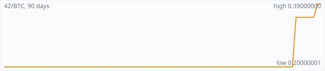

<a href="../"></a>

[All markets](../) · [Why testnet markets](../testnet-markets.md) · [Developers](../developers.md) · [Monthly reports](../reports/) · [Press kit](../press.md) · [altquick.com](https://altquick.com/)

# 42-coin (42) price in Bitcoin and how to buy it

42-coin is a Scrypt proof-of-work and proof-of-stake coin with a hard cap of just 42 coins. It trades against Bitcoin on AltQuick with a public order book and API.

**[Open the 42/BTC market on AltQuick →](https://altquick.com/market/42-coin-bitcoin/)**

## Live 42/BTC numbers

| | |
|---|---|
| Last price | 0.39000000 BTC |
| Best bid / ask | 0.35000000 / 0.41997973 BTC |
| Trades, last 7 days | 7 |
| Volume, last 7 days | 0.00204792 BTC |
| Last trade | 2026-10-03 21:41 UTC |

## About 42-coin

| | |
|---|---|
| Ticker | 42 |
| Launched | Announced on Bitcointalk in early January 2014 (original genesis block dated 7 January 2014); relaunched on a new chain on 12 November 2016. |
| Consensus | Hybrid Scrypt proof of work and proof of stake. All 42 coins are mined, so block rewards are zero and blocks pay only transaction fees. |

42-coin (ticker 42) takes Bitcoin's fixed-supply idea to an extreme: there will only ever be 42 coins. It was announced on the Bitcointalk forum in early January 2014, and the original chain's genesis block is dated 7 January 2014. That first version used Scrypt proof of work with 42-second blocks, but a code change in March 2014 quietly removed the 42-coin cap.

In 2016 the community revived the project. Holders swapped their coins onto a new chain, built on Novacoin code, that launched on 12 November 2016. The new chain brought back the 42-coin limit and added proof of stake alongside Scrypt mining. Target spacing is 21 minutes for proof-of-work blocks and 7 minutes for proof-of-stake blocks.

Every coin has now been mined, so miners and stakers earn only transaction fees. The project calls the design deflationary at the protocol level and says there was no premine, ICO or team allocation, with coins distributed by mining in 2014-2016. The number 42 shows up everywhere: the P2P port is 4242, the minimum stake age is 42 hours and blocks need 42 confirmations. The wallet also has a built-in tool for encrypting text.

With so few coins in existence, the 42/BTC order book is thin. Check the bids and asks below before placing a market order.

### Official links

- Website: [42-coin.org](https://42-coin.org/)
- Explorer: [explorer.42-coin.org](https://explorer.42-coin.org/)
- Explorer (CryptoID): [chainz.cryptoid.info/42](https://chainz.cryptoid.info/42/)
- Source code: [github.com/42-coin/42](https://github.com/42-coin/42)

## 42/BTC price history, last 90 days



| | |
|---|---|
| Change, 30 days | +95.0% |
| Change, 90 days | +95.0% |
| Highest daily close | 0.39000000 BTC |
| Lowest daily close | 0.20000001 BTC |

Daily candles from AltQuick's klines API, UTC days. On days without trades the previous close carries forward.

<details open><summary>Daily closes, last 30 days</summary>

| Date (UTC) | Close (BTC) | High | Low | Volume (42) |
|---|---|---|---|---|
| 2026-10-04 | 0.39000000 | 0.39000000 | 0.39000000 | 0 |
| 2026-10-03 | 0.39000000 | 0.39000000 | 0.39000000 | 0.00012821 |
| 2026-10-02 | 0.35000000 | 0.35000000 | 0.35000000 | 0 |
| 2026-10-01 | 0.35000000 | 0.35000000 | 0.35000000 | 0 |
| 2026-09-30 | 0.35000000 | 0.35000000 | 0.35000000 | 0 |
| 2026-09-29 | 0.35000000 | 0.35000000 | 0.35000000 | 0 |
| 2026-09-28 | 0.35000000 | 0.35000001 | 0.35000000 | 0.00570837 |
| 2026-09-27 | 0.34987645 | 0.34987645 | 0.20000001 | 1.18e-06 |
| 2026-09-26 | 0.20000001 | 0.20000001 | 0.20000001 | 0 |
| 2026-09-25 | 0.20000001 | 0.20000001 | 0.20000001 | 6.2e-06 |
| 2026-09-24 | 0.20000001 | 0.20000001 | 0.20000001 | 0 |
| 2026-09-23 | 0.20000001 | 0.20000001 | 0.20000001 | 0 |
| 2026-09-22 | 0.20000001 | 0.20000001 | 0.20000001 | 0 |
| 2026-09-21 | 0.20000001 | 0.20000001 | 0.20000001 | 0 |
| 2026-09-20 | 0.20000001 | 0.20000001 | 0.20000001 | 0 |
| 2026-09-19 | 0.20000001 | 0.20000001 | 0.20000001 | 0 |
| 2026-09-18 | 0.20000001 | 0.20000001 | 0.20000001 | 0 |
| 2026-09-17 | 0.20000001 | 0.20000001 | 0.20000001 | 0 |
| 2026-09-16 | 0.20000001 | 0.20000001 | 0.20000001 | 0 |
| 2026-09-15 | 0.20000001 | 0.20000001 | 0.20000001 | 0 |
| 2026-09-14 | 0.20000001 | 0.20000001 | 0.20000001 | 0 |
| 2026-09-13 | 0.20000001 | 0.20000001 | 0.20000001 | 0 |
| 2026-09-12 | 0.20000001 | 0.20000001 | 0.20000001 | 0 |
| 2026-09-11 | 0.20000001 | 0.20000001 | 0.20000001 | 0 |
| 2026-09-10 | 0.20000001 | 0.20000001 | 0.20000001 | 0 |
| 2026-09-09 | 0.20000001 | 0.20000001 | 0.20000001 | 0 |
| 2026-09-08 | 0.20000001 | 0.20000001 | 0.20000001 | 0 |
| 2026-09-07 | 0.20000001 | 0.20000001 | 0.20000001 | 0 |
| 2026-09-06 | 0.20000001 | 0.20000001 | 0.20000001 | 0 |
| 2026-09-05 | 0.20000001 | 0.20000001 | 0.20000001 | 0 |

</details>

## Order book snapshot

Top 5 bids (buy orders) and asks (sell orders).

| Bid price (BTC) | Bid amount (42) | Ask price (BTC) | Ask amount (42) |
|---|---|---|---|
| 0.35000000 | 0.001 | 0.41997973 | 8.496e-05 |
| 0.30000000 | 0.005 | 0.41997974 | 4.248e-05 |
| 0.20000000 | 0.001 | 0.41997979 | 4.8e-07 |
| 0.10000000 | 0.002 | 0.41997990 | 1.8e-07 |
| 0.06000010 | 0.0006 | 0.42000000 | 0.00017 |

## Recent trades

| Time (UTC) | Side | Price (BTC) | Amount (42) |
|---|---|---|---|
| 2026-10-03 21:41 | sell | 0.39000000 | 0.00012821 |
| 2026-09-28 16:04 | sell | 0.35000000 | 0.00538029 |
| 2026-09-28 08:38 | sell | 0.35000000 | 0.00018885 |
| 2026-09-28 08:38 | sell | 0.35000001 | 0.00013923 |
| 2026-09-27 17:41 | buy | 0.34987645 | 0.00000020 |
| 2026-09-27 17:41 | buy | 0.34987644 | 0.00000033 |
| 2026-09-27 17:41 | buy | 0.34987640 | 0.00000040 |
| 2026-09-27 10:21 | sell | 0.20000001 | 0.00000025 |
| 2026-09-25 02:37 | sell | 0.20000001 | 0.00000620 |
| 2026-09-04 19:16 | sell | 0.20000001 | 0.00000489 |

## How to buy 42-coin with Bitcoin

1. Create a free account on [altquick.com](https://altquick.com/) and deposit Bitcoin.
2. Open the [42/BTC market](https://altquick.com/market/42-coin-bitcoin/), check the order book, and place a limit or market order.
3. Withdraw 42 to your own wallet, or keep it on AltQuick to trade later.

To sell, deposit 42 and place a sell order on the same market to receive Bitcoin.

## 42-coin FAQ

### What is 42-coin (42)?

42-coin is a Scrypt proof-of-work and proof-of-stake coin with a hard cap of just 42 coins.

### When did 42-coin launch?

Announced on Bitcointalk in early January 2014 (original genesis block dated 7 January 2014); relaunched on a new chain on 12 November 2016.

### How is the 42-coin network secured?

Hybrid Scrypt proof of work and proof of stake. All 42 coins are mined, so block rewards are zero and blocks pay only transaction fees.

### How do I buy 42-coin with Bitcoin?

Create a free account on altquick.com, deposit Bitcoin, then place a limit or market order on the [42/BTC market](https://altquick.com/market/42-coin-bitcoin/). You can withdraw 42 to your own wallet afterwards. AltQuick's trading fee is 1%.

### Where does the 42 price on this page come from?

From AltQuick's public API: the last price, order book and trades of the 42/BTC market, and daily candles for the price history. No other exchanges are included.

## Related markets

- [Peercoin (PPC)](../peercoin/): Peercoin, launched in August 2012, was the first cryptocurrency to use proof of stake.
- [Clamcoin (CLAM)](../clamcoin/): Clams (CLAM) is a proof-of-stake coin that was airdropped in 2014 to every Bitcoin, Litecoin and Dogecoin address holding a balance.
- [Curecoin (CURE)](../curecoin/): Curecoin rewards people who run Folding@home disease-research simulations and secures its chain with proof of stake.

[See every AltQuick market](../) · [42-coin on altquick.com](https://altquick.com/asset/42-coin/)

## Get this data yourself

```
curl "https://altquick.com/api/v1/trades?market=BTC_42&limit=20"
curl "https://altquick.com/api/v1/depth?market=BTC_42&limit=20"
curl "https://altquick.com/api/v1/klines?market=BTC_42&interval=1d&limit=90"
```

Background facts were checked against each project's own sites and public sources. Nothing here is investment advice.

Last updated: 2026-10-04 10:43 UTC from AltQuick's public API.

---

AltQuick, US-based since 2015. [altquick.com](https://altquick.com/) · [API docs](https://github.com/AltQuick-com/api) · hello@altquick.com
