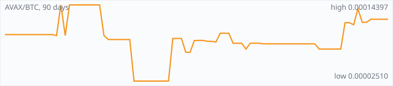

<a href="../"></a>

[All markets](../) · [Why testnet markets](../testnet-markets.md) · [Developers](../developers.md) · [Monthly reports](../reports/) · [Press kit](../press.md) · [altquick.com](https://altquick.com/)

# Avalanche (AVAX) price in Bitcoin and how to buy it

Avalanche is a proof-of-stake smart-contract platform whose mainnet launched in September 2020. It trades against Bitcoin on AltQuick with a public order book and API.

**[Open the AVAX/BTC market on AltQuick →](https://altquick.com/market/avalanche-bitcoin/)**

## Live AVAX/BTC numbers

| | |
|---|---|
| Last price | 0.00012167 BTC |
| Best bid / ask | 0.00011703 / 0.00013664 BTC |
| Trades, last 7 days | 14 |
| Volume, last 7 days | 0.00020886 BTC |
| Last trade | 2026-09-29 18:55 UTC |

## About Avalanche

| | |
|---|---|
| Ticker | AVAX |
| Launched | Mainnet launched on 21 September 2020. |
| Consensus | Proof of stake with the Avalanche family of consensus protocols (Snowman on the Primary Network chains), based on repeated random sampling of validators. |

Avalanche is a smart-contract network built by Ava Labs. Its mainnet went live on 21 September 2020. AVAX is the native coin: it pays transaction fees and is staked by validators. Running a Primary Network validator requires staking at least 2,000 AVAX.

What sets Avalanche apart is its consensus. Rather than mining, or having every validator talk to every other validator, each node repeatedly asks a small random sample of other validators what they prefer and switches when a large enough majority disagrees. After enough rounds the network settles on one answer. The design aims for finality in about a second.

The Primary Network is split into three chains. The C-Chain runs the Ethereum Virtual Machine, so Solidity contracts, MetaMask and other Ethereum tools work there; this is where most tokens and apps live. The P-Chain coordinates validators and tracks Avalanche L1s (formerly called subnets), separate chains that can set their own rules. The X-Chain is for creating and transferring assets.

Because AVAX exists on more than one chain, check which network AltQuick's deposit page expects before you send coins.

### Official links

- Website: [www.avax.network](https://www.avax.network/)
- Explorer: [explorer.avax.network/c-chain](https://explorer.avax.network/c-chain)
- Source code: [github.com/ava-labs/avalanchego](https://github.com/ava-labs/avalanchego)

## AVAX/BTC price history, last 90 days



| | |
|---|---|
| Change, 30 days | +44.3% |
| Change, 90 days | +24.6% |
| Highest daily close | 0.00014397 BTC |
| Lowest daily close | 0.00002510 BTC |

Daily candles from AltQuick's klines API, UTC days. On days without trades the previous close carries forward.

<details open><summary>Daily closes, last 30 days</summary>

| Date (UTC) | Close (BTC) | High | Low | Volume (AVAX) |
|---|---|---|---|---|
| 2026-10-01 | 0.00012167 | 0.00012167 | 0.00012167 | 0 |
| 2026-09-30 | 0.00012167 | 0.00012167 | 0.00012167 | 0 |
| 2026-09-29 | 0.00012167 | 0.00012167 | 0.00011285 | 0.325603 |
| 2026-09-28 | 0.00011684 | 0.00011684 | 0.00011684 | 0 |
| 2026-09-27 | 0.00011684 | 0.00011705 | 0.00008003 | 0.352927 |
| 2026-09-26 | 0.00013795 | 0.00013795 | 0.00011288 | 0.569255 |
| 2026-09-25 | 0.00011303 | 0.00011303 | 0.00011210 | 0.551344 |
| 2026-09-24 | 0.00011624 | 0.00011624 | 0.00011624 | 0 |
| 2026-09-23 | 0.00011624 | 0.00011624 | 0.00011624 | 0.19 |
| 2026-09-22 | 0.00007503 | 0.00007503 | 0.00007503 | 0 |
| 2026-09-21 | 0.00007503 | 0.00007503 | 0.00007503 | 0 |
| 2026-09-20 | 0.00007503 | 0.00007503 | 0.00007503 | 0 |
| 2026-09-19 | 0.00007503 | 0.00007503 | 0.00007503 | 0 |
| 2026-09-18 | 0.00007503 | 0.00007503 | 0.00007503 | 0 |
| 2026-09-17 | 0.00007503 | 0.00007503 | 0.00007503 | 0.00651503 |
| 2026-09-16 | 0.00008323 | 0.00008323 | 0.00008323 | 0 |
| 2026-09-15 | 0.00008323 | 0.00008323 | 0.00008323 | 0 |
| 2026-09-14 | 0.00008323 | 0.00008323 | 0.00008323 | 0 |
| 2026-09-13 | 0.00008323 | 0.00008323 | 0.00008323 | 0 |
| 2026-09-12 | 0.00008323 | 0.00008323 | 0.00008323 | 0 |
| 2026-09-11 | 0.00008323 | 0.00008323 | 0.00008323 | 0 |
| 2026-09-10 | 0.00008323 | 0.00008323 | 0.00008323 | 0 |
| 2026-09-09 | 0.00008323 | 0.00008323 | 0.00008323 | 0 |
| 2026-09-08 | 0.00008323 | 0.00008323 | 0.00008323 | 0 |
| 2026-09-07 | 0.00008323 | 0.00008323 | 0.00008323 | 0 |
| 2026-09-06 | 0.00008323 | 0.00008323 | 0.00008323 | 0 |
| 2026-09-05 | 0.00008323 | 0.00008323 | 0.00008323 | 0 |
| 2026-09-04 | 0.00008323 | 0.00008329 | 0.00008323 | 0.499973 |
| 2026-09-03 | 0.00008429 | 0.00008429 | 0.00008429 | 0 |
| 2026-09-02 | 0.00008429 | 0.00008429 | 0.00008429 | 0 |

</details>

## Order book snapshot

Top 5 bids (buy orders) and asks (sell orders).

| Bid price (BTC) | Bid amount (AVAX) | Ask price (BTC) | Ask amount (AVAX) |
|---|---|---|---|
| 0.00011703 | 9.09869 | 0.00013664 | 0.17832 |
| 0.00008003 | 19.91 | 0.00013665 | 0.0891598 |
| 0.00008000 | 25 | 0.00013938 | 2.12429 |
| 0.00007600 | 0.7 | 0.00013940 | 0.847851 |
| 0.00003300 | 0.0515152 | 0.00014000 | 3 |

## Recent trades

| Time (UTC) | Side | Price (BTC) | Amount (AVAX) |
|---|---|---|---|
| 2026-09-29 18:55 | sell | 0.00012167 | 0.22560348 |
| 2026-09-29 04:45 | sell | 0.00011285 | 0.10000000 |
| 2026-09-27 20:40 | sell | 0.00011684 | 0.08897000 |
| 2026-09-27 19:00 | sell | 0.00008003 | 0.09000000 |
| 2026-09-27 18:47 | sell | 0.00011691 | 0.02295719 |
| 2026-09-27 12:55 | sell | 0.00011635 | 0.06100000 |
| 2026-09-27 10:24 | sell | 0.00011705 | 0.09000000 |
| 2026-09-26 18:50 | buy | 0.00013795 | 0.21536788 |
| 2026-09-26 17:51 | sell | 0.00011652 | 0.07000000 |
| 2026-09-26 11:27 | sell | 0.00011552 | 0.09888700 |

## How to buy Avalanche with Bitcoin

1. Create a free account on [altquick.com](https://altquick.com/) and deposit Bitcoin.
2. Open the [AVAX/BTC market](https://altquick.com/market/avalanche-bitcoin/), check the order book, and place a limit or market order.
3. Withdraw AVAX to your own wallet, or keep it on AltQuick to trade later.

To sell, deposit AVAX and place a sell order on the same market to receive Bitcoin.

## Avalanche FAQ

### What is Avalanche (AVAX)?

Avalanche is a proof-of-stake smart-contract platform whose mainnet launched in September 2020.

### When did Avalanche launch?

Mainnet launched on 21 September 2020.

### How is the Avalanche network secured?

Proof of stake with the Avalanche family of consensus protocols (Snowman on the Primary Network chains), based on repeated random sampling of validators.

### How do I buy Avalanche with Bitcoin?

Create a free account on altquick.com, deposit Bitcoin, then place a limit or market order on the [AVAX/BTC market](https://altquick.com/market/avalanche-bitcoin/). You can withdraw AVAX to your own wallet afterwards. AltQuick's trading fee is 1%.

### Where does the AVAX price on this page come from?

From AltQuick's public API: the last price, order book and trades of the AVAX/BTC market, and daily candles for the price history. No other exchanges are included.

## Related markets

- [Solana (SOL)](../solana/): Solana is a high-throughput proof-of-stake smart-contract chain that orders transactions with Proof of History.
- [Qtum (QTUM)](../qtum/): Qtum is a proof-of-stake chain that combines Bitcoin's UTXO model with the Ethereum Virtual Machine.
- [Particl (PART)](../particl/): Particl is a pure proof-of-stake privacy coin on a Bitcoin Core codebase, built to power a decentralized marketplace.

[See every AltQuick market](../) · [Avalanche on altquick.com](https://altquick.com/asset/avalanche/)

## Get this data yourself

```
curl "https://altquick.com/api/v1/trades?market=BTC_AVAX&limit=20"
curl "https://altquick.com/api/v1/depth?market=BTC_AVAX&limit=20"
curl "https://altquick.com/api/v1/klines?market=BTC_AVAX&interval=1d&limit=90"
```

Background facts were checked against each project's own sites and public sources. Nothing here is investment advice.

Last updated: 2026-10-01 00:42 UTC from AltQuick's public API.

---

AltQuick, US-based since 2015. [altquick.com](https://altquick.com/) · [API docs](https://github.com/AltQuick-com/api) · hello@altquick.com
