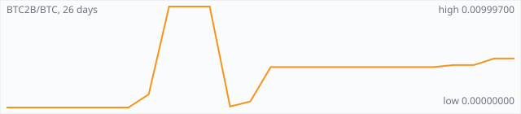

<a href="../"></a>

[All markets](../) · [Why testnet markets](../testnet-markets.md) · [Developers](../developers.md) · [Monthly reports](../reports/) · [Press kit](../press.md) · [altquick.com](https://altquick.com/)

# Bitcoin Blake2b (BTC2B) price in Bitcoin and how to buy it

Bitcoin Blake2b is a 2026 hard fork of Bitcoin that switched proof of work from SHA-256d to BLAKE2b at block 961,640. It trades against Bitcoin on AltQuick with a public order book and API.

**[Open the BTC2B/BTC market on AltQuick →](https://altquick.com/market/bitcoin-blake2b-bitcoin/)**

## Live BTC2B/BTC numbers

| | |
|---|---|
| Last price | 0.00400000 BTC |
| Best bid / ask | 0.00390000 / 0.00400000 BTC |
| Trades, last 7 days | 0 |
| Volume, last 7 days | 0.00000000 BTC |
| Last trade | 2026-09-23 04:14 UTC |

## About Bitcoin Blake2b

| | |
|---|---|
| Ticker | BTC2B |
| Launched | The first BLAKE2b block, height 961,640, was mined on 30 August 2026. The chain shares Bitcoin's history before the split. |
| Consensus | BLAKE2b proof of work from block 961,640 onward (SHA-256d before that), with Bitcoin's ten-minute block target and halving schedule. |

Bitcoin Blake2b is a hard fork of Bitcoin. It shares Bitcoin's full transaction history up to the split and then changed its proof of work from SHA-256d to BLAKE2b. The first BLAKE2b block is height 961,640, mined on 30 August 2026.

The fork grew out of BIP-110, a soft-fork proposal to stop Bitcoin blocks being used for arbitrary data storage while leaving ordinary payments alone. According to the project, nodes enforcing BIP-110 stopped accepting non-compliant blocks on 8 August 2026, but most SHA-256d hash power kept extending the original chain, so the rules never took effect there. Supporters then moved to a different mining algorithm so that existing SHA-256 miners cannot add blocks to their chain.

From block 961,640, temporary limits on data storage apply, including a cap of roughly 300 kB per block, until 1 September 2027, when node operators decide whether to keep them. The BLAKE2b proof of work is permanent. The chain keeps Bitcoin's ten-minute block target, 210,000-block halving interval and 21 million nominal supply, and uses a larger 164-byte block header. Some exchanges list the same coin as BTCB2 or BIP110.

Anyone who held bitcoin before the split holds the same amount on this chain. AltQuick's asset page notes that BTC2B deposits use the same Bitcoin bech32 address format, and that a send which hasn't been split can be credited as both BTC and BTC2B. Split your coins carefully before depositing.

### Official links

- Website: [bitcoin-blake2b.org](https://bitcoin-blake2b.org/)

## BTC2B/BTC price history, last 22 days



| | |
|---|---|
| Change, 30 days | - |
| Change, 22 days | - |
| Highest daily close | 0.00999700 BTC |
| Lowest daily close | 0.00000000 BTC |

Daily candles from AltQuick's klines API, UTC days. On days without trades the previous close carries forward.

<details open><summary>Daily closes, last 30 days</summary>

| Date (UTC) | Close (BTC) | High | Low | Volume (BTC2B) |
|---|---|---|---|---|
| 2026-10-01 | 0.00400000 | 0.00400000 | 0.00400000 | 0 |
| 2026-09-30 | 0.00400000 | 0.00400000 | 0.00400000 | 0 |
| 2026-09-29 | 0.00400000 | 0.00400000 | 0.00400000 | 0 |
| 2026-09-28 | 0.00400000 | 0.00400000 | 0.00400000 | 0 |
| 2026-09-27 | 0.00400000 | 0.00400000 | 0.00400000 | 0 |
| 2026-09-26 | 0.00400000 | 0.00400000 | 0.00400000 | 0 |
| 2026-09-25 | 0.00400000 | 0.00400000 | 0.00400000 | 0 |
| 2026-09-24 | 0.00400000 | 0.00400000 | 0.00400000 | 0 |
| 2026-09-23 | 0.00400000 | 0.00400000 | 0.00400000 | 1.25e-05 |
| 2026-09-22 | 0.00060000 | 0.00060000 | 0.00060000 | 9.965e-05 |
| 2026-09-21 | 0.00010000 | 0.00999800 | 0.00010000 | 0.0138492 |
| 2026-09-20 | 0.00999700 | 0.00999700 | 0.00999700 | 0 |
| 2026-09-19 | 0.00999700 | 0.00999700 | 0.00999700 | 0 |
| 2026-09-18 | 0.00999700 | 0.00999700 | 0.00999700 | 5.01e-06 |
| 2026-09-17 | 0.00130000 | 0.00999900 | 0.00130000 | 0.00480433 |
| 2026-09-16 | 0.00000000 | 0.00000000 | 0.00000000 | 0 |
| 2026-09-15 | 0.00000000 | 0.00000000 | 0.00000000 | 0 |
| 2026-09-14 | 0.00000000 | 0.00000000 | 0.00000000 | 0 |
| 2026-09-13 | 0.00000000 | 0.00000000 | 0.00000000 | 0 |
| 2026-09-12 | 0.00000000 | 0.00000000 | 0.00000000 | 0 |
| 2026-09-11 | 0.00000000 | 0.00000000 | 0.00000000 | 0 |
| 2026-09-10 | 0.00000000 | 0.00000000 | 0.00000000 | 0 |

</details>

## Order book snapshot

Top 5 bids (buy orders) and asks (sell orders).

| Bid price (BTC) | Bid amount (BTC2B) | Ask price (BTC) | Ask amount (BTC2B) |
|---|---|---|---|
| 0.00390000 | 1.283e-05 | 0.00400000 | 1.48361 |
| 0.00380000 | 1.579e-05 | 0.00432287 | 0.00474438 |
| 0.00370000 | 1.622e-05 | 0.00999700 | 0.000792 |
| 0.00360000 | 1.667e-05 |  |  |
| 0.00350000 | 1.429e-05 |  |  |

## Recent trades

| Time (UTC) | Side | Price (BTC) | Amount (BTC2B) |
|---|---|---|---|
| 2026-09-23 04:14 | buy | 0.00400000 | 0.00001250 |
| 2026-09-22 15:45 | buy | 0.00060000 | 0.00009965 |
| 2026-09-21 18:47 | buy | 0.00010000 | 0.00080001 |
| 2026-09-21 18:37 | sell | 0.00020000 | 0.00050000 |
| 2026-09-21 08:38 | buy | 0.00999800 | 0.00009902 |
| 2026-09-21 08:37 | buy | 0.00999800 | 0.00599720 |
| 2026-09-21 08:36 | buy | 0.00999700 | 0.00645294 |
| 2026-09-18 22:33 | buy | 0.00999700 | 0.00000501 |
| 2026-09-17 14:42 | sell | 0.00130000 | 0.00479231 |
| 2026-09-17 12:02 | buy | 0.00999900 | 0.00000501 |

## How to buy Bitcoin Blake2b with Bitcoin

1. Create a free account on [altquick.com](https://altquick.com/) and deposit Bitcoin.
2. Open the [BTC2B/BTC market](https://altquick.com/market/bitcoin-blake2b-bitcoin/), check the order book, and place a limit or market order.
3. Withdraw BTC2B to your own wallet, or keep it on AltQuick to trade later.

To sell, deposit BTC2B and place a sell order on the same market to receive Bitcoin.

## Bitcoin Blake2b FAQ

### What is Bitcoin Blake2b (BTC2B)?

Bitcoin Blake2b is a 2026 hard fork of Bitcoin that switched proof of work from SHA-256d to BLAKE2b at block 961,640.

### When did Bitcoin Blake2b launch?

The first BLAKE2b block, height 961,640, was mined on 30 August 2026. The chain shares Bitcoin's history before the split.

### How is the Bitcoin Blake2b network secured?

BLAKE2b proof of work from block 961,640 onward (SHA-256d before that), with Bitcoin's ten-minute block target and halving schedule.

### How do I buy Bitcoin Blake2b with Bitcoin?

Create a free account on altquick.com, deposit Bitcoin, then place a limit or market order on the [BTC2B/BTC market](https://altquick.com/market/bitcoin-blake2b-bitcoin/). You can withdraw BTC2B to your own wallet afterwards. AltQuick's trading fee is 1%.

### Where does the BTC2B price on this page come from?

From AltQuick's public API: the last price, order book and trades of the BTC2B/BTC market, and daily candles for the price history. No other exchanges are included.

## Related markets

- [Bitcoin Cash (BCH)](../bitcoin-cash/): Bitcoin Cash is the larger-block fork of Bitcoin created on 1 August 2017.
- [Namecoin (NMC)](../namecoin/): Namecoin, launched in April 2011, was the first fork of Bitcoin; it adds a decentralized name registry used for .bit domains and identities.
- [Litecoin (LTC)](../litecoin/): Litecoin is one of the oldest Bitcoin forks, launched by Charlie Lee in October 2011 with Scrypt mining and 2.5-minute blocks.

[See every AltQuick market](../) · [Bitcoin Blake2b on altquick.com](https://altquick.com/asset/bitcoin-blake2b/)

## Get this data yourself

```
curl "https://altquick.com/api/v1/trades?market=BTC_BTC2B&limit=20"
curl "https://altquick.com/api/v1/depth?market=BTC_BTC2B&limit=20"
curl "https://altquick.com/api/v1/klines?market=BTC_BTC2B&interval=1d&limit=90"
```

Background facts were checked against each project's own sites and public sources. Nothing here is investment advice.

Last updated: 2026-10-01 00:42 UTC from AltQuick's public API.

---

AltQuick, US-based since 2015. [altquick.com](https://altquick.com/) · [API docs](https://github.com/AltQuick-com/api) · hello@altquick.com
