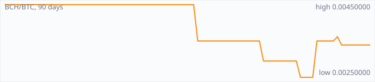

<a href="../"></a>

[All markets](../) · [Why testnet markets](../testnet-markets.md) · [Developers](../developers.md) · [Monthly reports](../reports/) · [Press kit](../press.md) · [altquick.com](https://altquick.com/)

# Bitcoin Cash (BCH) price in Bitcoin and how to buy it

Bitcoin Cash is the larger-block fork of Bitcoin created on 1 August 2017. It trades against Bitcoin on AltQuick with a public order book and API.

**[Open the BCH/BTC market on AltQuick →](https://altquick.com/market/bitcoin-cash-bitcoin/)**

## Live BCH/BTC numbers

| | |
|---|---|
| Last price | 0.00338963 BTC |
| Best bid / ask | 0.00275000 / 0.00400000 BTC |
| Trades, last 7 days | 1 |
| Volume, last 7 days | 0.00000723 BTC |
| Last trade | 2026-09-28 12:49 UTC |

## About Bitcoin Cash

| | |
|---|---|
| Ticker | BCH |
| Launched | Split from Bitcoin on 1 August 2017. |
| Consensus | SHA-256 proof of work, the same mining algorithm as Bitcoin. |

Bitcoin Cash split from Bitcoin on 1 August 2017, at the end of a long argument over how Bitcoin should scale. One side wanted to keep blocks small and add capacity through SegWit and second layers such as Lightning; the other wanted to raise the block size limit so more payments fit on chain. Bitcoin Cash is the result of the second camp forking away. Anyone holding BTC at the split received the same amount of BCH.

BCH keeps Bitcoin's SHA-256 proof of work, ten-minute block target and 21 million coin limit. The block size limit was raised to 8 MB at the fork and later to 32 MB. Later upgrades changed the difficulty adjustment so blocks stay regular even though BCH shares SHA-256 miners with the much larger Bitcoin network, and the 2023 upgrade added CashTokens, native tokens on the BCH chain.

The trade-off is the same one argued in 2017: bigger blocks allow cheaper on-chain payments, while critics say they make running a full node more expensive over time. BCH itself split again in November 2018, when Bitcoin SV left over a further disagreement.

BCH uses its own address format (CashAddr, starting with bitcoincash:), so make sure you withdraw to a BCH wallet, not a BTC one.

### Official links

- Website: [bitcoincash.org](https://bitcoincash.org/)
- Explorer (3xpl): [3xpl.com/bitcoin-cash](https://3xpl.com/bitcoin-cash)
- Full node (BCHN): [gitlab.com/bitcoin-cash-node/bitcoin-cash-node](https://gitlab.com/bitcoin-cash-node/bitcoin-cash-node)

## BCH/BTC price history, last 90 days



| | |
|---|---|
| Change, 30 days | -3.2% |
| Change, 90 days | -24.7% |
| Highest daily close | 0.00450000 BTC |
| Lowest daily close | 0.00250000 BTC |

Daily candles from AltQuick's klines API, UTC days. On days without trades the previous close carries forward.

<details open><summary>Daily closes, last 30 days</summary>

| Date (UTC) | Close (BTC) | High | Low | Volume (BCH) |
|---|---|---|---|---|
| 2026-10-04 | 0.00338963 | 0.00338963 | 0.00338963 | 0 |
| 2026-10-03 | 0.00338963 | 0.00338963 | 0.00338963 | 0 |
| 2026-10-02 | 0.00338963 | 0.00338963 | 0.00338963 | 0 |
| 2026-10-01 | 0.00338963 | 0.00338963 | 0.00338963 | 0 |
| 2026-09-30 | 0.00338963 | 0.00338963 | 0.00338963 | 0 |
| 2026-09-29 | 0.00338963 | 0.00338963 | 0.00338963 | 0 |
| 2026-09-28 | 0.00338963 | 0.00338963 | 0.00338963 | 0.00213565 |
| 2026-09-27 | 0.00361825 | 0.00361825 | 0.00361825 | 0.0004775 |
| 2026-09-26 | 0.00350000 | 0.00350000 | 0.00350000 | 0 |
| 2026-09-25 | 0.00350000 | 0.00350000 | 0.00350000 | 0 |
| 2026-09-24 | 0.00350000 | 0.00350000 | 0.00350000 | 0 |
| 2026-09-23 | 0.00350000 | 0.00350000 | 0.00350000 | 0 |
| 2026-09-22 | 0.00350000 | 0.00350000 | 0.00350000 | 0.00029827 |
| 2026-09-21 | 0.00250000 | 0.00250000 | 0.00250000 | 0 |
| 2026-09-20 | 0.00250000 | 0.00250000 | 0.00250000 | 0 |
| 2026-09-19 | 0.00250000 | 0.00250000 | 0.00250000 | 0 |
| 2026-09-18 | 0.00250000 | 0.00350000 | 0.00250000 | 0.00188765 |
| 2026-09-17 | 0.00294875 | 0.00294875 | 0.00294875 | 0 |
| 2026-09-16 | 0.00294875 | 0.00294875 | 0.00294875 | 0 |
| 2026-09-15 | 0.00294875 | 0.00294875 | 0.00294875 | 0 |
| 2026-09-14 | 0.00294875 | 0.00294875 | 0.00294875 | 0 |
| 2026-09-13 | 0.00294875 | 0.00294875 | 0.00294875 | 0 |
| 2026-09-12 | 0.00294875 | 0.00294875 | 0.00294875 | 0 |
| 2026-09-11 | 0.00294875 | 0.00294875 | 0.00294875 | 0 |
| 2026-09-10 | 0.00294875 | 0.00294875 | 0.00294875 | 0 |
| 2026-09-09 | 0.00294875 | 0.00294875 | 0.00294875 | 0.019 |
| 2026-09-08 | 0.00350000 | 0.00350000 | 0.00350000 | 0 |
| 2026-09-07 | 0.00350000 | 0.00350000 | 0.00350000 | 0 |
| 2026-09-06 | 0.00350000 | 0.00350000 | 0.00350000 | 0 |
| 2026-09-05 | 0.00350000 | 0.00350000 | 0.00350000 | 0 |

</details>

## Order book snapshot

Top 5 bids (buy orders) and asks (sell orders).

| Bid price (BTC) | Bid amount (BCH) | Ask price (BTC) | Ask amount (BCH) |
|---|---|---|---|
| 0.00275000 | 0.5 | 0.00400000 | 0.5 |
| 0.00270000 | 0.02 | 0.00409750 | 0.0216923 |
| 0.00101600 | 0.00684056 | 0.00580000 | 0.104833 |
| 0.00060000 | 0.0164333 | 0.01250000 | 0.0602 |
| 0.00012500 | 0.00144 | 0.02000000 | 5e-06 |

## Recent trades

| Time (UTC) | Side | Price (BTC) | Amount (BCH) |
|---|---|---|---|
| 2026-09-28 12:49 | sell | 0.00338963 | 0.00213565 |
| 2026-09-27 09:18 | sell | 0.00361825 | 0.00047750 |
| 2026-09-22 18:30 | buy | 0.00350000 | 0.00029827 |
| 2026-09-18 22:31 | sell | 0.00250000 | 0.00093908 |
| 2026-09-18 22:28 | buy | 0.00350000 | 0.00094857 |
| 2026-09-09 16:03 | sell | 0.00294875 | 0.01900000 |
| 2026-09-04 19:16 | sell | 0.00350000 | 0.00424483 |
| 2026-08-24 19:57 | sell | 0.00350000 | 0.00002660 |
| 2026-07-15 00:31 | sell | 0.00450000 | 0.00531939 |
| 2026-06-29 01:38 | sell | 0.00450000 | 0.00003397 |

## How to buy Bitcoin Cash with Bitcoin

1. Create a free account on [altquick.com](https://altquick.com/) and deposit Bitcoin.
2. Open the [BCH/BTC market](https://altquick.com/market/bitcoin-cash-bitcoin/), check the order book, and place a limit or market order.
3. Withdraw BCH to your own wallet, or keep it on AltQuick to trade later.

To sell, deposit BCH and place a sell order on the same market to receive Bitcoin.

## Bitcoin Cash FAQ

### What is Bitcoin Cash (BCH)?

Bitcoin Cash is the larger-block fork of Bitcoin created on 1 August 2017.

### When did Bitcoin Cash launch?

Split from Bitcoin on 1 August 2017.

### How is the Bitcoin Cash network secured?

SHA-256 proof of work, the same mining algorithm as Bitcoin.

### How do I buy Bitcoin Cash with Bitcoin?

Create a free account on altquick.com, deposit Bitcoin, then place a limit or market order on the [BCH/BTC market](https://altquick.com/market/bitcoin-cash-bitcoin/). You can withdraw BCH to your own wallet afterwards. AltQuick's trading fee is 1%.

### Where does the BCH price on this page come from?

From AltQuick's public API: the last price, order book and trades of the BCH/BTC market, and daily candles for the price history. No other exchanges are included.

## Related markets

- [Litecoin (LTC)](../litecoin/): Litecoin is one of the oldest Bitcoin forks, launched by Charlie Lee in October 2011 with Scrypt mining and 2.5-minute blocks.
- [Bitcoin Blake2b (BTC2B)](../bitcoin-blake2b/): Bitcoin Blake2b is a 2026 hard fork of Bitcoin that switched proof of work from SHA-256d to BLAKE2b at block 961,640.
- [Dogecoin (DOGE)](../dogecoin/): Dogecoin is the Shiba Inu meme coin launched in December 2013, a Scrypt chain merge-mined with Litecoin.

[See every AltQuick market](../) · [Bitcoin Cash on altquick.com](https://altquick.com/asset/bitcoin-cash/)

## Get this data yourself

```
curl "https://altquick.com/api/v1/trades?market=BTC_BCH&limit=20"
curl "https://altquick.com/api/v1/depth?market=BTC_BCH&limit=20"
curl "https://altquick.com/api/v1/klines?market=BTC_BCH&interval=1d&limit=90"
```

Background facts were checked against each project's own sites and public sources. Nothing here is investment advice.

Last updated: 2026-10-04 10:43 UTC from AltQuick's public API.

---

AltQuick, US-based since 2015. [altquick.com](https://altquick.com/) · [API docs](https://github.com/AltQuick-com/api) · hello@altquick.com
