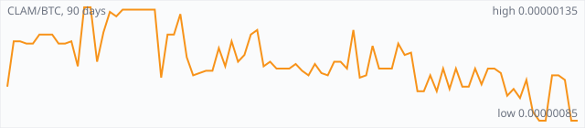

<a href="../"></a>

[All markets](../) · [Why testnet markets](../testnet-markets.md) · [Developers](../developers.md) · [Monthly reports](../reports/) · [Press kit](../press.md) · [altquick.com](https://altquick.com/)

# Clamcoin (CLAM) price in Bitcoin and how to buy it

Clams (CLAM) is a proof-of-stake coin that was airdropped in 2014 to every Bitcoin, Litecoin and Dogecoin address holding a balance. It trades against Bitcoin on AltQuick with a public order book and API.

**[Open the CLAM/BTC market on AltQuick →](https://altquick.com/market/clamcoin-bitcoin/)**

## Live CLAM/BTC numbers

| | |
|---|---|
| Last price | 0.00000086 BTC |
| Best bid / ask | 0.00000086 / 0.00000091 BTC |
| Trades, last 7 days | 57 |
| Volume, last 7 days | 0.00422321 BTC |
| Last trade | 2026-10-01 00:35 UTC |

## About Clamcoin

| | |
|---|---|
| Ticker | CLAM |
| Launched | May 2014, with coins distributed from a May 2014 snapshot of the Bitcoin, Litecoin and Dogecoin blockchains. |
| Consensus | Proof of stake only, with no mining phase. Blocks come about once a minute and each pays 1 CLAM to the staker. |

Clams, usually called Clamcoin, solved the hardest problem for a pure proof-of-stake coin (how to hand out the first coins) in an unusual way. Instead of mining, it sent coins to everyone. In May 2014 it took a snapshot of the Bitcoin, Litecoin and Dogecoin blockchains (BTC block 300,377, LTC block 565,693 and DOGE block 218,556), and every address with a balance above dust was credited 4.60545574 CLAM. A total of 14,897,662 CLAM was allocated this way. The project calls it Proof of Chain.

Those coins are still claimable. If you held BTC, LTC or DOGE in May 2014, you can import the old private keys into the CLAM wallet and dig up the CLAM sitting on those addresses. Move the original coins to a fresh wallet before exposing old keys to any new software.

The network has no proof-of-work phase. Unlocked wallets stake in the background, a block is produced roughly every minute, and each block pays 1 CLAM, about 525,960 new CLAM a year. That issuance is meant to replace coins that are lost or never claimed. Technically CLAM began as a fork of Blackcoin, which itself came from Peercoin's proof-of-stake design.

CLAM became the house currency of the dice site Just-Dice in late 2014.

### Official links

- Website: [clamcoin.org](https://clamcoin.org/)
- Explorer (CryptoID): [chainz.cryptoid.info/clam](https://chainz.cryptoid.info/clam/)
- Source code: [github.com/nochowderforyou/clams](https://github.com/nochowderforyou/clams)

## CLAM/BTC price history, last 90 days



| | |
|---|---|
| Change, 30 days | -17.3% |
| Change, 90 days | -27.7% |
| Highest daily close | 0.00000135 BTC |
| Lowest daily close | 0.00000085 BTC |

Daily candles from AltQuick's klines API, UTC days. On days without trades the previous close carries forward.

<details open><summary>Daily closes, last 30 days</summary>

| Date (UTC) | Close (BTC) | High | Low | Volume (CLAM) |
|---|---|---|---|---|
| 2026-10-01 | 0.00000086 | 0.00000086 | 0.00000086 | 0.7 |
| 2026-09-30 | 0.00000085 | 0.00000085 | 0.00000085 | 1426.3 |
| 2026-09-29 | 0.00000085 | 0.00000088 | 0.00000085 | 912.89 |
| 2026-09-28 | 0.00000089 | 0.00000093 | 0.00000085 | 820.76 |
| 2026-09-27 | 0.00000103 | 0.00000103 | 0.00000085 | 896.801 |
| 2026-09-26 | 0.00000095 | 0.00000107 | 0.00000085 | 119.475 |
| 2026-09-25 | 0.00000099 | 0.00000108 | 0.00000085 | 1631 |
| 2026-09-24 | 0.00000096 | 0.00000108 | 0.00000096 | 2.92616 |
| 2026-09-23 | 0.00000106 | 0.00000108 | 0.00000096 | 1140.21 |
| 2026-09-22 | 0.00000108 | 0.00000108 | 0.00000102 | 791.334 |
| 2026-09-21 | 0.00000108 | 0.00000108 | 0.00000101 | 67.2658 |
| 2026-09-20 | 0.00000101 | 0.00000108 | 0.00000101 | 1.67994 |
| 2026-09-19 | 0.00000108 | 0.00000108 | 0.00000101 | 345.031 |
| 2026-09-18 | 0.00000100 | 0.00000108 | 0.00000100 | 228.244 |
| 2026-09-17 | 0.00000100 | 0.00000108 | 0.00000100 | 25.1479 |
| 2026-09-16 | 0.00000108 | 0.00000108 | 0.00000099 | 994.364 |
| 2026-09-15 | 0.00000099 | 0.00000108 | 0.00000098 | 179.065 |
| 2026-09-14 | 0.00000108 | 0.00000108 | 0.00000098 | 626.575 |
| 2026-09-13 | 0.00000098 | 0.00000105 | 0.00000098 | 5.46095 |
| 2026-09-12 | 0.00000105 | 0.00000105 | 0.00000098 | 103.569 |
| 2026-09-11 | 0.00000098 | 0.00000105 | 0.00000098 | 32.7143 |
| 2026-09-10 | 0.00000098 | 0.00000115 | 0.00000097 | 39138.1 |
| 2026-09-09 | 0.00000115 | 0.00000115 | 0.00000114 | 22.1583 |
| 2026-09-08 | 0.00000114 | 0.00000114 | 0.00000109 | 10.2705 |
| 2026-09-07 | 0.00000119 | 0.00000119 | 0.00000114 | 3.92412 |
| 2026-09-06 | 0.00000108 | 0.00000108 | 0.00000108 | 0 |
| 2026-09-05 | 0.00000108 | 0.00000108 | 0.00000108 | 3.18 |
| 2026-09-04 | 0.00000108 | 0.00000121 | 0.00000108 | 424.968 |
| 2026-09-03 | 0.00000118 | 0.00000118 | 0.00000114 | 1.55305 |
| 2026-09-02 | 0.00000105 | 0.00000109 | 0.00000105 | 1860.06 |

</details>

## Order book snapshot

Top 5 bids (buy orders) and asks (sell orders).

| Bid price (BTC) | Bid amount (CLAM) | Ask price (BTC) | Ask amount (CLAM) |
|---|---|---|---|
| 0.00000086 | 2.53256 | 0.00000091 | 6 |
| 0.00000085 | 1548.64 | 0.00000094 | 0.88139 |
| 0.00000084 | 4000 | 0.00000099 | 5.12121 |
| 0.00000083 | 2000 | 0.00000101 | 31.0495 |
| 0.00000080 | 4.8375 | 0.00000102 | 9.38235 |

## Recent trades

| Time (UTC) | Side | Price (BTC) | Amount (CLAM) |
|---|---|---|---|
| 2026-10-01 00:35 | sell | 0.00000086 | 0.70000000 |
| 2026-09-30 04:18 | sell | 0.00000085 | 0.10000000 |
| 2026-09-30 02:17 | sell | 0.00000085 | 951.26250657 |
| 2026-09-30 02:17 | sell | 0.00000085 | 100.00000000 |
| 2026-09-30 02:17 | sell | 0.00000085 | 230.00000000 |
| 2026-09-30 02:17 | sell | 0.00000085 | 144.60440844 |
| 2026-09-30 00:40 | sell | 0.00000085 | 0.33000000 |
| 2026-09-29 18:41 | sell | 0.00000085 | 0.12000000 |
| 2026-09-29 17:47 | sell | 0.00000086 | 0.25000000 |
| 2026-09-29 09:28 | sell | 0.00000085 | 154.94559156 |

## How to buy Clamcoin with Bitcoin

1. Create a free account on [altquick.com](https://altquick.com/) and deposit Bitcoin.
2. Open the [CLAM/BTC market](https://altquick.com/market/clamcoin-bitcoin/), check the order book, and place a limit or market order.
3. Withdraw CLAM to your own wallet, or keep it on AltQuick to trade later.

To sell, deposit CLAM and place a sell order on the same market to receive Bitcoin.

## Clamcoin FAQ

### What is Clamcoin (CLAM)?

Clams (CLAM) is a proof-of-stake coin that was airdropped in 2014 to every Bitcoin, Litecoin and Dogecoin address holding a balance.

### When did Clamcoin launch?

May 2014, with coins distributed from a May 2014 snapshot of the Bitcoin, Litecoin and Dogecoin blockchains.

### How is the Clamcoin network secured?

Proof of stake only, with no mining phase. Blocks come about once a minute and each pays 1 CLAM to the staker.

### How do I buy Clamcoin with Bitcoin?

Create a free account on altquick.com, deposit Bitcoin, then place a limit or market order on the [CLAM/BTC market](https://altquick.com/market/clamcoin-bitcoin/). You can withdraw CLAM to your own wallet afterwards. AltQuick's trading fee is 1%.

### Where does the CLAM price on this page come from?

From AltQuick's public API: the last price, order book and trades of the CLAM/BTC market, and daily candles for the price history. No other exchanges are included.

## Related markets

- [Peercoin (PPC)](../peercoin/): Peercoin, launched in August 2012, was the first cryptocurrency to use proof of stake.
- [Dogecoin (DOGE)](../dogecoin/): Dogecoin is the Shiba Inu meme coin launched in December 2013, a Scrypt chain merge-mined with Litecoin.
- [42-coin (42)](../42-coin/): 42-coin is a Scrypt proof-of-work and proof-of-stake coin with a hard cap of just 42 coins.

[See every AltQuick market](../) · [Clamcoin on altquick.com](https://altquick.com/asset/clamcoin/)

## Get this data yourself

```
curl "https://altquick.com/api/v1/trades?market=BTC_CLAM&limit=20"
curl "https://altquick.com/api/v1/depth?market=BTC_CLAM&limit=20"
curl "https://altquick.com/api/v1/klines?market=BTC_CLAM&interval=1d&limit=90"
```

Background facts were checked against each project's own sites and public sources. Nothing here is investment advice.

Last updated: 2026-10-01 00:42 UTC from AltQuick's public API.

---

AltQuick, US-based since 2015. [altquick.com](https://altquick.com/) · [API docs](https://github.com/AltQuick-com/api) · hello@altquick.com
