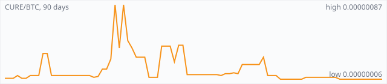

<a href="../"></a>

[All markets](../) · [Why testnet markets](../testnet-markets.md) · [Developers](../developers.md) · [Monthly reports](../reports/) · [Press kit](../press.md) · [altquick.com](https://altquick.com/)

# Curecoin (CURE) price in Bitcoin and how to buy it

Curecoin rewards people who run Folding@home disease-research simulations and secures its chain with proof of stake. It trades against Bitcoin on AltQuick with a public order book and API.

**[Open the CURE/BTC market on AltQuick →](https://altquick.com/market/curecoin-bitcoin/)**

## Live CURE/BTC numbers

| | |
|---|---|
| Last price | 0.00000005 BTC |
| Best bid / ask | 0.00000006 / 0.00000009 BTC |
| Trades, last 7 days | 10 |
| Volume, last 7 days | 0.00007535 BTC |
| Last trade | 2026-10-01 16:21 UTC |

## About Curecoin

| | |
|---|---|
| Ticker | CURE |
| Launched | Launched publicly in May 2014. |
| Consensus | Proof of stake since the Curecoin 2.0 hard fork in December 2018 (4-minute blocks, 4-day minimum stake age). It originally combined SHA-256 proof of work with Peercoin-style staking. |

Curecoin tries to make crypto issuance pay for something useful. Instead of rewarding miners for raw hashing, it pays people who run Folding@home, the distributed computing project that began at Stanford and simulates protein folding for research into diseases such as cancer and Alzheimer's. Folders join Team Curecoin and receive CURE in proportion to their share of the team's work.

Developers Joshua Smith and Maxwell Sanchez launched Curecoin publicly in May 2014. According to the project, Team Curecoin reached fifth place in Folding@home's all-time standings within about five months, and took the top spot for total contributions by mid-2017.

At launch, Curecoin combined SHA-256 proof of work with Peercoin-style proof of stake. The Curecoin 2.0 hard fork, completed in December 2018, removed ASIC mining entirely. Since then the chain is secured by proof of stake with 4-minute blocks and a 4-day minimum stake age, while more than 90% of new coins go to protein folders. The science work happens off chain on Folding@home's servers, which validate the work units, so the blockchain doesn't grow with the research data.

To earn CURE rather than buy it, install Folding@home and fold for Team Curecoin; the project's site has a step-by-step guide.

### Official links

- Website: [curecoin.net](https://curecoin.net/)
- Explorer (CryptoID): [chainz.cryptoid.info/cure](https://chainz.cryptoid.info/cure/)
- Source code: [github.com/cygnusxi/CurecoinSource](https://github.com/cygnusxi/CurecoinSource)

## CURE/BTC price history, last 90 days



| | |
|---|---|
| Change, 30 days | -77.3% |
| Change, 90 days | -28.6% |
| Highest daily close | 0.00000087 BTC |
| Lowest daily close | 0.00000005 BTC |

Daily candles from AltQuick's klines API, UTC days. On days without trades the previous close carries forward.

<details open><summary>Daily closes, last 30 days</summary>

| Date (UTC) | Close (BTC) | High | Low | Volume (CURE) |
|---|---|---|---|---|
| 2026-10-02 | 0.00000005 | 0.00000005 | 0.00000005 | 0 |
| 2026-10-01 | 0.00000005 | 0.00000010 | 0.00000005 | 1168 |
| 2026-09-30 | 0.00000006 | 0.00000006 | 0.00000006 | 0 |
| 2026-09-29 | 0.00000006 | 0.00000006 | 0.00000006 | 0 |
| 2026-09-28 | 0.00000006 | 0.00000006 | 0.00000006 | 0 |
| 2026-09-27 | 0.00000006 | 0.00000006 | 0.00000006 | 0 |
| 2026-09-26 | 0.00000006 | 0.00000006 | 0.00000006 | 0 |
| 2026-09-25 | 0.00000006 | 0.00000006 | 0.00000006 | 0 |
| 2026-09-24 | 0.00000006 | 0.00000006 | 0.00000006 | 0 |
| 2026-09-23 | 0.00000006 | 0.00000006 | 0.00000006 | 0 |
| 2026-09-22 | 0.00000006 | 0.00000006 | 0.00000006 | 0 |
| 2026-09-21 | 0.00000006 | 0.00000008 | 0.00000006 | 1941 |
| 2026-09-20 | 0.00000008 | 0.00000009 | 0.00000008 | 1138 |
| 2026-09-19 | 0.00000008 | 0.00000008 | 0.00000008 | 0 |
| 2026-09-18 | 0.00000008 | 0.00000008 | 0.00000008 | 0 |
| 2026-09-17 | 0.00000008 | 0.00000008 | 0.00000008 | 0 |
| 2026-09-16 | 0.00000008 | 0.00000008 | 0.00000008 | 0 |
| 2026-09-15 | 0.00000008 | 0.00000008 | 0.00000008 | 0 |
| 2026-09-14 | 0.00000008 | 0.00000008 | 0.00000008 | 0 |
| 2026-09-13 | 0.00000008 | 0.00000008 | 0.00000008 | 98 |
| 2026-09-12 | 0.00000006 | 0.00000006 | 0.00000006 | 0 |
| 2026-09-11 | 0.00000006 | 0.00000006 | 0.00000006 | 0 |
| 2026-09-10 | 0.00000006 | 0.00000006 | 0.00000006 | 0 |
| 2026-09-09 | 0.00000006 | 0.00000006 | 0.00000006 | 0 |
| 2026-09-08 | 0.00000006 | 0.00000006 | 0.00000006 | 0 |
| 2026-09-07 | 0.00000006 | 0.00000011 | 0.00000006 | 1082 |
| 2026-09-06 | 0.00000010 | 0.00000010 | 0.00000010 | 0 |
| 2026-09-05 | 0.00000010 | 0.00000010 | 0.00000010 | 0 |
| 2026-09-04 | 0.00000010 | 0.00000029 | 0.00000010 | 98 |
| 2026-09-03 | 0.00000030 | 0.00000030 | 0.00000030 | 48 |

</details>

## Order book snapshot

Top 5 bids (buy orders) and asks (sell orders).

| Bid price (BTC) | Bid amount (CURE) | Ask price (BTC) | Ask amount (CURE) |
|---|---|---|---|
| 0.00000006 | 1204.5 | 0.00000009 | 2.17778 |
| 0.00000005 | 5000 | 0.00000011 | 5 |
| 0.00000004 | 19484.2 | 0.00000014 | 7.35714 |
| 0.00000003 | 99479 | 0.00000026 | 247.795 |
| 0.00000002 | 151930 | 0.00000027 | 6.77273 |

## Recent trades

| Time (UTC) | Side | Price (BTC) | Amount (CURE) |
|---|---|---|---|
| 2026-10-01 16:21 | sell | 0.00000005 | 250.29761904 |
| 2026-10-01 16:21 | sell | 0.00000005 | 30.00000000 |
| 2026-10-01 16:21 | sell | 0.00000006 | 266.66666667 |
| 2026-10-01 16:21 | sell | 0.00000006 | 14.50000000 |
| 2026-10-01 16:21 | sell | 0.00000007 | 435.28571429 |
| 2026-10-01 16:21 | sell | 0.00000008 | 156.25000000 |
| 2026-10-01 16:21 | sell | 0.00000010 | 5.00000000 |
| 2026-10-01 16:21 | sell | 0.00000010 | 6.00000000 |
| 2026-10-01 16:21 | sell | 0.00000010 | 2.00000000 |
| 2026-10-01 16:21 | sell | 0.00000010 | 2.00000000 |

## How to buy Curecoin with Bitcoin

1. Create a free account on [altquick.com](https://altquick.com/) and deposit Bitcoin.
2. Open the [CURE/BTC market](https://altquick.com/market/curecoin-bitcoin/), check the order book, and place a limit or market order.
3. Withdraw CURE to your own wallet, or keep it on AltQuick to trade later.

To sell, deposit CURE and place a sell order on the same market to receive Bitcoin.

## Curecoin FAQ

### What is Curecoin (CURE)?

Curecoin rewards people who run Folding@home disease-research simulations and secures its chain with proof of stake.

### When did Curecoin launch?

Launched publicly in May 2014.

### How is the Curecoin network secured?

Proof of stake since the Curecoin 2.0 hard fork in December 2018 (4-minute blocks, 4-day minimum stake age). It originally combined SHA-256 proof of work with Peercoin-style staking.

### How do I buy Curecoin with Bitcoin?

Create a free account on altquick.com, deposit Bitcoin, then place a limit or market order on the [CURE/BTC market](https://altquick.com/market/curecoin-bitcoin/). You can withdraw CURE to your own wallet afterwards. AltQuick's trading fee is 1%.

### Where does the CURE price on this page come from?

From AltQuick's public API: the last price, order book and trades of the CURE/BTC market, and daily candles for the price history. No other exchanges are included.

## Related markets

- [Gapcoin (GAP)](../gapcoin/): Gapcoin is a prime-number coin whose proof of work searches for record-sized gaps between consecutive primes.
- [Peercoin (PPC)](../peercoin/): Peercoin, launched in August 2012, was the first cryptocurrency to use proof of stake.
- [Clamcoin (CLAM)](../clamcoin/): Clams (CLAM) is a proof-of-stake coin that was airdropped in 2014 to every Bitcoin, Litecoin and Dogecoin address holding a balance.

[See every AltQuick market](../) · [Curecoin on altquick.com](https://altquick.com/asset/curecoin/)

## Get this data yourself

```
curl "https://altquick.com/api/v1/trades?market=BTC_CURE&limit=20"
curl "https://altquick.com/api/v1/depth?market=BTC_CURE&limit=20"
curl "https://altquick.com/api/v1/klines?market=BTC_CURE&interval=1d&limit=90"
```

Background facts were checked against each project's own sites and public sources. Nothing here is investment advice.

Last updated: 2026-10-02 22:53 UTC from AltQuick's public API.

---

AltQuick, US-based since 2015. [altquick.com](https://altquick.com/) · [API docs](https://github.com/AltQuick-com/api) · hello@altquick.com
