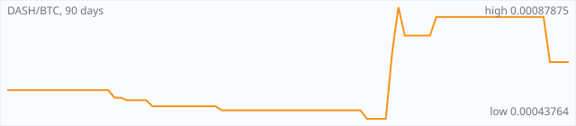

<a href="../"></a>

[All markets](../) · [Why testnet markets](../testnet-markets.md) · [Developers](../developers.md) · [Monthly reports](../reports/) · [Press kit](../press.md) · [altquick.com](https://altquick.com/)

# Dash (DASH) price in Bitcoin and how to buy it

Dash is a payments-focused cryptocurrency with a masternode network that provides InstantSend, ChainLocks and optional CoinJoin mixing. It trades against Bitcoin on AltQuick with a public order book and API.

**[Open the DASH/BTC market on AltQuick →](https://altquick.com/market/dash-bitcoin/)**

## Live DASH/BTC numbers

| | |
|---|---|
| Last price | 0.00066190 BTC |
| Best bid / ask | 0.00064885 / 0.00079303 BTC |
| Trades, last 7 days | 1 |
| Volume, last 7 days | 0.00002032 BTC |
| Last trade | 2026-09-29 18:56 UTC |

## About Dash

| | |
|---|---|
| Ticker | DASH |
| Launched | 18 January 2014, first as XCoin, soon renamed Darkcoin, and renamed Dash in March 2015. |
| Consensus | X11 proof of work for blocks (about every 2.5 minutes), plus a second tier of collateralized masternodes. |

Dash was launched on 18 January 2014 by Evan Duffield under the name XCoin. It was soon renamed Darkcoin, and in March 2015 it became Dash, short for digital cash. Miners use X11, a proof-of-work algorithm that chains eleven different hash functions, and a block is found about every two and a half minutes.

Dash's defining feature is its second tier of masternodes: servers that each lock up 1,000 DASH as collateral. Masternodes provide services ordinary miners don't. InstantSend locks a transaction within seconds so it can't be double-spent, ChainLocks has masternode quorums sign each block to protect against chain reorganizations, and CoinJoin (formerly PrivateSend) offers optional mixing for more privacy.

Block rewards are split between miners, masternodes and a treasury. Anyone can submit a proposal for treasury funding, and masternode owners vote on which ones get paid. That treasury has funded Dash's development for years without a company holding a premine.

Dash has been delisted by some exchanges because of its optional mixing. AltQuick keeps a DASH/BTC market; the live numbers below show how active it is right now.

### Official links

- Website: [www.dash.org](https://www.dash.org/)
- Explorer (Insight): [insight.dash.org/insight](https://insight.dash.org/insight/)
- Explorer (CryptoID): [chainz.cryptoid.info/dash](https://chainz.cryptoid.info/dash/)
- Source code: [github.com/dashpay/dash](https://github.com/dashpay/dash)

## DASH/BTC price history, last 90 days



| | |
|---|---|
| Change, 30 days | +51.2% |
| Change, 90 days | +20.1% |
| Highest daily close | 0.00087875 BTC |
| Lowest daily close | 0.00043764 BTC |

Daily candles from AltQuick's klines API, UTC days. On days without trades the previous close carries forward.

<details open><summary>Daily closes, last 30 days</summary>

| Date (UTC) | Close (BTC) | High | Low | Volume (DASH) |
|---|---|---|---|---|
| 2026-10-01 | 0.00066190 | 0.00066190 | 0.00066190 | 0 |
| 2026-09-30 | 0.00066190 | 0.00066190 | 0.00066190 | 0 |
| 2026-09-29 | 0.00066190 | 0.00066190 | 0.00066190 | 0.0306995 |
| 2026-09-28 | 0.00084000 | 0.00084000 | 0.00084000 | 0 |
| 2026-09-27 | 0.00084000 | 0.00084000 | 0.00084000 | 0 |
| 2026-09-26 | 0.00084000 | 0.00084000 | 0.00084000 | 0 |
| 2026-09-25 | 0.00084000 | 0.00084000 | 0.00084000 | 0 |
| 2026-09-24 | 0.00084000 | 0.00084000 | 0.00084000 | 0 |
| 2026-09-23 | 0.00084000 | 0.00084000 | 0.00084000 | 0 |
| 2026-09-22 | 0.00084000 | 0.00084000 | 0.00084000 | 0 |
| 2026-09-21 | 0.00084000 | 0.00084000 | 0.00084000 | 0 |
| 2026-09-20 | 0.00084000 | 0.00084000 | 0.00084000 | 0 |
| 2026-09-19 | 0.00084000 | 0.00084000 | 0.00084000 | 0 |
| 2026-09-18 | 0.00084000 | 0.00084000 | 0.00084000 | 0 |
| 2026-09-17 | 0.00084000 | 0.00084000 | 0.00084000 | 0 |
| 2026-09-16 | 0.00084000 | 0.00084000 | 0.00084000 | 0 |
| 2026-09-15 | 0.00084000 | 0.00084000 | 0.00084000 | 0 |
| 2026-09-14 | 0.00084000 | 0.00084000 | 0.00084000 | 0 |
| 2026-09-13 | 0.00084000 | 0.00084000 | 0.00084000 | 0 |
| 2026-09-12 | 0.00084000 | 0.00084000 | 0.00084000 | 0 |
| 2026-09-11 | 0.00084000 | 0.00084000 | 0.00079314 | 0.0705503 |
| 2026-09-10 | 0.00076685 | 0.00076685 | 0.00076685 | 0 |
| 2026-09-09 | 0.00076685 | 0.00076685 | 0.00076685 | 0 |
| 2026-09-08 | 0.00076685 | 0.00076685 | 0.00076685 | 0 |
| 2026-09-07 | 0.00076685 | 0.00076685 | 0.00076685 | 0 |
| 2026-09-06 | 0.00076685 | 0.00087000 | 0.00076685 | 2.11534 |
| 2026-09-05 | 0.00087875 | 0.00087875 | 0.00069875 | 84.6256 |
| 2026-09-04 | 0.00069875 | 0.00069875 | 0.00043764 | 73.7669 |
| 2026-09-03 | 0.00043764 | 0.00043764 | 0.00043764 | 0 |
| 2026-09-02 | 0.00043764 | 0.00043764 | 0.00043764 | 0 |

</details>

## Order book snapshot

Top 5 bids (buy orders) and asks (sell orders).

| Bid price (BTC) | Bid amount (DASH) | Ask price (BTC) | Ask amount (DASH) |
|---|---|---|---|
| 0.00064885 | 1.64109 | 0.00079303 | 0.0303967 |
| 0.00050000 | 0.12496 | 0.00084000 | 15 |
| 0.00043125 | 30.4402 | 0.00087875 | 43.7816 |
| 0.00011900 | 0.00655463 | 0.00400000 | 0.001 |
| 0.00010110 | 0.0395648 | 0.00541000 | 0.049 |

## Recent trades

| Time (UTC) | Side | Price (BTC) | Amount (DASH) |
|---|---|---|---|
| 2026-09-29 18:56 | sell | 0.00066190 | 0.03069955 |
| 2026-09-11 08:26 | buy | 0.00084000 | 0.00045239 |
| 2026-09-11 08:23 | buy | 0.00084000 | 0.04785715 |
| 2026-09-11 08:23 | buy | 0.00079314 | 0.02224072 |
| 2026-09-06 16:31 | sell | 0.00076685 | 0.02043811 |
| 2026-09-06 05:50 | buy | 0.00087000 | 0.00002286 |
| 2026-09-06 05:50 | buy | 0.00087000 | 0.00296043 |
| 2026-09-06 05:50 | buy | 0.00087000 | 0.53177044 |
| 2026-09-06 05:46 | buy | 0.00087000 | 0.05685058 |
| 2026-09-06 05:44 | buy | 0.00087000 | 0.09213794 |

## How to buy Dash with Bitcoin

1. Create a free account on [altquick.com](https://altquick.com/) and deposit Bitcoin.
2. Open the [DASH/BTC market](https://altquick.com/market/dash-bitcoin/), check the order book, and place a limit or market order.
3. Withdraw DASH to your own wallet, or keep it on AltQuick to trade later.

To sell, deposit DASH and place a sell order on the same market to receive Bitcoin.

## Dash FAQ

### What is Dash (DASH)?

Dash is a payments-focused cryptocurrency with a masternode network that provides InstantSend, ChainLocks and optional CoinJoin mixing.

### When did Dash launch?

18 January 2014, first as XCoin, soon renamed Darkcoin, and renamed Dash in March 2015.

### How is the Dash network secured?

X11 proof of work for blocks (about every 2.5 minutes), plus a second tier of collateralized masternodes.

### How do I buy Dash with Bitcoin?

Create a free account on altquick.com, deposit Bitcoin, then place a limit or market order on the [DASH/BTC market](https://altquick.com/market/dash-bitcoin/). You can withdraw DASH to your own wallet afterwards. AltQuick's trading fee is 1%.

### Where does the DASH price on this page come from?

From AltQuick's public API: the last price, order book and trades of the DASH/BTC market, and daily candles for the price history. No other exchanges are included.

## Related markets

- [Monero (XMR)](../monero/): Monero is a CryptoNote-based privacy coin launched in April 2014 that hides senders, receivers and amounts by default.
- [Zcash (ZEC)](../zcash/): Zcash is a 2016 Bitcoin-style coin with optional shielded payments using zero-knowledge proofs.
- [Litecoin (LTC)](../litecoin/): Litecoin is one of the oldest Bitcoin forks, launched by Charlie Lee in October 2011 with Scrypt mining and 2.5-minute blocks.

[See every AltQuick market](../) · [Dash on altquick.com](https://altquick.com/asset/dash/)

## Get this data yourself

```
curl "https://altquick.com/api/v1/trades?market=BTC_DASH&limit=20"
curl "https://altquick.com/api/v1/depth?market=BTC_DASH&limit=20"
curl "https://altquick.com/api/v1/klines?market=BTC_DASH&interval=1d&limit=90"
```

Background facts were checked against each project's own sites and public sources. Nothing here is investment advice.

Last updated: 2026-10-01 00:42 UTC from AltQuick's public API.

---

AltQuick, US-based since 2015. [altquick.com](https://altquick.com/) · [API docs](https://github.com/AltQuick-com/api) · hello@altquick.com
