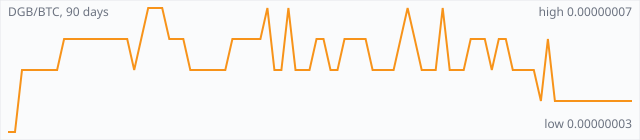

<a href="../"></a>

[All markets](../) · [Why testnet markets](../testnet-markets.md) · [Developers](../developers.md) · [Monthly reports](../reports/) · [Press kit](../press.md) · [altquick.com](https://altquick.com/)

# DigiByte (DGB) price in Bitcoin and how to buy it

DigiByte is a 2014 UTXO blockchain with 15-second blocks and five mining algorithms running side by side. It trades against Bitcoin on AltQuick with a public order book and API.

**[Open the DGB/BTC market on AltQuick →](https://altquick.com/market/digibyte-bitcoin/)**

## Live DGB/BTC numbers

| | |
|---|---|
| Last price | 0.00000004 BTC |
| Best bid / ask | 0.00000005 / 0.00000006 BTC |
| Trades, last 7 days | 7 |
| Volume, last 7 days | 0.00060173 BTC |
| Last trade | 2026-09-30 00:05 UTC |

## About DigiByte

| | |
|---|---|
| Ticker | DGB |
| Launched | 10 January 2014. |
| Consensus | Proof of work split across five algorithms (SHA-256, Scrypt, Skein, Qubit and Odocrypt), each targeting about a fifth of blocks. |

DigiByte was launched by Jared Tate on 10 January 2014. It's a UTXO chain in the Bitcoin family, tuned for speed: the block target is 15 seconds, forty times faster than Bitcoin. The maximum supply is 21 billion DGB.

Its most distinctive design choice is multi-algorithm mining. Five proof-of-work algorithms run at once (SHA-256, Scrypt, Skein, Qubit and Odocrypt), and each has its own difficulty and aims for about 20% of blocks. To take over the chain, an attacker would need a majority across several kinds of mining hardware, not just one. Odocrypt replaced Groestl in 2019 and changes itself every ten days, which makes it hard to build dedicated ASICs for.

DigiByte also created DigiShield, a difficulty adjustment that reacts quickly when hash power arrives or leaves. Other coins, Dogecoin among them, later adopted it. On top of the base chain the project offers DigiAssets for issuing tokens and Digi-ID for password-free logins.

DigiByte addresses are not interchangeable with Bitcoin addresses; withdraw only to a DGB wallet.

### Official links

- Website: [digibyte.org](https://digibyte.org/)
- Explorer: [digiexplorer.info](https://digiexplorer.info/)
- Explorer (CryptoID): [chainz.cryptoid.info/dgb](https://chainz.cryptoid.info/dgb/)
- Source code: [github.com/digibyte/digibyte](https://github.com/digibyte/digibyte)

## DGB/BTC price history, last 90 days



| | |
|---|---|
| Change, 30 days | -20.0% |
| Change, 90 days | -20.0% |
| Highest daily close | 0.00000007 BTC |
| Lowest daily close | 0.00000003 BTC |

Daily candles from AltQuick's klines API, UTC days. On days without trades the previous close carries forward.

<details open><summary>Daily closes, last 30 days</summary>

| Date (UTC) | Close (BTC) | High | Low | Volume (DGB) |
|---|---|---|---|---|
| 2026-10-01 | 0.00000004 | 0.00000004 | 0.00000004 | 0 |
| 2026-09-30 | 0.00000004 | 0.00000004 | 0.00000004 | 70.4492 |
| 2026-09-29 | 0.00000004 | 0.00000004 | 0.00000004 | 0 |
| 2026-09-28 | 0.00000004 | 0.00000004 | 0.00000004 | 0 |
| 2026-09-27 | 0.00000004 | 0.00000004 | 0.00000004 | 0 |
| 2026-09-26 | 0.00000004 | 0.00000004 | 0.00000004 | 3034.54 |
| 2026-09-25 | 0.00000004 | 0.00000006 | 0.00000004 | 9536.25 |
| 2026-09-24 | 0.00000004 | 0.00000004 | 0.00000004 | 79.1904 |
| 2026-09-23 | 0.00000006 | 0.00000006 | 0.00000004 | 235.355 |
| 2026-09-22 | 0.00000004 | 0.00000005 | 0.00000004 | 8998.44 |
| 2026-09-21 | 0.00000005 | 0.00000005 | 0.00000005 | 1420.64 |
| 2026-09-20 | 0.00000005 | 0.00000005 | 0.00000005 | 60.1695 |
| 2026-09-19 | 0.00000005 | 0.00000005 | 0.00000005 | 798 |
| 2026-09-18 | 0.00000005 | 0.00000005 | 0.00000005 | 1310.59 |
| 2026-09-17 | 0.00000006 | 0.00000006 | 0.00000006 | 0 |
| 2026-09-16 | 0.00000006 | 0.00000006 | 0.00000005 | 193526 |
| 2026-09-15 | 0.00000005 | 0.00000005 | 0.00000005 | 1789.85 |
| 2026-09-14 | 0.00000006 | 0.00000006 | 0.00000005 | 124.46 |
| 2026-09-13 | 0.00000006 | 0.00000006 | 0.00000006 | 0 |
| 2026-09-12 | 0.00000006 | 0.00000006 | 0.00000005 | 1235.98 |
| 2026-09-11 | 0.00000005 | 0.00000005 | 0.00000005 | 672.613 |
| 2026-09-10 | 0.00000005 | 0.00000005 | 0.00000005 | 179.819 |
| 2026-09-09 | 0.00000005 | 0.00000006 | 0.00000005 | 479.377 |
| 2026-09-08 | 0.00000007 | 0.00000007 | 0.00000007 | 14.8571 |
| 2026-09-07 | 0.00000005 | 0.00000005 | 0.00000005 | 80.3655 |
| 2026-09-06 | 0.00000005 | 0.00000005 | 0.00000005 | 0 |
| 2026-09-05 | 0.00000005 | 0.00000007 | 0.00000005 | 445.908 |
| 2026-09-04 | 0.00000006 | 0.00000007 | 0.00000006 | 20.119 |
| 2026-09-03 | 0.00000007 | 0.00000007 | 0.00000006 | 80.0952 |
| 2026-09-02 | 0.00000006 | 0.00000006 | 0.00000006 | 18 |

</details>

## Order book snapshot

Top 5 bids (buy orders) and asks (sell orders).

| Bid price (BTC) | Bid amount (DGB) | Ask price (BTC) | Ask amount (DGB) |
|---|---|---|---|
| 0.00000005 | 18.4 | 0.00000006 | 130510 |
| 0.00000004 | 1.98933e+06 | 0.00000007 | 83362.1 |
| 0.00000003 | 1.97997e+06 | 0.00000008 | 97826.8 |
| 0.00000002 | 1.98534e+06 | 0.00000009 | 97330.2 |
| 0.00000001 | 2.94528e+06 | 0.00000010 | 97458.9 |

## Recent trades

| Time (UTC) | Side | Price (BTC) | Amount (DGB) |
|---|---|---|---|
| 2026-09-30 00:05 | sell | 0.00000004 | 70.44924661 |
| 2026-09-26 08:38 | sell | 0.00000004 | 3034.54460977 |
| 2026-09-25 21:57 | sell | 0.00000004 | 4639.01527128 |
| 2026-09-25 21:28 | buy | 0.00000006 | 4019.50000000 |
| 2026-09-25 21:22 | buy | 0.00000006 | 626.33333333 |
| 2026-09-25 18:49 | sell | 0.00000004 | 251.40144057 |
| 2026-09-24 03:41 | sell | 0.00000004 | 79.19040807 |
| 2026-09-23 23:47 | buy | 0.00000006 | 3.00000000 |
| 2026-09-23 17:38 | sell | 0.00000004 | 203.35465276 |
| 2026-09-23 17:38 | sell | 0.00000005 | 29.00000000 |

## How to buy DigiByte with Bitcoin

1. Create a free account on [altquick.com](https://altquick.com/) and deposit Bitcoin.
2. Open the [DGB/BTC market](https://altquick.com/market/digibyte-bitcoin/), check the order book, and place a limit or market order.
3. Withdraw DGB to your own wallet, or keep it on AltQuick to trade later.

To sell, deposit DGB and place a sell order on the same market to receive Bitcoin.

## DigiByte FAQ

### What is DigiByte (DGB)?

DigiByte is a 2014 UTXO blockchain with 15-second blocks and five mining algorithms running side by side.

### When did DigiByte launch?

10 January 2014.

### How is the DigiByte network secured?

Proof of work split across five algorithms (SHA-256, Scrypt, Skein, Qubit and Odocrypt), each targeting about a fifth of blocks.

### How do I buy DigiByte with Bitcoin?

Create a free account on altquick.com, deposit Bitcoin, then place a limit or market order on the [DGB/BTC market](https://altquick.com/market/digibyte-bitcoin/). You can withdraw DGB to your own wallet afterwards. AltQuick's trading fee is 1%.

### Where does the DGB price on this page come from?

From AltQuick's public API: the last price, order book and trades of the DGB/BTC market, and daily candles for the price history. No other exchanges are included.

## Related markets

- [Litecoin (LTC)](../litecoin/): Litecoin is one of the oldest Bitcoin forks, launched by Charlie Lee in October 2011 with Scrypt mining and 2.5-minute blocks.
- [Dogecoin (DOGE)](../dogecoin/): Dogecoin is the Shiba Inu meme coin launched in December 2013, a Scrypt chain merge-mined with Litecoin.
- [Mazacoin (MAZA)](../mazacoin/): Mazacoin is a 2014 SHA-256 coin created by Payu Harris for the Oglala Lakota Nation and other tribal economies.

[See every AltQuick market](../) · [DigiByte on altquick.com](https://altquick.com/asset/digibyte/)

## Get this data yourself

```
curl "https://altquick.com/api/v1/trades?market=BTC_DGB&limit=20"
curl "https://altquick.com/api/v1/depth?market=BTC_DGB&limit=20"
curl "https://altquick.com/api/v1/klines?market=BTC_DGB&interval=1d&limit=90"
```

Background facts were checked against each project's own sites and public sources. Nothing here is investment advice.

Last updated: 2026-10-01 00:42 UTC from AltQuick's public API.

---

AltQuick, US-based since 2015. [altquick.com](https://altquick.com/) · [API docs](https://github.com/AltQuick-com/api) · hello@altquick.com
