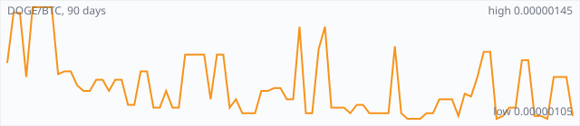

<a href="../"></a>

[All markets](../) · [Why testnet markets](../testnet-markets.md) · [Developers](../developers.md) · [Monthly reports](../reports/) · [Press kit](../press.md) · [altquick.com](https://altquick.com/)

# Dogecoin (DOGE) price in Bitcoin and how to buy it

Dogecoin is the Shiba Inu meme coin launched in December 2013, a Scrypt chain merge-mined with Litecoin. It trades against Bitcoin on AltQuick with a public order book and API.

**[Open the DOGE/BTC market on AltQuick →](https://altquick.com/market/dogecoin-bitcoin/)**

## Live DOGE/BTC numbers

| | |
|---|---|
| Last price | 0.00000106 BTC |
| Best bid / ask | 0.00000110 / 0.00000118 BTC |
| Trades, last 7 days | 49 |
| Volume, last 7 days | 0.00105610 BTC |
| Last trade | 2026-10-01 05:56 UTC |

## About Dogecoin

| | |
|---|---|
| Ticker | DOGE |
| Launched | 6 December 2013. |
| Consensus | Scrypt proof of work with one-minute blocks, merge-mined with Litecoin (AuxPoW) since 2014. |

Dogecoin was created by Billy Markus and Jackson Palmer and launched on 6 December 2013. It began as a joke about the flood of new altcoins, using the Shiba Inu 'doge' meme as its mascot, and found a large, friendly community almost immediately. Tipping strangers small amounts of DOGE online was the coin's first real use.

Technically Dogecoin sits in the Litecoin family. It uses Scrypt proof of work with a one-minute block target. Since 2014 it has been merge-mined with Litecoin, so Litecoin miners can secure both chains at once with the same work, which gave Dogecoin far more hash power than it could attract alone. It also adopted DigiByte's DigiShield difficulty adjustment.

Unlike Bitcoin, Dogecoin has no supply cap. After an early period of random block rewards, the reward was fixed at 10,000 DOGE per block, about 5 billion new coins a year. That fixed issuance shrinks as a percentage of supply over time.

Dogecoin addresses usually start with D; withdraw only to a DOGE wallet.

### Official links

- Website: [dogecoin.com](https://dogecoin.com/)
- Explorer: [dogechain.info](https://dogechain.info/)
- Source code: [github.com/dogecoin/dogecoin](https://github.com/dogecoin/dogecoin)

## DOGE/BTC price history, last 90 days



| | |
|---|---|
| Change, 30 days | -0.9% |
| Change, 90 days | -11.7% |
| Highest daily close | 0.00000145 BTC |
| Lowest daily close | 0.00000105 BTC |

Daily candles from AltQuick's klines API, UTC days. On days without trades the previous close carries forward.

<details open><summary>Daily closes, last 30 days</summary>

| Date (UTC) | Close (BTC) | High | Low | Volume (DOGE) |
|---|---|---|---|---|
| 2026-10-04 | 0.00000106 | 0.00000106 | 0.00000106 | 0 |
| 2026-10-03 | 0.00000106 | 0.00000106 | 0.00000106 | 0 |
| 2026-10-02 | 0.00000106 | 0.00000106 | 0.00000106 | 0 |
| 2026-10-01 | 0.00000106 | 0.00000106 | 0.00000106 | 4.81 |
| 2026-09-30 | 0.00000120 | 0.00000120 | 0.00000120 | 0 |
| 2026-09-29 | 0.00000120 | 0.00000120 | 0.00000120 | 0.075 |
| 2026-09-28 | 0.00000120 | 0.00000120 | 0.00000105 | 910.293 |
| 2026-09-27 | 0.00000105 | 0.00000127 | 0.00000105 | 89.8434 |
| 2026-09-26 | 0.00000106 | 0.00000106 | 0.00000106 | 0 |
| 2026-09-25 | 0.00000106 | 0.00000126 | 0.00000105 | 811.699 |
| 2026-09-24 | 0.00000126 | 0.00000126 | 0.00000126 | 1.11905 |
| 2026-09-23 | 0.00000126 | 0.00000126 | 0.00000126 | 0.28 |
| 2026-09-22 | 0.00000109 | 0.00000109 | 0.00000109 | 0 |
| 2026-09-21 | 0.00000109 | 0.00000133 | 0.00000109 | 91.8271 |
| 2026-09-20 | 0.00000106 | 0.00000125 | 0.00000105 | 1.79 |
| 2026-09-19 | 0.00000105 | 0.00000108 | 0.00000105 | 318.066 |
| 2026-09-18 | 0.00000129 | 0.00000129 | 0.00000105 | 88.0875 |
| 2026-09-17 | 0.00000129 | 0.00000129 | 0.00000109 | 9.01248 |
| 2026-09-16 | 0.00000120 | 0.00000129 | 0.00000117 | 3.10162 |
| 2026-09-15 | 0.00000113 | 0.00000133 | 0.00000105 | 123.915 |
| 2026-09-14 | 0.00000114 | 0.00000117 | 0.00000105 | 7.09831 |
| 2026-09-13 | 0.00000106 | 0.00000113 | 0.00000105 | 7.99 |
| 2026-09-12 | 0.00000112 | 0.00000112 | 0.00000105 | 42.0962 |
| 2026-09-11 | 0.00000112 | 0.00000112 | 0.00000112 | 0 |
| 2026-09-10 | 0.00000112 | 0.00000112 | 0.00000105 | 4.64051 |
| 2026-09-09 | 0.00000107 | 0.00000107 | 0.00000107 | 0.18 |
| 2026-09-08 | 0.00000107 | 0.00000131 | 0.00000107 | 4.71855 |
| 2026-09-07 | 0.00000105 | 0.00000105 | 0.00000105 | 0.69 |
| 2026-09-06 | 0.00000105 | 0.00000105 | 0.00000105 | 1.05 |
| 2026-09-05 | 0.00000105 | 0.00000107 | 0.00000105 | 3447.91 |

</details>

## Order book snapshot

Top 5 bids (buy orders) and asks (sell orders).

| Bid price (BTC) | Bid amount (DOGE) | Ask price (BTC) | Ask amount (DOGE) |
|---|---|---|---|
| 0.00000110 | 0.981818 | 0.00000118 | 1.30181 |
| 0.00000106 | 29.1994 | 0.00000119 | 0.798319 |
| 0.00000105 | 4958.58 | 0.00000127 | 27.6823 |
| 0.00000104 | 0.0576923 | 0.00000129 | 1.27717 |
| 0.00000103 | 8125.75 | 0.00000130 | 3 |

## Recent trades

| Time (UTC) | Side | Price (BTC) | Amount (DOGE) |
|---|---|---|---|
| 2026-10-01 05:56 | sell | 0.00000106 | 4.50000000 |
| 2026-10-01 00:36 | sell | 0.00000106 | 0.31000000 |
| 2026-09-29 18:41 | buy | 0.00000120 | 0.07500000 |
| 2026-09-28 18:54 | buy | 0.00000120 | 2.71666667 |
| 2026-09-28 01:59 | sell | 0.00000105 | 181.50397202 |
| 2026-09-28 01:01 | sell | 0.00000105 | 626.07282329 |
| 2026-09-28 01:00 | sell | 0.00000105 | 100.00000000 |
| 2026-09-27 21:52 | sell | 0.00000105 | 56.19514051 |
| 2026-09-27 21:52 | sell | 0.00000106 | 0.34905661 |
| 2026-09-27 21:52 | sell | 0.00000106 | 0.93396227 |

## How to buy Dogecoin with Bitcoin

1. Create a free account on [altquick.com](https://altquick.com/) and deposit Bitcoin.
2. Open the [DOGE/BTC market](https://altquick.com/market/dogecoin-bitcoin/), check the order book, and place a limit or market order.
3. Withdraw DOGE to your own wallet, or keep it on AltQuick to trade later.

To sell, deposit DOGE and place a sell order on the same market to receive Bitcoin.

## Dogecoin FAQ

### What is Dogecoin (DOGE)?

Dogecoin is the Shiba Inu meme coin launched in December 2013, a Scrypt chain merge-mined with Litecoin.

### When did Dogecoin launch?

6 December 2013.

### How is the Dogecoin network secured?

Scrypt proof of work with one-minute blocks, merge-mined with Litecoin (AuxPoW) since 2014.

### How do I buy Dogecoin with Bitcoin?

Create a free account on altquick.com, deposit Bitcoin, then place a limit or market order on the [DOGE/BTC market](https://altquick.com/market/dogecoin-bitcoin/). You can withdraw DOGE to your own wallet afterwards. AltQuick's trading fee is 1%.

### Where does the DOGE price on this page come from?

From AltQuick's public API: the last price, order book and trades of the DOGE/BTC market, and daily candles for the price history. No other exchanges are included.

## Related markets

- [Litecoin (LTC)](../litecoin/): Litecoin is one of the oldest Bitcoin forks, launched by Charlie Lee in October 2011 with Scrypt mining and 2.5-minute blocks.
- [Clamcoin (CLAM)](../clamcoin/): Clams (CLAM) is a proof-of-stake coin that was airdropped in 2014 to every Bitcoin, Litecoin and Dogecoin address holding a balance.
- [Wownero (WOW)](../wownero/): Wownero is a Doge-inspired, CPU-mined privacy memecoin forked from Monero and launched on 1 April 2018.

[See every AltQuick market](../) · [Dogecoin on altquick.com](https://altquick.com/asset/dogecoin/)

## Get this data yourself

```
curl "https://altquick.com/api/v1/trades?market=BTC_DOGE&limit=20"
curl "https://altquick.com/api/v1/depth?market=BTC_DOGE&limit=20"
curl "https://altquick.com/api/v1/klines?market=BTC_DOGE&interval=1d&limit=90"
```

Background facts were checked against each project's own sites and public sources. Nothing here is investment advice.

Last updated: 2026-10-04 10:43 UTC from AltQuick's public API.

---

AltQuick, US-based since 2015. [altquick.com](https://altquick.com/) · [API docs](https://github.com/AltQuick-com/api) · hello@altquick.com
