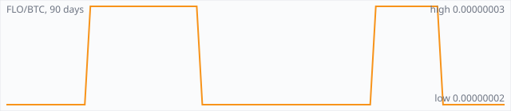

<a href="../"></a>

[All markets](../) · [Why testnet markets](../testnet-markets.md) · [Developers](../developers.md) · [Monthly reports](../reports/) · [Press kit](../press.md) · [altquick.com](https://altquick.com/)

# Florincoin (FLO) price in Bitcoin and how to buy it

FLO, originally Florincoin, is a 2013 Scrypt coin that lets every transaction carry a text field, used to store metadata on chain. It trades against Bitcoin on AltQuick with a public order book and API.

**[Open the FLO/BTC market on AltQuick →](https://altquick.com/market/florincoin-bitcoin/)**

## Live FLO/BTC numbers

| | |
|---|---|
| Last price | 0.00000002 BTC |
| Best bid / ask | 0.00000002 / 0.00000003 BTC |
| Trades, last 7 days | 4 |
| Volume, last 7 days | 0.00018004 BTC |
| Last trade | 2026-10-01 15:14 UTC |

## About Florincoin

| | |
|---|---|
| Ticker | FLO |
| Launched | 17 June 2013, with no premine. |
| Consensus | Scrypt proof of work with 40-second blocks. |

FLO launched as Florincoin on 17 June 2013, released with no premine by a developer known as skyangel. It's a Scrypt proof-of-work coin with a 40-second block target and a total supply of 160 million coins.

Its contribution was a text field on every transaction. Florincoin was the first coin to build a transaction comment into the protocol and wallet, now called floData. The field started at 140 characters, a hard fork in late 2013 raised it to 528 bytes, and it now holds 1,040 bytes. Bitcoin's OP_RETURN outputs carry far less data and are pruned by many nodes, while floData stays part of the permanent transaction history.

That made FLO a base layer for applications that need to record small pieces of data permanently. The Alexandria project and its Open Index Protocol (OIP) used FLO to publish indexes and metadata for content stored elsewhere, so a record can be found and verified later without trusting a single server.

A note on links: the flo.cash domain that used to host the project site now shows a for-sale page, so this page links only to the source code.

### Official links

- Source code: [github.com/floblockchain/flo](https://github.com/floblockchain/flo)

## FLO/BTC price history, last 90 days



| | |
|---|---|
| Change, 30 days | +0.0% |
| Change, 90 days | +0.0% |
| Highest daily close | 0.00000003 BTC |
| Lowest daily close | 0.00000002 BTC |

Daily candles from AltQuick's klines API, UTC days. On days without trades the previous close carries forward.

<details open><summary>Daily closes, last 30 days</summary>

| Date (UTC) | Close (BTC) | High | Low | Volume (FLO) |
|---|---|---|---|---|
| 2026-10-04 | 0.00000002 | 0.00000002 | 0.00000002 | 0 |
| 2026-10-03 | 0.00000002 | 0.00000002 | 0.00000002 | 0 |
| 2026-10-02 | 0.00000002 | 0.00000002 | 0.00000002 | 0 |
| 2026-10-01 | 0.00000002 | 0.00000002 | 0.00000002 | 2.8 |
| 2026-09-30 | 0.00000002 | 0.00000002 | 0.00000002 | 9000 |
| 2026-09-29 | 0.00000002 | 0.00000002 | 0.00000002 | 0 |
| 2026-09-28 | 0.00000002 | 0.00000002 | 0.00000002 | 0 |
| 2026-09-27 | 0.00000002 | 0.00000002 | 0.00000002 | 0 |
| 2026-09-26 | 0.00000002 | 0.00000002 | 0.00000002 | 0 |
| 2026-09-25 | 0.00000002 | 0.00000002 | 0.00000002 | 0 |
| 2026-09-24 | 0.00000002 | 0.00000002 | 0.00000002 | 0 |
| 2026-09-23 | 0.00000002 | 0.00000002 | 0.00000002 | 12.4 |
| 2026-09-22 | 0.00000003 | 0.00000003 | 0.00000003 | 0 |
| 2026-09-21 | 0.00000003 | 0.00000003 | 0.00000003 | 0 |
| 2026-09-20 | 0.00000003 | 0.00000003 | 0.00000003 | 0 |
| 2026-09-19 | 0.00000003 | 0.00000003 | 0.00000003 | 0 |
| 2026-09-18 | 0.00000003 | 0.00000003 | 0.00000003 | 0 |
| 2026-09-17 | 0.00000003 | 0.00000003 | 0.00000003 | 0 |
| 2026-09-16 | 0.00000003 | 0.00000003 | 0.00000003 | 0 |
| 2026-09-15 | 0.00000003 | 0.00000003 | 0.00000003 | 0 |
| 2026-09-14 | 0.00000003 | 0.00000003 | 0.00000003 | 0 |
| 2026-09-13 | 0.00000003 | 0.00000003 | 0.00000003 | 0 |
| 2026-09-12 | 0.00000003 | 0.00000003 | 0.00000003 | 0 |
| 2026-09-11 | 0.00000003 | 0.00000003 | 0.00000003 | 100 |
| 2026-09-10 | 0.00000002 | 0.00000002 | 0.00000002 | 0 |
| 2026-09-09 | 0.00000002 | 0.00000002 | 0.00000002 | 0 |
| 2026-09-08 | 0.00000002 | 0.00000002 | 0.00000002 | 0 |
| 2026-09-07 | 0.00000002 | 0.00000002 | 0.00000002 | 0 |
| 2026-09-06 | 0.00000002 | 0.00000002 | 0.00000002 | 0 |
| 2026-09-05 | 0.00000002 | 0.00000002 | 0.00000002 | 0 |

</details>

## Order book snapshot

Top 5 bids (buy orders) and asks (sell orders).

| Bid price (BTC) | Bid amount (FLO) | Ask price (BTC) | Ask amount (FLO) |
|---|---|---|---|
| 0.00000002 | 15985.6 | 0.00000003 | 3563 |
| 0.00000001 | 131438 | 0.00000004 | 3084.99 |
|  |  | 0.00000005 | 34.5 |
|  |  | 0.00000006 | 4013 |
|  |  | 0.00000007 | 212.495 |

## Recent trades

| Time (UTC) | Side | Price (BTC) | Amount (FLO) |
|---|---|---|---|
| 2026-10-01 15:14 | sell | 0.00000002 | 2.80000000 |
| 2026-09-30 21:32 | sell | 0.00000002 | 660.59533035 |
| 2026-09-30 21:32 | sell | 0.00000002 | 5086.00000001 |
| 2026-09-30 21:32 | sell | 0.00000002 | 3253.40466964 |
| 2026-09-23 19:14 | sell | 0.00000002 | 12.40000000 |
| 2026-09-11 11:38 | buy | 0.00000003 | 100.00000000 |
| 2026-09-04 19:16 | sell | 0.00000002 | 8.19947926 |
| 2026-08-24 19:58 | sell | 0.00000002 | 83.71098552 |
| 2026-08-23 23:13 | sell | 0.00000002 | 1556.18486558 |
| 2026-08-11 17:36 | sell | 0.00000002 | 86.10000000 |

## How to buy Florincoin with Bitcoin

1. Create a free account on [altquick.com](https://altquick.com/) and deposit Bitcoin.
2. Open the [FLO/BTC market](https://altquick.com/market/florincoin-bitcoin/), check the order book, and place a limit or market order.
3. Withdraw FLO to your own wallet, or keep it on AltQuick to trade later.

To sell, deposit FLO and place a sell order on the same market to receive Bitcoin.

## Florincoin FAQ

### What is Florincoin (FLO)?

FLO, originally Florincoin, is a 2013 Scrypt coin that lets every transaction carry a text field, used to store metadata on chain.

### When did Florincoin launch?

17 June 2013, with no premine.

### How is the Florincoin network secured?

Scrypt proof of work with 40-second blocks.

### How do I buy Florincoin with Bitcoin?

Create a free account on altquick.com, deposit Bitcoin, then place a limit or market order on the [FLO/BTC market](https://altquick.com/market/florincoin-bitcoin/). You can withdraw FLO to your own wallet afterwards. AltQuick's trading fee is 1%.

### Where does the FLO price on this page come from?

From AltQuick's public API: the last price, order book and trades of the FLO/BTC market, and daily candles for the price history. No other exchanges are included.

## Related markets

- [Namecoin (NMC)](../namecoin/): Namecoin, launched in April 2011, was the first fork of Bitcoin; it adds a decentralized name registry used for .bit domains and identities.
- [Mazacoin (MAZA)](../mazacoin/): Mazacoin is a 2014 SHA-256 coin created by Payu Harris for the Oglala Lakota Nation and other tribal economies.
- [Litecoin (LTC)](../litecoin/): Litecoin is one of the oldest Bitcoin forks, launched by Charlie Lee in October 2011 with Scrypt mining and 2.5-minute blocks.

[See every AltQuick market](../) · [Florincoin on altquick.com](https://altquick.com/asset/florincoin/)

## Get this data yourself

```
curl "https://altquick.com/api/v1/trades?market=BTC_FLO&limit=20"
curl "https://altquick.com/api/v1/depth?market=BTC_FLO&limit=20"
curl "https://altquick.com/api/v1/klines?market=BTC_FLO&interval=1d&limit=90"
```

Background facts were checked against each project's own sites and public sources. Nothing here is investment advice.

Last updated: 2026-10-04 10:43 UTC from AltQuick's public API.

---

AltQuick, US-based since 2015. [altquick.com](https://altquick.com/) · [API docs](https://github.com/AltQuick-com/api) · hello@altquick.com
