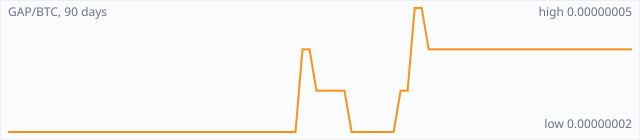

<a href="../"></a>

[All markets](../) · [Why testnet markets](../testnet-markets.md) · [Developers](../developers.md) · [Monthly reports](../reports/) · [Press kit](../press.md) · [altquick.com](https://altquick.com/)

# Gapcoin (GAP) price in Bitcoin and how to buy it

Gapcoin is a prime-number coin whose proof of work searches for record-sized gaps between consecutive primes. It trades against Bitcoin on AltQuick with a public order book and API.

**[Open the GAP/BTC market on AltQuick →](https://altquick.com/market/gapcoin-bitcoin/)**

## Live GAP/BTC numbers

| | |
|---|---|
| Last price | 0.00000004 BTC |
| Best bid / ask | 0.00000004 / 0.00000006 BTC |
| Trades, last 7 days | 0 |
| Volume, last 7 days | 0.00000000 BTC |
| Last trade | 2026-09-13 23:18 UTC |

## About Gapcoin

| | |
|---|---|
| Ticker | GAP |
| Launched | 21 October 2014 at 18:00 UTC, with no premine. |
| Consensus | Custom proof of work that searches for large prime gaps, with difficulty measured by a gap's merit; 2.5-minute block target. |

Gapcoin launched on 21 October 2014 at 18:00 UTC with no premine. Like Primecoin and Riecoin, it replaces pointless hashing with a math problem, but a different one: it hunts for prime gaps, long runs of composite numbers between two consecutive primes.

Difficulty is measured by a gap's merit, the gap length divided by the natural logarithm of the starting prime. That makes gaps near primes of different sizes comparable. To tie the work to a block, miners build candidate primes from the block header hash multiplied by 2^shift plus an adder, and the adder must be smaller than 2^shift so one search can't be reused for another block. Because nobody can predict where large gaps occur, every share is equally valuable, which makes pool payouts simpler than on other prime coins. The search has turned up many first-known-occurrence records on the public prime gap lists.

The block target is 2.5 minutes and difficulty adjusts every block. The block reward scales with difficulty and halves every 420,000 blocks, so the final supply isn't fixed; the project estimates about 10 to 30 million GAP.

In 2026 the maintainers released Gapcoin Core 2606, rebuilt on the same base as Riecoin Core. Read their upgrade notes before moving coins. The old gapcoin.org domain now hosts an unrelated gambling site, so don't use it.

### Official links

- Website (Gapcoin Core): [gapcoin.club](https://gapcoin.club/)
- Project site: [gapcoin-project.github.io](https://gapcoin-project.github.io/)
- Source code: [github.com/PrimesClub/Gapcoin](https://github.com/PrimesClub/Gapcoin)

## GAP/BTC price history, last 90 days



| | |
|---|---|
| Change, 30 days | +0.0% |
| Change, 90 days | +100.0% |
| Highest daily close | 0.00000005 BTC |
| Lowest daily close | 0.00000002 BTC |

Daily candles from AltQuick's klines API, UTC days. On days without trades the previous close carries forward.

<details open><summary>Daily closes, last 30 days</summary>

| Date (UTC) | Close (BTC) | High | Low | Volume (GAP) |
|---|---|---|---|---|
| 2026-10-04 | 0.00000004 | 0.00000004 | 0.00000004 | 0 |
| 2026-10-03 | 0.00000004 | 0.00000004 | 0.00000004 | 0 |
| 2026-10-02 | 0.00000004 | 0.00000004 | 0.00000004 | 0 |
| 2026-10-01 | 0.00000004 | 0.00000004 | 0.00000004 | 0 |
| 2026-09-30 | 0.00000004 | 0.00000004 | 0.00000004 | 0 |
| 2026-09-29 | 0.00000004 | 0.00000004 | 0.00000004 | 0 |
| 2026-09-28 | 0.00000004 | 0.00000004 | 0.00000004 | 0 |
| 2026-09-27 | 0.00000004 | 0.00000004 | 0.00000004 | 0 |
| 2026-09-26 | 0.00000004 | 0.00000004 | 0.00000004 | 0 |
| 2026-09-25 | 0.00000004 | 0.00000004 | 0.00000004 | 0 |
| 2026-09-24 | 0.00000004 | 0.00000004 | 0.00000004 | 0 |
| 2026-09-23 | 0.00000004 | 0.00000004 | 0.00000004 | 0 |
| 2026-09-22 | 0.00000004 | 0.00000004 | 0.00000004 | 0 |
| 2026-09-21 | 0.00000004 | 0.00000004 | 0.00000004 | 0 |
| 2026-09-20 | 0.00000004 | 0.00000004 | 0.00000004 | 0 |
| 2026-09-19 | 0.00000004 | 0.00000004 | 0.00000004 | 0 |
| 2026-09-18 | 0.00000004 | 0.00000004 | 0.00000004 | 0 |
| 2026-09-17 | 0.00000004 | 0.00000004 | 0.00000004 | 0 |
| 2026-09-16 | 0.00000004 | 0.00000004 | 0.00000004 | 0 |
| 2026-09-15 | 0.00000004 | 0.00000004 | 0.00000004 | 0 |
| 2026-09-14 | 0.00000004 | 0.00000004 | 0.00000004 | 0 |
| 2026-09-13 | 0.00000004 | 0.00000004 | 0.00000004 | 1.4 |
| 2026-09-12 | 0.00000004 | 0.00000004 | 0.00000004 | 0 |
| 2026-09-11 | 0.00000004 | 0.00000004 | 0.00000004 | 0 |
| 2026-09-10 | 0.00000004 | 0.00000004 | 0.00000004 | 0 |
| 2026-09-09 | 0.00000004 | 0.00000004 | 0.00000004 | 0 |
| 2026-09-08 | 0.00000004 | 0.00000004 | 0.00000004 | 2 |
| 2026-09-07 | 0.00000004 | 0.00000004 | 0.00000004 | 0 |
| 2026-09-06 | 0.00000004 | 0.00000004 | 0.00000004 | 0 |
| 2026-09-05 | 0.00000004 | 0.00000004 | 0.00000004 | 0 |

</details>

## Order book snapshot

Top 5 bids (buy orders) and asks (sell orders).

| Bid price (BTC) | Bid amount (GAP) | Ask price (BTC) | Ask amount (GAP) |
|---|---|---|---|
| 0.00000004 | 13.85 | 0.00000006 | 6.17 |
| 0.00000003 | 81.3333 | 0.00000007 | 13 |
| 0.00000002 | 3126.35 | 0.00000008 | 8.8 |
| 0.00000001 | 9400 | 0.00000009 | 9 |
|  |  | 0.00000010 | 17.1 |

## Recent trades

| Time (UTC) | Side | Price (BTC) | Amount (GAP) |
|---|---|---|---|
| 2026-09-13 23:18 | sell | 0.00000004 | 1.40000000 |
| 2026-09-08 07:12 | sell | 0.00000004 | 2.00000000 |
| 2026-09-04 19:16 | sell | 0.00000004 | 155.00630167 |
| 2026-09-02 19:40 | buy | 0.00000005 | 20.10000000 |
| 2026-09-02 19:40 | buy | 0.00000005 | 34.40000000 |
| 2026-09-02 09:30 | sell | 0.00000004 | 99.00000000 |
| 2026-09-02 09:00 | buy | 0.00000004 | 11.00000000 |
| 2026-09-02 09:00 | buy | 0.00000004 | 2.00000000 |
| 2026-08-31 09:35 | sell | 0.00000003 | 1.80000000 |
| 2026-08-24 19:58 | sell | 0.00000002 | 32.72614255 |

## How to buy Gapcoin with Bitcoin

1. Create a free account on [altquick.com](https://altquick.com/) and deposit Bitcoin.
2. Open the [GAP/BTC market](https://altquick.com/market/gapcoin-bitcoin/), check the order book, and place a limit or market order.
3. Withdraw GAP to your own wallet, or keep it on AltQuick to trade later.

To sell, deposit GAP and place a sell order on the same market to receive Bitcoin.

## Gapcoin FAQ

### What is Gapcoin (GAP)?

Gapcoin is a prime-number coin whose proof of work searches for record-sized gaps between consecutive primes.

### When did Gapcoin launch?

21 October 2014 at 18:00 UTC, with no premine.

### How is the Gapcoin network secured?

Custom proof of work that searches for large prime gaps, with difficulty measured by a gap's merit; 2.5-minute block target.

### How do I buy Gapcoin with Bitcoin?

Create a free account on altquick.com, deposit Bitcoin, then place a limit or market order on the [GAP/BTC market](https://altquick.com/market/gapcoin-bitcoin/). You can withdraw GAP to your own wallet afterwards. AltQuick's trading fee is 1%.

### Where does the GAP price on this page come from?

From AltQuick's public API: the last price, order book and trades of the GAP/BTC market, and daily candles for the price history. No other exchanges are included.

## Related markets

- [Curecoin (CURE)](../curecoin/): Curecoin rewards people who run Folding@home disease-research simulations and secures its chain with proof of stake.
- [42-coin (42)](../42-coin/): 42-coin is a Scrypt proof-of-work and proof-of-stake coin with a hard cap of just 42 coins.
- [Florincoin (FLO)](../florincoin/): FLO, originally Florincoin, is a 2013 Scrypt coin that lets every transaction carry a text field, used to store metadata on chain.

[See every AltQuick market](../) · [Gapcoin on altquick.com](https://altquick.com/asset/gapcoin/)

## Get this data yourself

```
curl "https://altquick.com/api/v1/trades?market=BTC_GAP&limit=20"
curl "https://altquick.com/api/v1/depth?market=BTC_GAP&limit=20"
curl "https://altquick.com/api/v1/klines?market=BTC_GAP&interval=1d&limit=90"
```

Background facts were checked against each project's own sites and public sources. Nothing here is investment advice.

Last updated: 2026-10-04 10:43 UTC from AltQuick's public API.

---

AltQuick, US-based since 2015. [altquick.com](https://altquick.com/) · [API docs](https://github.com/AltQuick-com/api) · hello@altquick.com
