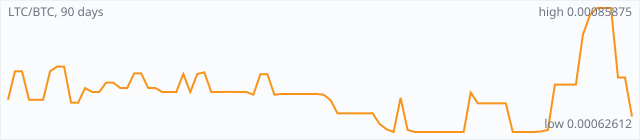

<a href="../"></a>

[All markets](../) · [Why testnet markets](../testnet-markets.md) · [Developers](../developers.md) · [Monthly reports](../reports/) · [Press kit](../press.md) · [altquick.com](https://altquick.com/)

# Litecoin (LTC) price in Bitcoin and how to buy it

Litecoin is one of the oldest Bitcoin forks, launched by Charlie Lee in October 2011 with Scrypt mining and 2.5-minute blocks. It trades against Bitcoin on AltQuick with a public order book and API.

**[Open the LTC/BTC market on AltQuick →](https://altquick.com/market/litecoin-bitcoin/)**

## Live LTC/BTC numbers

| | |
|---|---|
| Last price | 0.00065505 BTC |
| Best bid / ask | 0.00065505 / 0.00079999 BTC |
| Trades, last 7 days | 18 |
| Volume, last 7 days | 0.00311277 BTC |
| Last trade | 2026-10-02 22:46 UTC |

## About Litecoin

| | |
|---|---|
| Ticker | LTC |
| Launched | October 2011. |
| Consensus | Scrypt proof of work with a 2.5-minute block target; Dogecoin is merge-mined alongside it. |

Litecoin was released by Charlie Lee, then a Google engineer, in October 2011. He forked Bitcoin's code and changed a few parameters: Scrypt instead of SHA-256 for mining, a 2.5-minute block target instead of ten minutes, and a supply cap of 84 million coins, four times Bitcoin's. Rewards halve every 840,000 blocks, roughly every four years like Bitcoin.

For much of its history Litecoin has served as a testing ground for changes before they reach Bitcoin. It activated Segregated Witness in May 2017, a few months ahead of Bitcoin, and early Lightning Network payments and cross-chain atomic swaps were demonstrated on it.

In May 2022 Litecoin activated MWEB (MimbleWimble Extension Blocks), an optional side layer where amounts are hidden. Moving coins into MWEB is opt-in, so regular Litecoin transactions remain transparent.

Since 2014 Dogecoin has been merge-mined with Litecoin, so the same Scrypt hardware secures both chains.

### Official links

- Website: [litecoin.org](https://litecoin.org/)
- Explorer: [litecoinspace.org](https://litecoinspace.org/)
- Source code: [github.com/litecoin-project/litecoin](https://github.com/litecoin-project/litecoin)

## LTC/BTC price history, last 90 days



| | |
|---|---|
| Change, 30 days | +4.6% |
| Change, 90 days | -11.5% |
| Highest daily close | 0.00085875 BTC |
| Lowest daily close | 0.00062612 BTC |

Daily candles from AltQuick's klines API, UTC days. On days without trades the previous close carries forward.

<details open><summary>Daily closes, last 30 days</summary>

| Date (UTC) | Close (BTC) | High | Low | Volume (LTC) |
|---|---|---|---|---|
| 2026-10-03 | 0.00065505 | 0.00065505 | 0.00065505 | 0 |
| 2026-10-02 | 0.00065505 | 0.00065505 | 0.00065505 | 0.3 |
| 2026-10-01 | 0.00065503 | 0.00071000 | 0.00065502 | 0.64467 |
| 2026-09-30 | 0.00072837 | 0.00072837 | 0.00072837 | 0 |
| 2026-09-29 | 0.00072837 | 0.00072838 | 0.00072837 | 0.470662 |
| 2026-09-28 | 0.00085875 | 0.00085875 | 0.00075180 | 1.55128 |
| 2026-09-27 | 0.00085875 | 0.00085875 | 0.00085875 | 0 |
| 2026-09-26 | 0.00085875 | 0.00085875 | 0.00085875 | 1.00221 |
| 2026-09-25 | 0.00084500 | 0.00084500 | 0.00075513 | 0.140991 |
| 2026-09-24 | 0.00080875 | 0.00080875 | 0.00073400 | 22.064 |
| 2026-09-23 | 0.00071500 | 0.00073400 | 0.00071500 | 0.862655 |
| 2026-09-22 | 0.00071500 | 0.00071500 | 0.00071500 | 0.628958 |
| 2026-09-21 | 0.00071500 | 0.00071500 | 0.00071500 | 0 |
| 2026-09-20 | 0.00071500 | 0.00071500 | 0.00063000 | 0.235614 |
| 2026-09-19 | 0.00063000 | 0.00063000 | 0.00062706 | 0.0826492 |
| 2026-09-18 | 0.00062702 | 0.00062703 | 0.00062702 | 0.146175 |
| 2026-09-17 | 0.00062614 | 0.00062614 | 0.00062614 | 0 |
| 2026-09-16 | 0.00062614 | 0.00062620 | 0.00062614 | 1.7283 |
| 2026-09-15 | 0.00062614 | 0.00062614 | 0.00062614 | 0 |
| 2026-09-14 | 0.00062614 | 0.00068000 | 0.00062614 | 0.604716 |
| 2026-09-13 | 0.00068000 | 0.00068000 | 0.00068000 | 0 |
| 2026-09-12 | 0.00068000 | 0.00068000 | 0.00068000 | 0.19 |
| 2026-09-11 | 0.00068000 | 0.00068001 | 0.00068000 | 0.157063 |
| 2026-09-10 | 0.00068000 | 0.00068000 | 0.00068000 | 0 |
| 2026-09-09 | 0.00068000 | 0.00070000 | 0.00068000 | 0.322867 |
| 2026-09-08 | 0.00070000 | 0.00070000 | 0.00067120 | 3.32736 |
| 2026-09-07 | 0.00062612 | 0.00062612 | 0.00062612 | 0 |
| 2026-09-06 | 0.00062612 | 0.00062612 | 0.00062612 | 0 |
| 2026-09-05 | 0.00062612 | 0.00062612 | 0.00062612 | 0 |
| 2026-09-04 | 0.00062612 | 0.00062620 | 0.00062612 | 1.79241 |

</details>

## Order book snapshot

Top 5 bids (buy orders) and asks (sell orders).

| Bid price (BTC) | Bid amount (LTC) | Ask price (BTC) | Ask amount (LTC) |
|---|---|---|---|
| 0.00065505 | 5.3151 | 0.00079999 | 0.00099336 |
| 0.00065503 | 6.99968 | 0.00080000 | 0.00049668 |
| 0.00065000 | 9.231e-05 | 0.00084300 | 0.0002847 |
| 0.00064000 | 9.375e-05 | 0.00085875 | 5.33064 |
| 0.00063500 | 0.111465 | 0.00088888 | 5 |

## Recent trades

| Time (UTC) | Side | Price (BTC) | Amount (LTC) |
|---|---|---|---|
| 2026-10-02 22:46 | sell | 0.00065505 | 0.30000000 |
| 2026-10-01 05:23 | sell | 0.00065503 | 0.23713101 |
| 2026-10-01 05:00 | sell | 0.00065502 | 0.40690138 |
| 2026-10-01 05:00 | sell | 0.00066000 | 0.00009091 |
| 2026-10-01 05:00 | sell | 0.00067000 | 0.00007463 |
| 2026-10-01 05:00 | sell | 0.00068000 | 0.00008824 |
| 2026-10-01 05:00 | sell | 0.00069000 | 0.00008696 |
| 2026-10-01 05:00 | sell | 0.00070000 | 0.00007143 |
| 2026-10-01 05:00 | sell | 0.00071000 | 0.00014085 |
| 2026-10-01 05:00 | sell | 0.00071000 | 0.00008451 |

## How to buy Litecoin with Bitcoin

1. Create a free account on [altquick.com](https://altquick.com/) and deposit Bitcoin.
2. Open the [LTC/BTC market](https://altquick.com/market/litecoin-bitcoin/), check the order book, and place a limit or market order.
3. Withdraw LTC to your own wallet, or keep it on AltQuick to trade later.

To sell, deposit LTC and place a sell order on the same market to receive Bitcoin.

## Litecoin FAQ

### What is Litecoin (LTC)?

Litecoin is one of the oldest Bitcoin forks, launched by Charlie Lee in October 2011 with Scrypt mining and 2.5-minute blocks.

### When did Litecoin launch?

October 2011.

### How is the Litecoin network secured?

Scrypt proof of work with a 2.5-minute block target; Dogecoin is merge-mined alongside it.

### How do I buy Litecoin with Bitcoin?

Create a free account on altquick.com, deposit Bitcoin, then place a limit or market order on the [LTC/BTC market](https://altquick.com/market/litecoin-bitcoin/). You can withdraw LTC to your own wallet afterwards. AltQuick's trading fee is 1%.

### Where does the LTC price on this page come from?

From AltQuick's public API: the last price, order book and trades of the LTC/BTC market, and daily candles for the price history. No other exchanges are included.

## Related markets

- [Dogecoin (DOGE)](../dogecoin/): Dogecoin is the Shiba Inu meme coin launched in December 2013, a Scrypt chain merge-mined with Litecoin.
- [Bitcoin Cash (BCH)](../bitcoin-cash/): Bitcoin Cash is the larger-block fork of Bitcoin created on 1 August 2017.
- [DigiByte (DGB)](../digibyte/): DigiByte is a 2014 UTXO blockchain with 15-second blocks and five mining algorithms running side by side.

[See every AltQuick market](../) · [Litecoin on altquick.com](https://altquick.com/asset/litecoin/)

## Get this data yourself

```
curl "https://altquick.com/api/v1/trades?market=BTC_LTC&limit=20"
curl "https://altquick.com/api/v1/depth?market=BTC_LTC&limit=20"
curl "https://altquick.com/api/v1/klines?market=BTC_LTC&interval=1d&limit=90"
```

Background facts were checked against each project's own sites and public sources. Nothing here is investment advice.

Last updated: 2026-10-03 10:43 UTC from AltQuick's public API.

---

AltQuick, US-based since 2015. [altquick.com](https://altquick.com/) · [API docs](https://github.com/AltQuick-com/api) · hello@altquick.com
