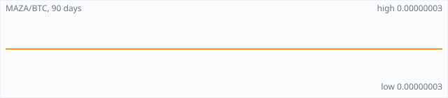

<a href="../"></a>

[All markets](../) · [Why testnet markets](../testnet-markets.md) · [Developers](../developers.md) · [Monthly reports](../reports/) · [Press kit](../press.md) · [altquick.com](https://altquick.com/)

# Mazacoin (MAZA) price in Bitcoin and how to buy it

Mazacoin is a 2014 SHA-256 coin created by Payu Harris for the Oglala Lakota Nation and other tribal economies. It trades against Bitcoin on AltQuick with a public order book and API.

**[Open the MAZA/BTC market on AltQuick →](https://altquick.com/market/mazacoin-bitcoin/)**

## Live MAZA/BTC numbers

| | |
|---|---|
| Last price | 0.00000003 BTC |
| Best bid / ask | 0.00000003 / 0.00000004 BTC |
| Trades, last 7 days | 2 |
| Volume, last 7 days | 0.00109080 BTC |
| Last trade | 2026-10-01 16:36 UTC |

## About Mazacoin

| | |
|---|---|
| Ticker | MAZA |
| Launched | Initial release on 7 February 2014. |
| Consensus | Proof of work with SHA-256 and, since version 0.16.3 (2022), the CPU-friendly MinotaurX algorithm, plus Hive mining. |

Mazacoin was created by developer Payu Harris and released on 7 February 2014. It was aimed at the Oglala Lakota Nation on the Pine Ridge Reservation in South Dakota, as a currency that a tribal nation could use under its own sovereignty rather than depending on the US banking system. The project now describes itself more broadly as a coin for Native American and other sovereign communities. Its launch drew national press coverage, including Forbes in 2014 and MIT Technology Review in 2022.

The code descends from Zetacoin, a Bitcoin derivative, and the chain began with SHA-256 proof of work and one-minute blocks. Version 0.16.3, released in January 2022, added two ways to secure the chain without ASICs. MinotaurX is a CPU-mineable algorithm, and Hive mining lets holders spend MAZA in the wallet to create 'bees' that try to produce blocks after proof-of-work blocks, using almost no energy. SHA-256 mining still works, though ASICBoost is no longer supported.

People have also used the Mazacoin blockchain as a permanent archive, embedding records with the Apertus tool. The project site lists tribal IDs and Standing Rock testimonies among the things preserved this way.

MAZA trades lightly, so check the order book depth below before buying.

### Official links

- Website: [mazacoin.org](https://mazacoin.org/)
- Explorer: [mazacha.in](https://mazacha.in/)
- Source code: [github.com/MazaCoin/maza](https://github.com/MazaCoin/maza)

## MAZA/BTC price history, last 90 days



| | |
|---|---|
| Change, 30 days | +0.0% |
| Change, 90 days | +0.0% |
| Highest daily close | 0.00000003 BTC |
| Lowest daily close | 0.00000003 BTC |

Daily candles from AltQuick's klines API, UTC days. On days without trades the previous close carries forward.

<details open><summary>Daily closes, last 30 days</summary>

| Date (UTC) | Close (BTC) | High | Low | Volume (MAZA) |
|---|---|---|---|---|
| 2026-10-03 | 0.00000003 | 0.00000003 | 0.00000003 | 0 |
| 2026-10-02 | 0.00000003 | 0.00000003 | 0.00000003 | 0 |
| 2026-10-01 | 0.00000003 | 0.00000003 | 0.00000003 | 2433.62 |
| 2026-09-30 | 0.00000003 | 0.00000003 | 0.00000003 | 0 |
| 2026-09-29 | 0.00000003 | 0.00000003 | 0.00000003 | 0 |
| 2026-09-28 | 0.00000003 | 0.00000003 | 0.00000003 | 33927 |
| 2026-09-27 | 0.00000003 | 0.00000003 | 0.00000003 | 0 |
| 2026-09-26 | 0.00000003 | 0.00000003 | 0.00000003 | 0 |
| 2026-09-25 | 0.00000003 | 0.00000003 | 0.00000003 | 8203.75 |
| 2026-09-24 | 0.00000003 | 0.00000003 | 0.00000003 | 18459.6 |
| 2026-09-23 | 0.00000003 | 0.00000003 | 0.00000003 | 12646 |
| 2026-09-22 | 0.00000003 | 0.00000003 | 0.00000003 | 0 |
| 2026-09-21 | 0.00000003 | 0.00000003 | 0.00000003 | 0 |
| 2026-09-20 | 0.00000003 | 0.00000003 | 0.00000003 | 0 |
| 2026-09-19 | 0.00000003 | 0.00000003 | 0.00000003 | 0 |
| 2026-09-18 | 0.00000003 | 0.00000003 | 0.00000003 | 0 |
| 2026-09-17 | 0.00000003 | 0.00000003 | 0.00000003 | 0 |
| 2026-09-16 | 0.00000003 | 0.00000003 | 0.00000003 | 0 |
| 2026-09-15 | 0.00000003 | 0.00000003 | 0.00000003 | 0 |
| 2026-09-14 | 0.00000003 | 0.00000003 | 0.00000003 | 0 |
| 2026-09-13 | 0.00000003 | 0.00000003 | 0.00000003 | 0 |
| 2026-09-12 | 0.00000003 | 0.00000003 | 0.00000003 | 0 |
| 2026-09-11 | 0.00000003 | 0.00000003 | 0.00000003 | 0 |
| 2026-09-10 | 0.00000003 | 0.00000003 | 0.00000003 | 0 |
| 2026-09-09 | 0.00000003 | 0.00000003 | 0.00000003 | 0 |
| 2026-09-08 | 0.00000003 | 0.00000003 | 0.00000003 | 0 |
| 2026-09-07 | 0.00000003 | 0.00000003 | 0.00000003 | 0 |
| 2026-09-06 | 0.00000003 | 0.00000003 | 0.00000003 | 0 |
| 2026-09-05 | 0.00000003 | 0.00000003 | 0.00000003 | 0 |
| 2026-09-04 | 0.00000003 | 0.00000003 | 0.00000003 | 0 |

</details>

## Order book snapshot

Top 5 bids (buy orders) and asks (sell orders).

| Bid price (BTC) | Bid amount (MAZA) | Ask price (BTC) | Ask amount (MAZA) |
|---|---|---|---|
| 0.00000003 | 49144.3 | 0.00000004 | 51900.8 |
| 0.00000002 | 223070 | 0.00000005 | 20003 |
| 0.00000001 | 372421 | 0.00000006 | 32333.3 |
|  |  | 0.00000007 | 1115.1 |
|  |  | 0.00000008 | 60.3687 |

## Recent trades

| Time (UTC) | Side | Price (BTC) | Amount (MAZA) |
|---|---|---|---|
| 2026-10-01 16:36 | sell | 0.00000003 | 2433.62350000 |
| 2026-09-28 19:06 | sell | 0.00000003 | 33926.99996697 |
| 2026-09-25 21:28 | sell | 0.00000003 | 8203.75483764 |
| 2026-09-24 05:47 | sell | 0.00000003 | 18459.59538420 |
| 2026-09-23 11:19 | sell | 0.00000003 | 12646.00000000 |
| 2026-08-24 19:59 | sell | 0.00000003 | 725.66647902 |
| 2026-08-24 11:53 | sell | 0.00000003 | 3492.00000000 |
| 2026-08-13 17:06 | sell | 0.00000003 | 3185.00000000 |
| 2026-08-07 08:19 | sell | 0.00000003 | 2512.00000000 |
| 2026-08-05 10:23 | sell | 0.00000003 | 3178.00000000 |

## How to buy Mazacoin with Bitcoin

1. Create a free account on [altquick.com](https://altquick.com/) and deposit Bitcoin.
2. Open the [MAZA/BTC market](https://altquick.com/market/mazacoin-bitcoin/), check the order book, and place a limit or market order.
3. Withdraw MAZA to your own wallet, or keep it on AltQuick to trade later.

To sell, deposit MAZA and place a sell order on the same market to receive Bitcoin.

## Mazacoin FAQ

### What is Mazacoin (MAZA)?

Mazacoin is a 2014 SHA-256 coin created by Payu Harris for the Oglala Lakota Nation and other tribal economies.

### When did Mazacoin launch?

Initial release on 7 February 2014.

### How is the Mazacoin network secured?

Proof of work with SHA-256 and, since version 0.16.3 (2022), the CPU-friendly MinotaurX algorithm, plus Hive mining.

### How do I buy Mazacoin with Bitcoin?

Create a free account on altquick.com, deposit Bitcoin, then place a limit or market order on the [MAZA/BTC market](https://altquick.com/market/mazacoin-bitcoin/). You can withdraw MAZA to your own wallet afterwards. AltQuick's trading fee is 1%.

### Where does the MAZA price on this page come from?

From AltQuick's public API: the last price, order book and trades of the MAZA/BTC market, and daily candles for the price history. No other exchanges are included.

## Related markets

- [DigiByte (DGB)](../digibyte/): DigiByte is a 2014 UTXO blockchain with 15-second blocks and five mining algorithms running side by side.
- [Florincoin (FLO)](../florincoin/): FLO, originally Florincoin, is a 2013 Scrypt coin that lets every transaction carry a text field, used to store metadata on chain.
- [Namecoin (NMC)](../namecoin/): Namecoin, launched in April 2011, was the first fork of Bitcoin; it adds a decentralized name registry used for .bit domains and identities.

[See every AltQuick market](../) · [Mazacoin on altquick.com](https://altquick.com/asset/mazacoin/)

## Get this data yourself

```
curl "https://altquick.com/api/v1/trades?market=BTC_MAZA&limit=20"
curl "https://altquick.com/api/v1/depth?market=BTC_MAZA&limit=20"
curl "https://altquick.com/api/v1/klines?market=BTC_MAZA&interval=1d&limit=90"
```

Background facts were checked against each project's own sites and public sources. Nothing here is investment advice.

Last updated: 2026-10-03 10:43 UTC from AltQuick's public API.

---

AltQuick, US-based since 2015. [altquick.com](https://altquick.com/) · [API docs](https://github.com/AltQuick-com/api) · hello@altquick.com
