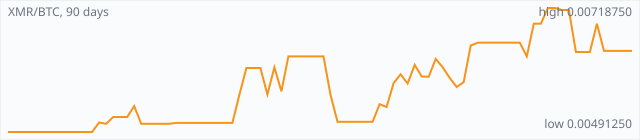

<a href="../"></a>

[All markets](../) · [Why testnet markets](../testnet-markets.md) · [Developers](../developers.md) · [Monthly reports](../reports/) · [Press kit](../press.md) · [altquick.com](https://altquick.com/)

# Monero (XMR) price in Bitcoin and how to buy it

Monero is a CryptoNote-based privacy coin launched in April 2014 that hides senders, receivers and amounts by default. It trades against Bitcoin on AltQuick with a public order book and API.

**[Open the XMR/BTC market on AltQuick →](https://altquick.com/market/monero-bitcoin/)**

## Live XMR/BTC numbers

| | |
|---|---|
| Last price | 0.00640000 BTC |
| Best bid / ask | 0.00650000 / 0.00690000 BTC |
| Trades, last 7 days | 9 |
| Volume, last 7 days | 0.00235824 BTC |
| Last trade | 2026-09-29 18:56 UTC |

## About Monero

| | |
|---|---|
| Ticker | XMR |
| Launched | 18 April 2014, originally as Bitmonero. |
| Consensus | RandomX proof of work, designed for general-purpose CPUs, with roughly two-minute blocks. |

Monero launched on 18 April 2014 as Bitmonero, a fork of the CryptoNote code used by Bytecoin, and was soon renamed Monero, Esperanto for 'coin'. It's run by an open community with no company or premine behind it.

Privacy is mandatory, not optional. Ring signatures mix the real sender with decoys, stealth addresses give every payment a one-time address so the recipient's public address never appears on chain, and RingCT, added in 2017, hides amounts. Since every transaction looks alike, coins are fungible: no coin carries a visible history. View keys let you prove a payment to an auditor when you choose to.

Since November 2019 Monero has used RandomX, a proof-of-work algorithm built to run best on ordinary CPUs and resist ASICs. After the main emission curve ended in 2022, a permanent tail emission of 0.6 XMR per block keeps paying miners. Block size adjusts dynamically with demand.

Because of its privacy, Monero has been delisted by many large exchanges. AltQuick keeps an XMR/BTC market.

### Official links

- Website: [www.getmonero.org](https://www.getmonero.org/)
- Explorer: [xmrchain.net](https://xmrchain.net/)
- Source code: [github.com/monero-project/monero](https://github.com/monero-project/monero)

## XMR/BTC price history, last 90 days



| | |
|---|---|
| Change, 30 days | +7.9% |
| Change, 90 days | +30.3% |
| Highest daily close | 0.00718750 BTC |
| Lowest daily close | 0.00491250 BTC |

Daily candles from AltQuick's klines API, UTC days. On days without trades the previous close carries forward.

<details open><summary>Daily closes, last 30 days</summary>

| Date (UTC) | Close (BTC) | High | Low | Volume (XMR) |
|---|---|---|---|---|
| 2026-10-03 | 0.00640000 | 0.00640000 | 0.00640000 | 0 |
| 2026-10-02 | 0.00640000 | 0.00640000 | 0.00640000 | 0 |
| 2026-10-01 | 0.00640000 | 0.00640000 | 0.00640000 | 0 |
| 2026-09-30 | 0.00640000 | 0.00640000 | 0.00640000 | 0 |
| 2026-09-29 | 0.00640000 | 0.00640000 | 0.00640000 | 0.206424 |
| 2026-09-28 | 0.00690000 | 0.00690000 | 0.00690000 | 0.15032 |
| 2026-09-27 | 0.00638000 | 0.00638000 | 0.00638000 | 0 |
| 2026-09-26 | 0.00638000 | 0.00638000 | 0.00638000 | 0 |
| 2026-09-25 | 0.00638000 | 0.00638000 | 0.00638000 | 0.000135 |
| 2026-09-24 | 0.00715000 | 0.00715000 | 0.00715000 | 0 |
| 2026-09-23 | 0.00715000 | 0.00715000 | 0.00715000 | 0.00302377 |
| 2026-09-22 | 0.00718750 | 0.00718750 | 0.00718750 | 0 |
| 2026-09-21 | 0.00718750 | 0.00718750 | 0.00707000 | 1.74394 |
| 2026-09-20 | 0.00690000 | 0.00690000 | 0.00690000 | 0 |
| 2026-09-19 | 0.00690000 | 0.00690000 | 0.00669000 | 1.77466 |
| 2026-09-18 | 0.00630000 | 0.00630000 | 0.00630000 | 0.057793 |
| 2026-09-17 | 0.00655000 | 0.00655000 | 0.00655000 | 0 |
| 2026-09-16 | 0.00655000 | 0.00655000 | 0.00655000 | 0 |
| 2026-09-15 | 0.00655000 | 0.00655000 | 0.00655000 | 0 |
| 2026-09-14 | 0.00655000 | 0.00655000 | 0.00655000 | 0 |
| 2026-09-13 | 0.00655000 | 0.00655000 | 0.00655000 | 0 |
| 2026-09-12 | 0.00655000 | 0.00655000 | 0.00655000 | 3.74359 |
| 2026-09-11 | 0.00655000 | 0.00655000 | 0.00650000 | 0.0797336 |
| 2026-09-10 | 0.00650000 | 0.00650000 | 0.00590820 | 0.003365 |
| 2026-09-09 | 0.00582755 | 0.00586256 | 0.00571189 | 0.00068547 |
| 2026-09-08 | 0.00573818 | 0.00595678 | 0.00572942 | 0.0009588 |
| 2026-09-07 | 0.00590524 | 0.00625000 | 0.00590524 | 0.0002662 |
| 2026-09-06 | 0.00610000 | 0.00628553 | 0.00597160 | 0.00168 |
| 2026-09-05 | 0.00625423 | 0.00625423 | 0.00590227 | 0.00100957 |
| 2026-09-04 | 0.00592670 | 0.00620000 | 0.00592670 | 0.0333517 |

</details>

## Order book snapshot

Top 5 bids (buy orders) and asks (sell orders).

| Bid price (BTC) | Bid amount (XMR) | Ask price (BTC) | Ask amount (XMR) |
|---|---|---|---|
| 0.00650000 | 7.7e-06 | 0.00690000 | 2.84968 |
| 0.00640000 | 0.793583 | 0.00710855 | 0.102434 |
| 0.00630000 | 7.94e-06 | 0.00715000 | 0.00697623 |
| 0.00620000 | 9.68e-06 | 0.00718750 | 1.96492 |
| 0.00615000 | 0.0693285 | 0.00788750 | 2.66551 |

## Recent trades

| Time (UTC) | Side | Price (BTC) | Amount (XMR) |
|---|---|---|---|
| 2026-09-29 18:56 | sell | 0.00640000 | 0.20642447 |
| 2026-09-28 12:27 | buy | 0.00690000 | 0.00296521 |
| 2026-09-28 12:06 | buy | 0.00690000 | 0.00530869 |
| 2026-09-28 11:49 | buy | 0.00690000 | 0.00241884 |
| 2026-09-28 11:41 | buy | 0.00690000 | 0.00289855 |
| 2026-09-28 02:33 | buy | 0.00690000 | 0.00850579 |
| 2026-09-28 02:32 | buy | 0.00690000 | 0.00724637 |
| 2026-09-28 02:06 | buy | 0.00690000 | 0.01159420 |
| 2026-09-28 01:01 | buy | 0.00690000 | 0.10938260 |
| 2026-09-25 10:14 | sell | 0.00638000 | 0.00013500 |

## How to buy Monero with Bitcoin

1. Create a free account on [altquick.com](https://altquick.com/) and deposit Bitcoin.
2. Open the [XMR/BTC market](https://altquick.com/market/monero-bitcoin/), check the order book, and place a limit or market order.
3. Withdraw XMR to your own wallet, or keep it on AltQuick to trade later.

To sell, deposit XMR and place a sell order on the same market to receive Bitcoin.

## Monero FAQ

### What is Monero (XMR)?

Monero is a CryptoNote-based privacy coin launched in April 2014 that hides senders, receivers and amounts by default.

### When did Monero launch?

18 April 2014, originally as Bitmonero.

### How is the Monero network secured?

RandomX proof of work, designed for general-purpose CPUs, with roughly two-minute blocks.

### How do I buy Monero with Bitcoin?

Create a free account on altquick.com, deposit Bitcoin, then place a limit or market order on the [XMR/BTC market](https://altquick.com/market/monero-bitcoin/). You can withdraw XMR to your own wallet afterwards. AltQuick's trading fee is 1%.

### Where does the XMR price on this page come from?

From AltQuick's public API: the last price, order book and trades of the XMR/BTC market, and daily candles for the price history. No other exchanges are included.

## Related markets

- [Wownero (WOW)](../wownero/): Wownero is a Doge-inspired, CPU-mined privacy memecoin forked from Monero and launched on 1 April 2018.
- [Zcash (ZEC)](../zcash/): Zcash is a 2016 Bitcoin-style coin with optional shielded payments using zero-knowledge proofs.
- [Dash (DASH)](../dash/): Dash is a payments-focused cryptocurrency with a masternode network that provides InstantSend, ChainLocks and optional CoinJoin mixing.

[See every AltQuick market](../) · [Monero on altquick.com](https://altquick.com/asset/monero/)

## Get this data yourself

```
curl "https://altquick.com/api/v1/trades?market=BTC_XMR&limit=20"
curl "https://altquick.com/api/v1/depth?market=BTC_XMR&limit=20"
curl "https://altquick.com/api/v1/klines?market=BTC_XMR&interval=1d&limit=90"
```

Background facts were checked against each project's own sites and public sources. Nothing here is investment advice.

Last updated: 2026-10-03 10:43 UTC from AltQuick's public API.

---

AltQuick, US-based since 2015. [altquick.com](https://altquick.com/) · [API docs](https://github.com/AltQuick-com/api) · hello@altquick.com
