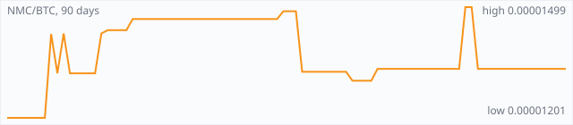

<a href="../"></a>

[All markets](../) · [Why testnet markets](../testnet-markets.md) · [Developers](../developers.md) · [Monthly reports](../reports/) · [Press kit](../press.md) · [altquick.com](https://altquick.com/)

# Namecoin (NMC) price in Bitcoin and how to buy it

Namecoin, launched in April 2011, was the first fork of Bitcoin; it adds a decentralized name registry used for .bit domains and identities. It trades against Bitcoin on AltQuick with a public order book and API.

**[Open the NMC/BTC market on AltQuick →](https://altquick.com/market/namecoin-bitcoin/)**

## Live NMC/BTC numbers

| | |
|---|---|
| Last price | 0.00001333 BTC |
| Best bid / ask | 0.00001333 / 0.00001499 BTC |
| Trades, last 7 days | 0 |
| Volume, last 7 days | 0.00000000 BTC |
| Last trade | 2026-09-20 14:08 UTC |

## About Namecoin

| | |
|---|---|
| Ticker | NMC |
| Launched | April 2011 (announced 18 April 2011), the first fork of Bitcoin. |
| Consensus | SHA-256 proof of work, merge-mined with Bitcoin since block 19,200 (October 2011). |

Namecoin was released in April 2011 by a developer known as Vincent Durham, building on an idea Bitcoin users had called BitDNS. It was the first fork of Bitcoin's code to run its own network, which makes it the oldest altcoin still running.

On top of a currency (NMC) with Bitcoin's 21 million cap and ten-minute blocks, Namecoin adds a key/value registry. You can register a name, attach up to 520 bytes of data to it and transfer it, and nobody can seize or censor the record. The best-known use is the .bit top-level domain, which sits outside ICANN. Names can also hold identity data such as PGP keys, Tor .onion addresses and TLS certificate information. Namecoin is often cited as the first practical answer to Zooko's triangle: names that are human-readable, secure and decentralized at once.

Namecoin was also the first chain to use merged mining. Since block 19,200 in October 2011, Bitcoin miners can mine Namecoin with the same work at no extra cost, so Namecoin is secured by a large share of Bitcoin's hash power.

The project is still active, with recent work on TLS certificate validation for Namecoin names. NMC is needed to register and renew names.

### Official links

- Website: [www.namecoin.org](https://www.namecoin.org/)
- Source code: [github.com/namecoin/namecoin-core](https://github.com/namecoin/namecoin-core)

## NMC/BTC price history, last 90 days



| | |
|---|---|
| Change, 30 days | +0.0% |
| Change, 90 days | +11.0% |
| Highest daily close | 0.00001499 BTC |
| Lowest daily close | 0.00001201 BTC |

Daily candles from AltQuick's klines API, UTC days. On days without trades the previous close carries forward.

<details open><summary>Daily closes, last 30 days</summary>

| Date (UTC) | Close (BTC) | High | Low | Volume (NMC) |
|---|---|---|---|---|
| 2026-10-05 | 0.00001333 | 0.00001333 | 0.00001333 | 0 |
| 2026-10-04 | 0.00001333 | 0.00001333 | 0.00001333 | 0 |
| 2026-10-03 | 0.00001333 | 0.00001333 | 0.00001333 | 0 |
| 2026-10-02 | 0.00001333 | 0.00001333 | 0.00001333 | 0 |
| 2026-10-01 | 0.00001333 | 0.00001333 | 0.00001333 | 0 |
| 2026-09-30 | 0.00001333 | 0.00001333 | 0.00001333 | 0 |
| 2026-09-29 | 0.00001333 | 0.00001333 | 0.00001333 | 0 |
| 2026-09-28 | 0.00001333 | 0.00001333 | 0.00001333 | 0 |
| 2026-09-27 | 0.00001333 | 0.00001333 | 0.00001333 | 0 |
| 2026-09-26 | 0.00001333 | 0.00001333 | 0.00001333 | 0 |
| 2026-09-25 | 0.00001333 | 0.00001333 | 0.00001333 | 0 |
| 2026-09-24 | 0.00001333 | 0.00001333 | 0.00001333 | 0 |
| 2026-09-23 | 0.00001333 | 0.00001333 | 0.00001333 | 0 |
| 2026-09-22 | 0.00001333 | 0.00001333 | 0.00001333 | 0 |
| 2026-09-21 | 0.00001333 | 0.00001333 | 0.00001333 | 0 |
| 2026-09-20 | 0.00001333 | 0.00001333 | 0.00001333 | 0.02225 |
| 2026-09-19 | 0.00001499 | 0.00001499 | 0.00001499 | 0 |
| 2026-09-18 | 0.00001499 | 0.00001499 | 0.00001333 | 14.6664 |
| 2026-09-17 | 0.00001333 | 0.00001333 | 0.00001333 | 0 |
| 2026-09-16 | 0.00001333 | 0.00001333 | 0.00001333 | 0 |
| 2026-09-15 | 0.00001333 | 0.00001333 | 0.00001333 | 0 |
| 2026-09-14 | 0.00001333 | 0.00001333 | 0.00001333 | 0 |
| 2026-09-13 | 0.00001333 | 0.00001333 | 0.00001333 | 0 |
| 2026-09-12 | 0.00001333 | 0.00001333 | 0.00001333 | 0 |
| 2026-09-11 | 0.00001333 | 0.00001333 | 0.00001333 | 0 |
| 2026-09-10 | 0.00001333 | 0.00001333 | 0.00001333 | 0 |
| 2026-09-09 | 0.00001333 | 0.00001333 | 0.00001333 | 0 |
| 2026-09-08 | 0.00001333 | 0.00001333 | 0.00001333 | 0 |
| 2026-09-07 | 0.00001333 | 0.00001333 | 0.00001333 | 0 |
| 2026-09-06 | 0.00001333 | 0.00001333 | 0.00001333 | 0 |

</details>

## Order book snapshot

Top 5 bids (buy orders) and asks (sell orders).

| Bid price (BTC) | Bid amount (NMC) | Ask price (BTC) | Ask amount (NMC) |
|---|---|---|---|
| 0.00001333 | 283.811 | 0.00001499 | 99 |
| 0.00001301 | 1082.72 | 0.00001507 | 1084.34 |
| 0.00001281 | 1593.9 | 0.00001532 | 69.874 |
| 0.00001241 | 1752.51 | 0.00001557 | 1726.6 |
| 0.00001191 | 810.11 | 0.00001617 | 2345.03 |

## Recent trades

| Time (UTC) | Side | Price (BTC) | Amount (NMC) |
|---|---|---|---|
| 2026-09-20 14:08 | sell | 0.00001333 | 0.02225000 |
| 2026-09-18 23:57 | buy | 0.00001499 | 1.00000000 |
| 2026-09-18 23:57 | sell | 0.00001333 | 13.66644687 |
| 2026-09-04 19:16 | sell | 0.00001333 | 2.49994529 |
| 2026-08-31 06:23 | sell | 0.00001301 | 63.11354161 |
| 2026-08-31 06:23 | sell | 0.00001325 | 99.98905839 |
| 2026-08-29 03:24 | sell | 0.00001325 | 0.00644161 |
| 2026-08-29 03:24 | buy | 0.00001507 | 0.00398143 |
| 2026-08-23 12:34 | sell | 0.00001325 | 0.00450000 |
| 2026-08-20 02:30 | buy | 0.00001488 | 114.46489829 |

## How to buy Namecoin with Bitcoin

1. Create a free account on [altquick.com](https://altquick.com/) and deposit Bitcoin.
2. Open the [NMC/BTC market](https://altquick.com/market/namecoin-bitcoin/), check the order book, and place a limit or market order.
3. Withdraw NMC to your own wallet, or keep it on AltQuick to trade later.

To sell, deposit NMC and place a sell order on the same market to receive Bitcoin.

## Namecoin FAQ

### What is Namecoin (NMC)?

Namecoin, launched in April 2011, was the first fork of Bitcoin; it adds a decentralized name registry used for .bit domains and identities.

### When did Namecoin launch?

April 2011 (announced 18 April 2011), the first fork of Bitcoin.

### How is the Namecoin network secured?

SHA-256 proof of work, merge-mined with Bitcoin since block 19,200 (October 2011).

### How do I buy Namecoin with Bitcoin?

Create a free account on altquick.com, deposit Bitcoin, then place a limit or market order on the [NMC/BTC market](https://altquick.com/market/namecoin-bitcoin/). You can withdraw NMC to your own wallet afterwards. AltQuick's trading fee is 1%.

### Where does the NMC price on this page come from?

From AltQuick's public API: the last price, order book and trades of the NMC/BTC market, and daily candles for the price history. No other exchanges are included.

## Related markets

- [Florincoin (FLO)](../florincoin/): FLO, originally Florincoin, is a 2013 Scrypt coin that lets every transaction carry a text field, used to store metadata on chain.
- [Peercoin (PPC)](../peercoin/): Peercoin, launched in August 2012, was the first cryptocurrency to use proof of stake.
- [Bitcoin Blake2b (BTC2B)](../bitcoin-blake2b/): Bitcoin Blake2b is a 2026 hard fork of Bitcoin that switched proof of work from SHA-256d to BLAKE2b at block 961,640.

[See every AltQuick market](../) · [Namecoin on altquick.com](https://altquick.com/asset/namecoin/)

## Get this data yourself

```
curl "https://altquick.com/api/v1/trades?market=BTC_NMC&limit=20"
curl "https://altquick.com/api/v1/depth?market=BTC_NMC&limit=20"
curl "https://altquick.com/api/v1/klines?market=BTC_NMC&interval=1d&limit=90"
```

Background facts were checked against each project's own sites and public sources. Nothing here is investment advice.

Last updated: 2026-10-05 10:43 UTC from AltQuick's public API.

---

AltQuick, US-based since 2015. [altquick.com](https://altquick.com/) · [API docs](https://github.com/AltQuick-com/api) · hello@altquick.com
