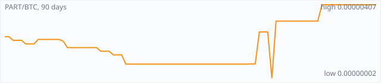

<a href="../"></a>

[All markets](../) · [Why testnet markets](../testnet-markets.md) · [Developers](../developers.md) · [Monthly reports](../reports/) · [Press kit](../press.md) · [altquick.com](https://altquick.com/)

# Particl (PART) price in Bitcoin and how to buy it

Particl is a pure proof-of-stake privacy coin on a Bitcoin Core codebase, built to power a decentralized marketplace. It trades against Bitcoin on AltQuick with a public order book and API.

**[Open the PART/BTC market on AltQuick →](https://altquick.com/market/particl-bitcoin/)**

## Live PART/BTC numbers

| | |
|---|---|
| Last price | 0.00000407 BTC |
| Best bid / ask | 0.00000061 / 0.00000407 BTC |
| Trades, last 7 days | 0 |
| Volume, last 7 days | 0.00000000 BTC |
| Last trade | 2026-09-21 07:58 UTC |

## About Particl

| | |
|---|---|
| Ticker | PART |
| Launched | Mainnet genesis block on 17 July 2017. |
| Consensus | Particl Proof-of-Stake (pure PoS from the first block, no mining phase) with 120-second blocks and cold staking. |

Particl's main network launched on 17 July 2017 as a pure proof-of-stake chain. Many proof-of-stake coins start with a mining period; Particl was staked from the first block. It's built on Bitcoin Core's code and kept close to recent Bitcoin releases, with a 120-second block target.

PART can be sent at three privacy levels. Public transactions work like Bitcoin. Blind transactions use Confidential Transactions to hide the amount. Anon transactions use RingCT, ring signatures and stealth addresses to also hide who sent and received the coins. Bulletproofs keep the private transactions smaller. Stakers can use cold staking, where the coins stay in cold storage or a hardware wallet while a separate online node stakes for them.

The coin exists to power the Particl Marketplace, a peer-to-peer shopping app with no company in the middle. Buyers and sellers lock funds in a two-party escrow, so neither side gains by walking away. The marketplace alpha shipped in May 2018 on testnet. Particl also develops BasicSwap, a decentralized exchange for atomic swaps between coins such as BTC, XMR and PART.

Rhombus (RHOM), also listed on AltQuick, is a fork of Particl's code.

### Official links

- Website: [particl.io](https://particl.io/)
- Explorer: [explorer.particl.io](https://explorer.particl.io/)
- Source code: [github.com/particl/particl-core](https://github.com/particl/particl-core)

## PART/BTC price history, last 90 days



| | |
|---|---|
| Change, 30 days | +408.8% |
| Change, 90 days | +76.2% |
| Highest daily close | 0.00000407 BTC |
| Lowest daily close | 0.00000002 BTC |

Daily candles from AltQuick's klines API, UTC days. On days without trades the previous close carries forward.

<details open><summary>Daily closes, last 30 days</summary>

| Date (UTC) | Close (BTC) | High | Low | Volume (PART) |
|---|---|---|---|---|
| 2026-10-01 | 0.00000407 | 0.00000407 | 0.00000407 | 0 |
| 2026-09-30 | 0.00000407 | 0.00000407 | 0.00000407 | 0 |
| 2026-09-29 | 0.00000407 | 0.00000407 | 0.00000407 | 0 |
| 2026-09-28 | 0.00000407 | 0.00000407 | 0.00000407 | 0 |
| 2026-09-27 | 0.00000407 | 0.00000407 | 0.00000407 | 0 |
| 2026-09-26 | 0.00000407 | 0.00000407 | 0.00000407 | 0 |
| 2026-09-25 | 0.00000407 | 0.00000407 | 0.00000407 | 0 |
| 2026-09-24 | 0.00000407 | 0.00000407 | 0.00000407 | 0 |
| 2026-09-23 | 0.00000407 | 0.00000407 | 0.00000407 | 0 |
| 2026-09-22 | 0.00000407 | 0.00000407 | 0.00000407 | 0 |
| 2026-09-21 | 0.00000407 | 0.00000407 | 0.00000317 | 2425.01 |
| 2026-09-20 | 0.00000317 | 0.00000317 | 0.00000317 | 0 |
| 2026-09-19 | 0.00000317 | 0.00000317 | 0.00000317 | 0 |
| 2026-09-18 | 0.00000317 | 0.00000317 | 0.00000317 | 0 |
| 2026-09-17 | 0.00000317 | 0.00000317 | 0.00000317 | 0 |
| 2026-09-16 | 0.00000317 | 0.00000317 | 0.00000317 | 0 |
| 2026-09-15 | 0.00000317 | 0.00000317 | 0.00000317 | 0 |
| 2026-09-14 | 0.00000317 | 0.00000317 | 0.00000317 | 0 |
| 2026-09-13 | 0.00000317 | 0.00000317 | 0.00000317 | 0 |
| 2026-09-12 | 0.00000317 | 0.00000317 | 0.00000317 | 0 |
| 2026-09-11 | 0.00000317 | 0.00000317 | 0.00000317 | 0 |
| 2026-09-10 | 0.00000317 | 0.00000317 | 0.00000265 | 2861.59 |
| 2026-09-09 | 0.00000002 | 0.00000267 | 0.00000002 | 2595.27 |
| 2026-09-08 | 0.00000257 | 0.00000257 | 0.00000257 | 0 |
| 2026-09-07 | 0.00000257 | 0.00000257 | 0.00000257 | 0 |
| 2026-09-06 | 0.00000257 | 0.00000257 | 0.00000081 | 353.636 |
| 2026-09-05 | 0.00000081 | 0.00000081 | 0.00000081 | 0 |
| 2026-09-04 | 0.00000081 | 0.00000081 | 0.00000081 | 0.518519 |
| 2026-09-03 | 0.00000080 | 0.00000080 | 0.00000080 | 0 |
| 2026-09-02 | 0.00000080 | 0.00000080 | 0.00000080 | 0 |

</details>

## Order book snapshot

Top 5 bids (buy orders) and asks (sell orders).

| Bid price (BTC) | Bid amount (PART) | Ask price (BTC) | Ask amount (PART) |
|---|---|---|---|
| 0.00000061 | 29.9344 | 0.00000407 | 2130.32 |
| 0.00000060 | 333.317 | 0.00000458 | 212.321 |
| 0.00000059 | 22.0339 | 0.00000538 | 249.494 |
| 0.00000040 | 32.5 | 0.00000638 | 280.842 |
| 0.00000029 | 44.8276 | 0.00000758 | 278.193 |

## Recent trades

| Time (UTC) | Side | Price (BTC) | Amount (PART) |
|---|---|---|---|
| 2026-09-21 07:58 | buy | 0.00000407 | 24.00000000 |
| 2026-09-21 07:56 | buy | 0.00000398 | 168.65326634 |
| 2026-09-21 07:56 | buy | 0.00000358 | 118.40223464 |
| 2026-09-21 07:56 | buy | 0.00000357 | 1707.63025211 |
| 2026-09-21 07:56 | buy | 0.00000328 | 62.53658537 |
| 2026-09-21 07:56 | buy | 0.00000317 | 343.78864355 |
| 2026-09-10 17:33 | buy | 0.00000317 | 294.00000000 |
| 2026-09-10 16:58 | buy | 0.00000317 | 203.00000000 |
| 2026-09-10 16:35 | buy | 0.00000317 | 1.00000000 |
| 2026-09-10 16:35 | buy | 0.00000317 | 505.00000000 |

## How to buy Particl with Bitcoin

1. Create a free account on [altquick.com](https://altquick.com/) and deposit Bitcoin.
2. Open the [PART/BTC market](https://altquick.com/market/particl-bitcoin/), check the order book, and place a limit or market order.
3. Withdraw PART to your own wallet, or keep it on AltQuick to trade later.

To sell, deposit PART and place a sell order on the same market to receive Bitcoin.

## Particl FAQ

### What is Particl (PART)?

Particl is a pure proof-of-stake privacy coin on a Bitcoin Core codebase, built to power a decentralized marketplace.

### When did Particl launch?

Mainnet genesis block on 17 July 2017.

### How is the Particl network secured?

Particl Proof-of-Stake (pure PoS from the first block, no mining phase) with 120-second blocks and cold staking.

### How do I buy Particl with Bitcoin?

Create a free account on altquick.com, deposit Bitcoin, then place a limit or market order on the [PART/BTC market](https://altquick.com/market/particl-bitcoin/). You can withdraw PART to your own wallet afterwards. AltQuick's trading fee is 1%.

### Where does the PART price on this page come from?

From AltQuick's public API: the last price, order book and trades of the PART/BTC market, and daily candles for the price history. No other exchanges are included.

## Related markets

- [Rhombus (RHOM)](../rhombus/): Rhombus (RHOM) is a proof-of-stake privacy coin forked from Particl, with public, blind and anonymous transactions.
- [Monero (XMR)](../monero/): Monero is a CryptoNote-based privacy coin launched in April 2014 that hides senders, receivers and amounts by default.
- [Qtum (QTUM)](../qtum/): Qtum is a proof-of-stake chain that combines Bitcoin's UTXO model with the Ethereum Virtual Machine.

[See every AltQuick market](../) · [Particl on altquick.com](https://altquick.com/asset/particl/)

## Get this data yourself

```
curl "https://altquick.com/api/v1/trades?market=BTC_PART&limit=20"
curl "https://altquick.com/api/v1/depth?market=BTC_PART&limit=20"
curl "https://altquick.com/api/v1/klines?market=BTC_PART&interval=1d&limit=90"
```

Background facts were checked against each project's own sites and public sources. Nothing here is investment advice.

Last updated: 2026-10-01 00:42 UTC from AltQuick's public API.

---

AltQuick, US-based since 2015. [altquick.com](https://altquick.com/) · [API docs](https://github.com/AltQuick-com/api) · hello@altquick.com
