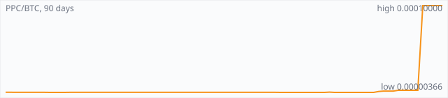

<a href="../"></a>

[All markets](../) · [Why testnet markets](../testnet-markets.md) · [Developers](../developers.md) · [Monthly reports](../reports/) · [Press kit](../press.md) · [altquick.com](https://altquick.com/)

# Peercoin (PPC) price in Bitcoin and how to buy it

Peercoin, launched in August 2012, was the first cryptocurrency to use proof of stake. It trades against Bitcoin on AltQuick with a public order book and API.

**[Open the PPC/BTC market on AltQuick →](https://altquick.com/market/peercoin-bitcoin/)**

## Live PPC/BTC numbers

| | |
|---|---|
| Last price | 0.00010000 BTC |
| Best bid / ask | 0.00000382 / 0.00010000 BTC |
| Trades, last 7 days | 6 |
| Volume, last 7 days | 0.00029010 BTC |
| Last trade | 2026-09-28 16:53 UTC |

## About Peercoin

| | |
|---|---|
| Ticker | PPC |
| Launched | August 2012 (the network started on 19 August 2012 according to the launch announcement). |
| Consensus | Hybrid: coin-age proof of stake secures the chain, and SHA-256 proof of work adds a trickle of new coins. |

Peercoin was launched in August 2012 by the pseudonymous Sunny King, who later created Primecoin, and Scott Nadal. It was the first cryptocurrency to use proof of stake, and nearly every proof-of-stake coin since, including Blackcoin, Clams and early Curecoin, borrows from its design. It launched with no ICO, premine or developer tax.

Peercoin's proof of stake is based on coin age: the number of coins you hold multiplied by how long you've held them. Holders run a wallet that mints blocks, and the chance of minting one grows with coin age, but each unspent output gets only one hash attempt per second, so it uses very little energy. Minting a block consumes the coin age and earns a reward.

Proof of work was used to distribute coins at the start and still adds a trickle of new PPC through SHA-256 mining, the same algorithm as Bitcoin. Long-term security, though, comes from the minters, which ties security to people with a stake in the network. There is no hard supply cap; Peercoin aims for low, continuous inflation instead.

Note: peercoin.org is a parked domain. The project's site is peercoin.net.

### Official links

- Website: [www.peercoin.net](https://www.peercoin.net/)
- Explorer: [explorer.peercoin.net](https://explorer.peercoin.net/)
- Explorer (CryptoID): [chainz.cryptoid.info/ppc](https://chainz.cryptoid.info/ppc/)
- Source code: [github.com/peercoin/peercoin](https://github.com/peercoin/peercoin)

## PPC/BTC price history, last 90 days



| | |
|---|---|
| Change, 30 days | +2632.2% |
| Change, 90 days | +2511.0% |
| Highest daily close | 0.00010000 BTC |
| Lowest daily close | 0.00000366 BTC |

Daily candles from AltQuick's klines API, UTC days. On days without trades the previous close carries forward.

<details open><summary>Daily closes, last 30 days</summary>

| Date (UTC) | Close (BTC) | High | Low | Volume (PPC) |
|---|---|---|---|---|
| 2026-10-01 | 0.00010000 | 0.00010000 | 0.00010000 | 0 |
| 2026-09-30 | 0.00010000 | 0.00010000 | 0.00010000 | 0 |
| 2026-09-29 | 0.00010000 | 0.00010000 | 0.00010000 | 0 |
| 2026-09-28 | 0.00010000 | 0.00010000 | 0.00000597 | 3.05524 |
| 2026-09-27 | 0.00000597 | 0.00000597 | 0.00000597 | 0 |
| 2026-09-26 | 0.00000597 | 0.00000597 | 0.00000597 | 0 |
| 2026-09-25 | 0.00000597 | 0.00000597 | 0.00000597 | 0 |
| 2026-09-24 | 0.00000597 | 0.00000597 | 0.00000597 | 0 |
| 2026-09-23 | 0.00000597 | 0.00000597 | 0.00000517 | 2422.04 |
| 2026-09-22 | 0.00000517 | 0.00000517 | 0.00000517 | 1396.52 |
| 2026-09-21 | 0.00000517 | 0.00000517 | 0.00000517 | 0 |
| 2026-09-20 | 0.00000517 | 0.00000517 | 0.00000467 | 174.47 |
| 2026-09-19 | 0.00000467 | 0.00000467 | 0.00000397 | 2861.72 |
| 2026-09-18 | 0.00000366 | 0.00000366 | 0.00000366 | 0 |
| 2026-09-17 | 0.00000366 | 0.00000366 | 0.00000366 | 0 |
| 2026-09-16 | 0.00000366 | 0.00000366 | 0.00000366 | 0 |
| 2026-09-15 | 0.00000366 | 0.00000366 | 0.00000366 | 0 |
| 2026-09-14 | 0.00000366 | 0.00000366 | 0.00000366 | 0 |
| 2026-09-13 | 0.00000366 | 0.00000366 | 0.00000366 | 0 |
| 2026-09-12 | 0.00000366 | 0.00000366 | 0.00000366 | 0 |
| 2026-09-11 | 0.00000366 | 0.00000366 | 0.00000366 | 0 |
| 2026-09-10 | 0.00000366 | 0.00000366 | 0.00000366 | 173.95 |
| 2026-09-09 | 0.00000397 | 0.00000397 | 0.00000397 | 13.8237 |
| 2026-09-08 | 0.00000366 | 0.00000366 | 0.00000366 | 0 |
| 2026-09-07 | 0.00000366 | 0.00000366 | 0.00000366 | 0 |
| 2026-09-06 | 0.00000366 | 0.00000366 | 0.00000366 | 0 |
| 2026-09-05 | 0.00000366 | 0.00000366 | 0.00000366 | 0 |
| 2026-09-04 | 0.00000366 | 0.00000397 | 0.00000366 | 196.39 |
| 2026-09-03 | 0.00000366 | 0.00000366 | 0.00000366 | 0 |
| 2026-09-02 | 0.00000366 | 0.00000366 | 0.00000366 | 0 |

</details>

## Order book snapshot

Top 5 bids (buy orders) and asks (sell orders).

| Bid price (BTC) | Bid amount (PPC) | Ask price (BTC) | Ask amount (PPC) |
|---|---|---|---|
| 0.00000382 | 0.0209424 | 0.00010000 | 12.1102 |
| 0.00000380 | 491.068 | 0.00060000 | 0.001 |
| 0.00000378 | 1000 | 0.00100000 | 45 |
| 0.00000377 | 15 | 0.00400000 | 10 |
| 0.00000366 | 26.6518 | 0.00445670 | 0.081 |

## Recent trades

| Time (UTC) | Side | Price (BTC) | Amount (PPC) |
|---|---|---|---|
| 2026-09-28 16:53 | buy | 0.00010000 | 2.88980000 |
| 2026-09-28 16:53 | buy | 0.00004000 | 0.00200000 |
| 2026-09-28 16:53 | buy | 0.00001500 | 0.00400000 |
| 2026-09-28 16:53 | buy | 0.00001500 | 0.00400000 |
| 2026-09-28 16:53 | buy | 0.00000598 | 0.03300000 |
| 2026-09-28 16:53 | buy | 0.00000597 | 0.12243765 |
| 2026-09-23 11:14 | buy | 0.00000597 | 181.35008376 |
| 2026-09-23 11:13 | buy | 0.00000577 | 1684.25996534 |
| 2026-09-23 11:13 | buy | 0.00000557 | 287.12208259 |
| 2026-09-23 11:13 | buy | 0.00000537 | 269.16945997 |

## How to buy Peercoin with Bitcoin

1. Create a free account on [altquick.com](https://altquick.com/) and deposit Bitcoin.
2. Open the [PPC/BTC market](https://altquick.com/market/peercoin-bitcoin/), check the order book, and place a limit or market order.
3. Withdraw PPC to your own wallet, or keep it on AltQuick to trade later.

To sell, deposit PPC and place a sell order on the same market to receive Bitcoin.

## Peercoin FAQ

### What is Peercoin (PPC)?

Peercoin, launched in August 2012, was the first cryptocurrency to use proof of stake.

### When did Peercoin launch?

August 2012 (the network started on 19 August 2012 according to the launch announcement).

### How is the Peercoin network secured?

Hybrid: coin-age proof of stake secures the chain, and SHA-256 proof of work adds a trickle of new coins.

### How do I buy Peercoin with Bitcoin?

Create a free account on altquick.com, deposit Bitcoin, then place a limit or market order on the [PPC/BTC market](https://altquick.com/market/peercoin-bitcoin/). You can withdraw PPC to your own wallet afterwards. AltQuick's trading fee is 1%.

### Where does the PPC price on this page come from?

From AltQuick's public API: the last price, order book and trades of the PPC/BTC market, and daily candles for the price history. No other exchanges are included.

## Related markets

- [Clamcoin (CLAM)](../clamcoin/): Clams (CLAM) is a proof-of-stake coin that was airdropped in 2014 to every Bitcoin, Litecoin and Dogecoin address holding a balance.
- [42-coin (42)](../42-coin/): 42-coin is a Scrypt proof-of-work and proof-of-stake coin with a hard cap of just 42 coins.
- [Namecoin (NMC)](../namecoin/): Namecoin, launched in April 2011, was the first fork of Bitcoin; it adds a decentralized name registry used for .bit domains and identities.

[See every AltQuick market](../) · [Peercoin on altquick.com](https://altquick.com/asset/peercoin/)

## Get this data yourself

```
curl "https://altquick.com/api/v1/trades?market=BTC_PPC&limit=20"
curl "https://altquick.com/api/v1/depth?market=BTC_PPC&limit=20"
curl "https://altquick.com/api/v1/klines?market=BTC_PPC&interval=1d&limit=90"
```

Background facts were checked against each project's own sites and public sources. Nothing here is investment advice.

Last updated: 2026-10-01 10:43 UTC from AltQuick's public API.

---

AltQuick, US-based since 2015. [altquick.com](https://altquick.com/) · [API docs](https://github.com/AltQuick-com/api) · hello@altquick.com
