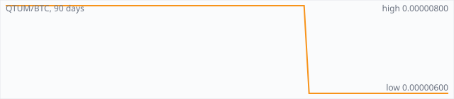

<a href="../"></a>

[All markets](../) · [Why testnet markets](../testnet-markets.md) · [Developers](../developers.md) · [Monthly reports](../reports/) · [Press kit](../press.md) · [altquick.com](https://altquick.com/)

# Qtum (QTUM) price in Bitcoin and how to buy it

Qtum is a proof-of-stake chain that combines Bitcoin's UTXO model with the Ethereum Virtual Machine. It trades against Bitcoin on AltQuick with a public order book and API.

**[Open the QTUM/BTC market on AltQuick →](https://altquick.com/market/qtum-bitcoin/)**

## Live QTUM/BTC numbers

| | |
|---|---|
| Last price | 0.00000600 BTC |
| Best bid / ask | 0.00000600 / 0.00001768 BTC |
| Trades, last 7 days | 0 |
| Volume, last 7 days | 0.00000000 BTC |
| Last trade | 2026-09-04 19:16 UTC |

## About Qtum

| | |
|---|---|
| Ticker | QTUM |
| Launched | Mainnet ("Ignition") launched on 13 September 2017. |
| Consensus | Proof of stake, with an on-chain governance protocol for adjusting parameters such as block size and gas. |

Qtum's mainnet, called Ignition, launched on 13 September 2017. The project tries to combine two things: Bitcoin's UTXO transaction model and the Ethereum Virtual Machine. Balances are tracked as Bitcoin-style unspent outputs, while an abstraction layer lets Solidity smart contracts written for Ethereum run on top of them.

The chain is secured by proof of stake rather than mining; QTUM holders stake to produce blocks, which now come about every 32 seconds. Qtum also has a Decentralized Governance Protocol that lets the network change parameters such as the block size limit and gas schedule through on-chain votes, without a hard fork.

QTUM pays for contract gas and is staked by block producers. The network keeps pulling in upstream changes from both Bitcoin Core and Ethereum, so it's a different bet from account-based chains such as Ethereum, Avalanche's C-Chain or Solana.

Qtum addresses look like Bitcoin addresses but are not interchangeable; withdraw only to a QTUM wallet.

### Official links

- Website: [qtum.org](https://qtum.org/)
- Explorer: [qtum.info](https://qtum.info/)
- Source code: [github.com/qtumproject/qtum](https://github.com/qtumproject/qtum)

## QTUM/BTC price history, last 90 days



| | |
|---|---|
| Change, 30 days | +0.0% |
| Change, 90 days | -25.0% |
| Highest daily close | 0.00000800 BTC |
| Lowest daily close | 0.00000600 BTC |

Daily candles from AltQuick's klines API, UTC days. On days without trades the previous close carries forward.

<details open><summary>Daily closes, last 30 days</summary>

| Date (UTC) | Close (BTC) | High | Low | Volume (QTUM) |
|---|---|---|---|---|
| 2026-10-04 | 0.00000600 | 0.00000600 | 0.00000600 | 0 |
| 2026-10-03 | 0.00000600 | 0.00000600 | 0.00000600 | 0 |
| 2026-10-02 | 0.00000600 | 0.00000600 | 0.00000600 | 0 |
| 2026-10-01 | 0.00000600 | 0.00000600 | 0.00000600 | 0 |
| 2026-09-30 | 0.00000600 | 0.00000600 | 0.00000600 | 0 |
| 2026-09-29 | 0.00000600 | 0.00000600 | 0.00000600 | 0 |
| 2026-09-28 | 0.00000600 | 0.00000600 | 0.00000600 | 0 |
| 2026-09-27 | 0.00000600 | 0.00000600 | 0.00000600 | 0 |
| 2026-09-26 | 0.00000600 | 0.00000600 | 0.00000600 | 0 |
| 2026-09-25 | 0.00000600 | 0.00000600 | 0.00000600 | 0 |
| 2026-09-24 | 0.00000600 | 0.00000600 | 0.00000600 | 0 |
| 2026-09-23 | 0.00000600 | 0.00000600 | 0.00000600 | 0 |
| 2026-09-22 | 0.00000600 | 0.00000600 | 0.00000600 | 0 |
| 2026-09-21 | 0.00000600 | 0.00000600 | 0.00000600 | 0 |
| 2026-09-20 | 0.00000600 | 0.00000600 | 0.00000600 | 0 |
| 2026-09-19 | 0.00000600 | 0.00000600 | 0.00000600 | 0 |
| 2026-09-18 | 0.00000600 | 0.00000600 | 0.00000600 | 0 |
| 2026-09-17 | 0.00000600 | 0.00000600 | 0.00000600 | 0 |
| 2026-09-16 | 0.00000600 | 0.00000600 | 0.00000600 | 0 |
| 2026-09-15 | 0.00000600 | 0.00000600 | 0.00000600 | 0 |
| 2026-09-14 | 0.00000600 | 0.00000600 | 0.00000600 | 0 |
| 2026-09-13 | 0.00000600 | 0.00000600 | 0.00000600 | 0 |
| 2026-09-12 | 0.00000600 | 0.00000600 | 0.00000600 | 0 |
| 2026-09-11 | 0.00000600 | 0.00000600 | 0.00000600 | 0 |
| 2026-09-10 | 0.00000600 | 0.00000600 | 0.00000600 | 0 |
| 2026-09-09 | 0.00000600 | 0.00000600 | 0.00000600 | 0 |
| 2026-09-08 | 0.00000600 | 0.00000600 | 0.00000600 | 0 |
| 2026-09-07 | 0.00000600 | 0.00000600 | 0.00000600 | 0 |
| 2026-09-06 | 0.00000600 | 0.00000600 | 0.00000600 | 0 |
| 2026-09-05 | 0.00000600 | 0.00000600 | 0.00000600 | 0 |

</details>

## Order book snapshot

Top 5 bids (buy orders) and asks (sell orders).

| Bid price (BTC) | Bid amount (QTUM) | Ask price (BTC) | Ask amount (QTUM) |
|---|---|---|---|
| 0.00000600 | 32.4378 | 0.00001768 | 4.9225 |
| 0.00000500 | 3 | 0.00010800 | 100 |
| 0.00000010 | 100 | 0.00011999 | 0.0495346 |
| 0.00000001 | 4000 | 0.00012400 | 0.99 |
|  |  | 0.00034500 | 0.53 |

## Recent trades

| Time (UTC) | Side | Price (BTC) | Amount (QTUM) |
|---|---|---|---|
| 2026-09-04 19:16 | sell | 0.00000600 | 0.89555577 |
| 2026-01-05 06:36 | sell | 0.00000800 | 0.05035307 |
| 2026-01-05 06:36 | sell | 0.00001609 | 0.01997832 |
| 2025-12-26 07:18 | sell | 0.00001609 | 4.95205400 |
| 2025-06-03 06:06 | sell | 0.00001930 | 0.78631134 |
| 2025-05-31 02:56 | sell | 0.00001930 | 0.04000000 |
| 2025-05-31 02:55 | sell | 0.00002000 | 20.00000000 |
| 2025-03-31 04:55 | sell | 0.00001930 | 3.70980400 |
| 2025-03-30 06:17 | sell | 0.00002500 | 12.01106619 |
| 2025-03-29 04:03 | sell | 0.00002500 | 2.38833600 |

## How to buy Qtum with Bitcoin

1. Create a free account on [altquick.com](https://altquick.com/) and deposit Bitcoin.
2. Open the [QTUM/BTC market](https://altquick.com/market/qtum-bitcoin/), check the order book, and place a limit or market order.
3. Withdraw QTUM to your own wallet, or keep it on AltQuick to trade later.

To sell, deposit QTUM and place a sell order on the same market to receive Bitcoin.

## Qtum FAQ

### What is Qtum (QTUM)?

Qtum is a proof-of-stake chain that combines Bitcoin's UTXO model with the Ethereum Virtual Machine.

### When did Qtum launch?

Mainnet ("Ignition") launched on 13 September 2017.

### How is the Qtum network secured?

Proof of stake, with an on-chain governance protocol for adjusting parameters such as block size and gas.

### How do I buy Qtum with Bitcoin?

Create a free account on altquick.com, deposit Bitcoin, then place a limit or market order on the [QTUM/BTC market](https://altquick.com/market/qtum-bitcoin/). You can withdraw QTUM to your own wallet afterwards. AltQuick's trading fee is 1%.

### Where does the QTUM price on this page come from?

From AltQuick's public API: the last price, order book and trades of the QTUM/BTC market, and daily candles for the price history. No other exchanges are included.

## Related markets

- [Particl (PART)](../particl/): Particl is a pure proof-of-stake privacy coin on a Bitcoin Core codebase, built to power a decentralized marketplace.
- [Avalanche (AVAX)](../avalanche/): Avalanche is a proof-of-stake smart-contract platform whose mainnet launched in September 2020.
- [Solana (SOL)](../solana/): Solana is a high-throughput proof-of-stake smart-contract chain that orders transactions with Proof of History.

[See every AltQuick market](../) · [Qtum on altquick.com](https://altquick.com/asset/qtum/)

## Get this data yourself

```
curl "https://altquick.com/api/v1/trades?market=BTC_QTUM&limit=20"
curl "https://altquick.com/api/v1/depth?market=BTC_QTUM&limit=20"
curl "https://altquick.com/api/v1/klines?market=BTC_QTUM&interval=1d&limit=90"
```

Background facts were checked against each project's own sites and public sources. Nothing here is investment advice.

Last updated: 2026-10-04 10:43 UTC from AltQuick's public API.

---

AltQuick, US-based since 2015. [altquick.com](https://altquick.com/) · [API docs](https://github.com/AltQuick-com/api) · hello@altquick.com
