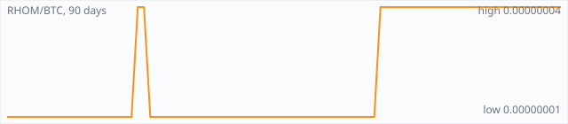

<a href="../"></a>

[All markets](../) · [Why testnet markets](../testnet-markets.md) · [Developers](../developers.md) · [Monthly reports](../reports/) · [Press kit](../press.md) · [altquick.com](https://altquick.com/)

# Rhombus (RHOM) price in Bitcoin and how to buy it

Rhombus (RHOM) is a proof-of-stake privacy coin forked from Particl, with public, blind and anonymous transactions. It trades against Bitcoin on AltQuick with a public order book and API.

**[Open the RHOM/BTC market on AltQuick →](https://altquick.com/market/rhombus-bitcoin/)**

## Live RHOM/BTC numbers

| | |
|---|---|
| Last price | 0.00000004 BTC |
| Best bid / ask | 0.00000001 / 0.00000004 BTC |
| Trades, last 7 days | 0 |
| Volume, last 7 days | 0.00000000 BTC |
| Last trade | 2026-09-04 19:16 UTC |

## About Rhombus

| | |
|---|---|
| Ticker | RHOM |
| Launched | Distributed through an airdrop to Bitcoin holders based on a snapshot taken around December 2020 (before BTC block 660,023). |
| Consensus | Pure proof of stake with no mining phase, 2.5-minute block target and cold staking. |

Rhombus is a privacy coin built on a fork of Particl Core, so it inherits a recent Bitcoin Core codebase. The project says it keeps that codebase in step with Bitcoin's updates. The chain is pure proof of stake with no mining phase, a 2.5-minute block target and 2 MB blocks. Each staked block pays about 25 RHOM, which the project puts at roughly 0.5% annual inflation, and cold staking lets coins stay offline while a node stakes for them.

Like Particl, RHOM can be sent with three privacy levels. Public sends are traceable like Bitcoin. Blind sends use Confidential Transactions to hide amounts. Anonymous sends use RingCT, Bulletproofs and stealth addresses to also hide the participants. You choose per transaction, trading privacy against fee and size. SegWit is on for every transaction, and an off-chain messaging network (SMSG) carries data so the chain stays small.

The initial coins were airdropped to Bitcoin holders. Addresses holding more than 0.001 BTC before Bitcoin block 660,023, a snapshot announced for 5 December 2020, could claim RHOM at about 500 RHOM per BTC by signing a message, with claims open until 5 December 2021. The project's site now states that about half of the supply has been burned.

Don't confuse RHOM with 'Rhombus DeFi' (RHO), an unrelated BSC token.

### Official links

- Website: [rhom.com](https://rhom.com/)
- Explorer: [explorer.rhom.com](https://explorer.rhom.com/)
- Source code: [github.com/rhombus-project/rhombus-core](https://github.com/rhombus-project/rhombus-core)

## RHOM/BTC price history, last 90 days



| | |
|---|---|
| Change, 30 days | +300.0% |
| Change, 90 days | +300.0% |
| Highest daily close | 0.00000004 BTC |
| Lowest daily close | 0.00000001 BTC |

Daily candles from AltQuick's klines API, UTC days. On days without trades the previous close carries forward.

<details open><summary>Daily closes, last 30 days</summary>

| Date (UTC) | Close (BTC) | High | Low | Volume (RHOM) |
|---|---|---|---|---|
| 2026-10-02 | 0.00000004 | 0.00000004 | 0.00000004 | 0 |
| 2026-10-01 | 0.00000004 | 0.00000004 | 0.00000004 | 0 |
| 2026-09-30 | 0.00000004 | 0.00000004 | 0.00000004 | 0 |
| 2026-09-29 | 0.00000004 | 0.00000004 | 0.00000004 | 0 |
| 2026-09-28 | 0.00000004 | 0.00000004 | 0.00000004 | 0 |
| 2026-09-27 | 0.00000004 | 0.00000004 | 0.00000004 | 0 |
| 2026-09-26 | 0.00000004 | 0.00000004 | 0.00000004 | 0 |
| 2026-09-25 | 0.00000004 | 0.00000004 | 0.00000004 | 0 |
| 2026-09-24 | 0.00000004 | 0.00000004 | 0.00000004 | 0 |
| 2026-09-23 | 0.00000004 | 0.00000004 | 0.00000004 | 0 |
| 2026-09-22 | 0.00000004 | 0.00000004 | 0.00000004 | 0 |
| 2026-09-21 | 0.00000004 | 0.00000004 | 0.00000004 | 0 |
| 2026-09-20 | 0.00000004 | 0.00000004 | 0.00000004 | 0 |
| 2026-09-19 | 0.00000004 | 0.00000004 | 0.00000004 | 0 |
| 2026-09-18 | 0.00000004 | 0.00000004 | 0.00000004 | 0 |
| 2026-09-17 | 0.00000004 | 0.00000004 | 0.00000004 | 0 |
| 2026-09-16 | 0.00000004 | 0.00000004 | 0.00000004 | 0 |
| 2026-09-15 | 0.00000004 | 0.00000004 | 0.00000004 | 0 |
| 2026-09-14 | 0.00000004 | 0.00000004 | 0.00000004 | 0 |
| 2026-09-13 | 0.00000004 | 0.00000004 | 0.00000004 | 0 |
| 2026-09-12 | 0.00000004 | 0.00000004 | 0.00000004 | 0 |
| 2026-09-11 | 0.00000004 | 0.00000004 | 0.00000004 | 0 |
| 2026-09-10 | 0.00000004 | 0.00000004 | 0.00000004 | 0 |
| 2026-09-09 | 0.00000004 | 0.00000004 | 0.00000004 | 0 |
| 2026-09-08 | 0.00000004 | 0.00000004 | 0.00000004 | 0 |
| 2026-09-07 | 0.00000004 | 0.00000004 | 0.00000004 | 0 |
| 2026-09-06 | 0.00000004 | 0.00000004 | 0.00000004 | 0 |
| 2026-09-05 | 0.00000004 | 0.00000004 | 0.00000004 | 0 |
| 2026-09-04 | 0.00000004 | 0.00000004 | 0.00000004 | 8137.6 |
| 2026-09-03 | 0.00000001 | 0.00000001 | 0.00000001 | 0 |

</details>

## Order book snapshot

Top 5 bids (buy orders) and asks (sell orders).

| Bid price (BTC) | Bid amount (RHOM) | Ask price (BTC) | Ask amount (RHOM) |
|---|---|---|---|
| 0.00000001 | 1.25691e+06 | 0.00000004 | 1121.61 |
|  |  | 0.00000005 | 1.01112e+06 |
|  |  | 0.00000006 | 1000 |
|  |  | 0.00000007 | 1000.75 |
|  |  | 0.00000008 | 1000 |

## Recent trades

| Time (UTC) | Side | Price (BTC) | Amount (RHOM) |
|---|---|---|---|
| 2026-09-04 19:16 | sell | 0.00000004 | 0.25000000 |
| 2026-09-04 15:34 | buy | 0.00000004 | 1.65000000 |
| 2026-09-04 15:34 | buy | 0.00000004 | 2127.01000000 |
| 2026-09-04 15:34 | buy | 0.00000004 | 2000.00000000 |
| 2026-09-04 15:34 | buy | 0.00000004 | 2000.00000000 |
| 2026-09-04 15:34 | buy | 0.00000004 | 2000.00000000 |
| 2026-09-04 15:34 | buy | 0.00000004 | 8.69500000 |
| 2026-08-24 13:40 | sell | 0.00000001 | 3446.39297893 |
| 2026-08-08 16:51 | sell | 0.00000001 | 2419.00000000 |
| 2026-07-29 07:20 | sell | 0.00000001 | 1391.27930000 |

## How to buy Rhombus with Bitcoin

1. Create a free account on [altquick.com](https://altquick.com/) and deposit Bitcoin.
2. Open the [RHOM/BTC market](https://altquick.com/market/rhombus-bitcoin/), check the order book, and place a limit or market order.
3. Withdraw RHOM to your own wallet, or keep it on AltQuick to trade later.

To sell, deposit RHOM and place a sell order on the same market to receive Bitcoin.

## Rhombus FAQ

### What is Rhombus (RHOM)?

Rhombus (RHOM) is a proof-of-stake privacy coin forked from Particl, with public, blind and anonymous transactions.

### When did Rhombus launch?

Distributed through an airdrop to Bitcoin holders based on a snapshot taken around December 2020 (before BTC block 660,023).

### How is the Rhombus network secured?

Pure proof of stake with no mining phase, 2.5-minute block target and cold staking.

### How do I buy Rhombus with Bitcoin?

Create a free account on altquick.com, deposit Bitcoin, then place a limit or market order on the [RHOM/BTC market](https://altquick.com/market/rhombus-bitcoin/). You can withdraw RHOM to your own wallet afterwards. AltQuick's trading fee is 1%.

### Where does the RHOM price on this page come from?

From AltQuick's public API: the last price, order book and trades of the RHOM/BTC market, and daily candles for the price history. No other exchanges are included.

## Related markets

- [Particl (PART)](../particl/): Particl is a pure proof-of-stake privacy coin on a Bitcoin Core codebase, built to power a decentralized marketplace.
- [Monero (XMR)](../monero/): Monero is a CryptoNote-based privacy coin launched in April 2014 that hides senders, receivers and amounts by default.
- [Zcash (ZEC)](../zcash/): Zcash is a 2016 Bitcoin-style coin with optional shielded payments using zero-knowledge proofs.

[See every AltQuick market](../) · [Rhombus on altquick.com](https://altquick.com/asset/rhombus/)

## Get this data yourself

```
curl "https://altquick.com/api/v1/trades?market=BTC_RHOM&limit=20"
curl "https://altquick.com/api/v1/depth?market=BTC_RHOM&limit=20"
curl "https://altquick.com/api/v1/klines?market=BTC_RHOM&interval=1d&limit=90"
```

Background facts were checked against each project's own sites and public sources. Nothing here is investment advice.

Last updated: 2026-10-02 22:53 UTC from AltQuick's public API.

---

AltQuick, US-based since 2015. [altquick.com](https://altquick.com/) · [API docs](https://github.com/AltQuick-com/api) · hello@altquick.com
