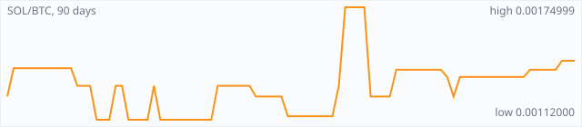

<a href="../"></a>

[All markets](../) · [Why testnet markets](../testnet-markets.md) · [Developers](../developers.md) · [Monthly reports](../reports/) · [Press kit](../press.md) · [altquick.com](https://altquick.com/)

# Solana (SOL) price in Bitcoin and how to buy it

Solana is a high-throughput proof-of-stake smart-contract chain that orders transactions with Proof of History. It trades against Bitcoin on AltQuick with a public order book and API.

**[Open the SOL/BTC market on AltQuick →](https://altquick.com/market/solana-bitcoin/)**

## Live SOL/BTC numbers

| | |
|---|---|
| Last price | 0.00145000 BTC |
| Best bid / ask | 0.00140000 / 0.00145000 BTC |
| Trades, last 7 days | 4 |
| Volume, last 7 days | 0.00009206 BTC |
| Last trade | 2026-10-01 16:21 UTC |

## About Solana

| | |
|---|---|
| Ticker | SOL |
| Launched | Mainnet Beta launched on 16 March 2020. |
| Consensus | Proof of stake with Tower BFT voting, ordered by Proof of History, a verifiable clock built from sequential hashing. |

Solana was founded by Anatoly Yakovenko, who described its core idea in a 2017 whitepaper, and its Mainnet Beta launched on 16 March 2020. It's built for speed and low fees: one chain without sharding, tuned to process many transactions per second on powerful validator hardware.

The key idea is Proof of History, a sequence of hashes computed one after another that proves time has passed between events. Because every validator can check the order of events from that sequence, they don't need to message each other just to agree on time. Tower BFT, a proof-of-stake voting protocol, then finalizes blocks on top of that clock. The runtime can also execute transactions that don't touch the same accounts in parallel.

The trade-offs are real. Running a validator takes strong hardware and bandwidth, and the network has had several outages, notably in 2021 and 2022. Multiple independent validator clients are now being developed to reduce the risk of one bug halting the chain.

SOL pays transaction fees and is staked to validators. AltQuick quotes it against Bitcoin.

### Official links

- Website: [solana.com](https://solana.com/)
- Explorer (Solscan): [solscan.io](https://solscan.io/)
- Validator client (Agave): [github.com/anza-xyz/agave](https://github.com/anza-xyz/agave)

## SOL/BTC price history, last 90 days



| | |
|---|---|
| Change, 30 days | +16.0% |
| Change, 90 days | +25.3% |
| Highest daily close | 0.00174999 BTC |
| Lowest daily close | 0.00112000 BTC |

Daily candles from AltQuick's klines API, UTC days. On days without trades the previous close carries forward.

<details open><summary>Daily closes, last 30 days</summary>

| Date (UTC) | Close (BTC) | High | Low | Volume (SOL) |
|---|---|---|---|---|
| 2026-10-02 | 0.00145000 | 0.00145000 | 0.00145000 | 0 |
| 2026-10-01 | 0.00145000 | 0.00145000 | 0.00145000 | 0.0508897 |
| 2026-09-30 | 0.00140000 | 0.00140000 | 0.00140000 | 0 |
| 2026-09-29 | 0.00140000 | 0.00140000 | 0.00140000 | 0 |
| 2026-09-28 | 0.00140000 | 0.00140000 | 0.00140000 | 0.00105 |
| 2026-09-27 | 0.00140000 | 0.00140000 | 0.00140000 | 0.01 |
| 2026-09-26 | 0.00140000 | 0.00140000 | 0.00140000 | 0.002 |
| 2026-09-25 | 0.00136000 | 0.00136000 | 0.00136000 | 0 |
| 2026-09-24 | 0.00136000 | 0.00136000 | 0.00136000 | 0 |
| 2026-09-23 | 0.00136000 | 0.00136000 | 0.00136000 | 0 |
| 2026-09-22 | 0.00136000 | 0.00136000 | 0.00136000 | 0 |
| 2026-09-21 | 0.00136000 | 0.00136000 | 0.00136000 | 0 |
| 2026-09-20 | 0.00136000 | 0.00136000 | 0.00136000 | 0.0748088 |
| 2026-09-19 | 0.00136000 | 0.00136000 | 0.00136000 | 0 |
| 2026-09-18 | 0.00136000 | 0.00136000 | 0.00136000 | 0 |
| 2026-09-17 | 0.00136000 | 0.00136000 | 0.00136000 | 0 |
| 2026-09-16 | 0.00136000 | 0.00136000 | 0.00136000 | 0 |
| 2026-09-15 | 0.00136000 | 0.00136000 | 0.00136000 | 0.00174265 |
| 2026-09-14 | 0.00125000 | 0.00125000 | 0.00125000 | 0.00185605 |
| 2026-09-13 | 0.00136000 | 0.00136000 | 0.00136000 | 0.00036765 |
| 2026-09-12 | 0.00139999 | 0.00139999 | 0.00139999 | 0.00150716 |
| 2026-09-11 | 0.00140000 | 0.00140000 | 0.00140000 | 0 |
| 2026-09-10 | 0.00140000 | 0.00140000 | 0.00139999 | 0.445657 |
| 2026-09-09 | 0.00139999 | 0.00139999 | 0.00139999 | 0 |
| 2026-09-08 | 0.00139999 | 0.00139999 | 0.00139999 | 0 |
| 2026-09-07 | 0.00139999 | 0.00139999 | 0.00139999 | 0.0638076 |
| 2026-09-06 | 0.00139999 | 0.00139999 | 0.00139999 | 0 |
| 2026-09-05 | 0.00139999 | 0.00139999 | 0.00139999 | 0.00084287 |
| 2026-09-04 | 0.00125001 | 0.00125001 | 0.00125001 | 0.0279179 |
| 2026-09-03 | 0.00125001 | 0.00125001 | 0.00125001 | 0 |

</details>

## Order book snapshot

Top 5 bids (buy orders) and asks (sell orders).

| Bid price (BTC) | Bid amount (SOL) | Ask price (BTC) | Ask amount (SOL) |
|---|---|---|---|
| 0.00140000 | 0.98695 | 0.00145000 | 9.94926 |
| 0.00130000 | 1 | 0.00500000 | 1e-05 |
| 0.00126120 | 0.0399937 | 0.00600000 | 1e-05 |
| 0.00011200 | 0.0190179 | 0.80000000 | 0.00033 |
| 0.00005000 | 0.0028 | 0.85000000 | 4e-05 |

## Recent trades

| Time (UTC) | Side | Price (BTC) | Amount (SOL) |
|---|---|---|---|
| 2026-10-01 16:21 | buy | 0.00145000 | 0.05088965 |
| 2026-09-28 12:18 | sell | 0.00140000 | 0.00105000 |
| 2026-09-27 06:34 | sell | 0.00140000 | 0.01000000 |
| 2026-09-26 18:44 | sell | 0.00140000 | 0.00200000 |
| 2026-09-20 14:54 | buy | 0.00136000 | 0.00217648 |
| 2026-09-20 06:19 | buy | 0.00136000 | 0.07263235 |
| 2026-09-15 15:06 | buy | 0.00136000 | 0.00174265 |
| 2026-09-14 19:16 | sell | 0.00125000 | 0.00185605 |
| 2026-09-13 10:44 | buy | 0.00136000 | 0.00036765 |
| 2026-09-12 08:53 | buy | 0.00139999 | 0.00150716 |

## How to buy Solana with Bitcoin

1. Create a free account on [altquick.com](https://altquick.com/) and deposit Bitcoin.
2. Open the [SOL/BTC market](https://altquick.com/market/solana-bitcoin/), check the order book, and place a limit or market order.
3. Withdraw SOL to your own wallet, or keep it on AltQuick to trade later.

To sell, deposit SOL and place a sell order on the same market to receive Bitcoin.

## Solana FAQ

### What is Solana (SOL)?

Solana is a high-throughput proof-of-stake smart-contract chain that orders transactions with Proof of History.

### When did Solana launch?

Mainnet Beta launched on 16 March 2020.

### How is the Solana network secured?

Proof of stake with Tower BFT voting, ordered by Proof of History, a verifiable clock built from sequential hashing.

### How do I buy Solana with Bitcoin?

Create a free account on altquick.com, deposit Bitcoin, then place a limit or market order on the [SOL/BTC market](https://altquick.com/market/solana-bitcoin/). You can withdraw SOL to your own wallet afterwards. AltQuick's trading fee is 1%.

### Where does the SOL price on this page come from?

From AltQuick's public API: the last price, order book and trades of the SOL/BTC market, and daily candles for the price history. No other exchanges are included.

## Related markets

- [Avalanche (AVAX)](../avalanche/): Avalanche is a proof-of-stake smart-contract platform whose mainnet launched in September 2020.
- [Qtum (QTUM)](../qtum/): Qtum is a proof-of-stake chain that combines Bitcoin's UTXO model with the Ethereum Virtual Machine.
- [Dogecoin (DOGE)](../dogecoin/): Dogecoin is the Shiba Inu meme coin launched in December 2013, a Scrypt chain merge-mined with Litecoin.

[See every AltQuick market](../) · [Solana on altquick.com](https://altquick.com/asset/solana/)

## Get this data yourself

```
curl "https://altquick.com/api/v1/trades?market=BTC_SOL&limit=20"
curl "https://altquick.com/api/v1/depth?market=BTC_SOL&limit=20"
curl "https://altquick.com/api/v1/klines?market=BTC_SOL&interval=1d&limit=90"
```

Background facts were checked against each project's own sites and public sources. Nothing here is investment advice.

Last updated: 2026-10-02 22:53 UTC from AltQuick's public API.

---

AltQuick, US-based since 2015. [altquick.com](https://altquick.com/) · [API docs](https://github.com/AltQuick-com/api) · hello@altquick.com
