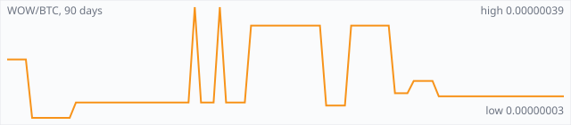

<a href="../"></a>

[All markets](../) · [Why testnet markets](../testnet-markets.md) · [Developers](../developers.md) · [Monthly reports](../reports/) · [Press kit](../press.md) · [altquick.com](https://altquick.com/)

# Wownero (WOW) price in Bitcoin and how to buy it

Wownero is a Doge-inspired, CPU-mined privacy memecoin forked from Monero and launched on 1 April 2018. It trades against Bitcoin on AltQuick with a public order book and API.

**[Open the WOW/BTC market on AltQuick →](https://altquick.com/market/wownero-bitcoin/)**

## Live WOW/BTC numbers

| | |
|---|---|
| Last price | 0.00000010 BTC |
| Best bid / ask | 0.00000012 / 0.00000013 BTC |
| Trades, last 7 days | 0 |
| Volume, last 7 days | 0.00000000 BTC |
| Last trade | 2026-09-11 08:25 UTC |

## About Wownero

| | |
|---|---|
| Ticker | WOW |
| Launched | 1 April 2018 (April Fools' Day), with no premine. |
| Consensus | CPU-oriented proof of work using a lighter variant of Monero's RandomX; solo mining only. |

Wownero launched on April Fools' Day 2018 as a self-described privacy memecoin, mixing Dogecoin's humor with Monero's technology. It's a software fork of Monero, not a chain fork, so nobody got free coins at launch, and there is no premine, trusted setup or developer tax.

Privacy works the way it does in Monero: ring signatures hide the sender, stealth addresses hide the recipient and RingCT hides amounts, all on by default. Wownero uses larger rings than Monero. Mining uses a lighter version of RandomX aimed at ordinary CPUs, and the project promotes solo mining straight from a Wownero node rather than through big pools.

Unlike Monero, which has a permanent tail emission, Wownero has a fixed supply of 184 million coins emitted over about 50 years. The community suggests micro-tipping meme creators as the main use, and development is paid for by a community funding system rather than a company.

If you want the serious version of this technology, see Monero; Wownero is the same privacy model with jokes on top.

### Official links

- Website: [wownero.org](https://wownero.org/)
- Explorer: [explore.wownero.com](https://explore.wownero.com/)

## WOW/BTC price history, last 90 days



| | |
|---|---|
| Change, 30 days | -9.1% |
| Change, 90 days | -54.5% |
| Highest daily close | 0.00000039 BTC |
| Lowest daily close | 0.00000003 BTC |

Daily candles from AltQuick's klines API, UTC days. On days without trades the previous close carries forward.

<details open><summary>Daily closes, last 30 days</summary>

| Date (UTC) | Close (BTC) | High | Low | Volume (WOW) |
|---|---|---|---|---|
| 2026-10-04 | 0.00000010 | 0.00000010 | 0.00000010 | 0 |
| 2026-10-03 | 0.00000010 | 0.00000010 | 0.00000010 | 0 |
| 2026-10-02 | 0.00000010 | 0.00000010 | 0.00000010 | 0 |
| 2026-10-01 | 0.00000010 | 0.00000010 | 0.00000010 | 0 |
| 2026-09-30 | 0.00000010 | 0.00000010 | 0.00000010 | 0 |
| 2026-09-29 | 0.00000010 | 0.00000010 | 0.00000010 | 0 |
| 2026-09-28 | 0.00000010 | 0.00000010 | 0.00000010 | 0 |
| 2026-09-27 | 0.00000010 | 0.00000010 | 0.00000010 | 0 |
| 2026-09-26 | 0.00000010 | 0.00000010 | 0.00000010 | 0 |
| 2026-09-25 | 0.00000010 | 0.00000010 | 0.00000010 | 0 |
| 2026-09-24 | 0.00000010 | 0.00000010 | 0.00000010 | 0 |
| 2026-09-23 | 0.00000010 | 0.00000010 | 0.00000010 | 0 |
| 2026-09-22 | 0.00000010 | 0.00000010 | 0.00000010 | 0 |
| 2026-09-21 | 0.00000010 | 0.00000010 | 0.00000010 | 0 |
| 2026-09-20 | 0.00000010 | 0.00000010 | 0.00000010 | 0 |
| 2026-09-19 | 0.00000010 | 0.00000010 | 0.00000010 | 0 |
| 2026-09-18 | 0.00000010 | 0.00000010 | 0.00000010 | 0 |
| 2026-09-17 | 0.00000010 | 0.00000010 | 0.00000010 | 0 |
| 2026-09-16 | 0.00000010 | 0.00000010 | 0.00000010 | 0 |
| 2026-09-15 | 0.00000010 | 0.00000010 | 0.00000010 | 0 |
| 2026-09-14 | 0.00000010 | 0.00000010 | 0.00000010 | 0 |
| 2026-09-13 | 0.00000010 | 0.00000010 | 0.00000010 | 0 |
| 2026-09-12 | 0.00000010 | 0.00000010 | 0.00000010 | 0 |
| 2026-09-11 | 0.00000010 | 0.00000011 | 0.00000010 | 577.845 |
| 2026-09-10 | 0.00000015 | 0.00000015 | 0.00000015 | 0 |
| 2026-09-09 | 0.00000015 | 0.00000015 | 0.00000015 | 0 |
| 2026-09-08 | 0.00000015 | 0.00000015 | 0.00000015 | 0 |
| 2026-09-07 | 0.00000015 | 0.00000015 | 0.00000015 | 1.93333 |
| 2026-09-06 | 0.00000011 | 0.00000011 | 0.00000011 | 736.111 |
| 2026-09-05 | 0.00000011 | 0.00000011 | 0.00000011 | 0 |

</details>

## Order book snapshot

Top 5 bids (buy orders) and asks (sell orders).

| Bid price (BTC) | Bid amount (WOW) | Ask price (BTC) | Ask amount (WOW) |
|---|---|---|---|
| 0.00000012 | 745.667 | 0.00000013 | 2297.8 |
| 0.00000011 | 813.455 | 0.00000014 | 2297.8 |
| 0.00000010 | 1536.21 | 0.00000015 | 116.167 |
| 0.00000009 | 4254.89 | 0.00000016 | 151.363 |
| 0.00000008 | 4767.38 | 0.00000017 | 170.1 |

## Recent trades

| Time (UTC) | Side | Price (BTC) | Amount (WOW) |
|---|---|---|---|
| 2026-09-11 08:25 | sell | 0.00000010 | 3.91625190 |
| 2026-09-11 08:07 | sell | 0.00000010 | 459.87458988 |
| 2026-09-11 08:07 | sell | 0.00000010 | 9.60000000 |
| 2026-09-11 08:07 | sell | 0.00000011 | 104.45454546 |
| 2026-09-07 09:28 | buy | 0.00000015 | 1.93333334 |
| 2026-09-06 05:43 | sell | 0.00000011 | 736.11138486 |
| 2026-09-04 19:16 | sell | 0.00000011 | 263.88861514 |
| 2026-08-28 22:16 | buy | 0.00000033 | 192.42424242 |
| 2026-08-28 22:16 | buy | 0.00000032 | 100.00000000 |
| 2026-08-28 22:16 | buy | 0.00000031 | 100.00000000 |

## How to buy Wownero with Bitcoin

1. Create a free account on [altquick.com](https://altquick.com/) and deposit Bitcoin.
2. Open the [WOW/BTC market](https://altquick.com/market/wownero-bitcoin/), check the order book, and place a limit or market order.
3. Withdraw WOW to your own wallet, or keep it on AltQuick to trade later.

To sell, deposit WOW and place a sell order on the same market to receive Bitcoin.

## Wownero FAQ

### What is Wownero (WOW)?

Wownero is a Doge-inspired, CPU-mined privacy memecoin forked from Monero and launched on 1 April 2018.

### When did Wownero launch?

1 April 2018 (April Fools' Day), with no premine.

### How is the Wownero network secured?

CPU-oriented proof of work using a lighter variant of Monero's RandomX; solo mining only.

### How do I buy Wownero with Bitcoin?

Create a free account on altquick.com, deposit Bitcoin, then place a limit or market order on the [WOW/BTC market](https://altquick.com/market/wownero-bitcoin/). You can withdraw WOW to your own wallet afterwards. AltQuick's trading fee is 1%.

### Where does the WOW price on this page come from?

From AltQuick's public API: the last price, order book and trades of the WOW/BTC market, and daily candles for the price history. No other exchanges are included.

## Related markets

- [Monero (XMR)](../monero/): Monero is a CryptoNote-based privacy coin launched in April 2014 that hides senders, receivers and amounts by default.
- [Dogecoin (DOGE)](../dogecoin/): Dogecoin is the Shiba Inu meme coin launched in December 2013, a Scrypt chain merge-mined with Litecoin.
- [Zcash (ZEC)](../zcash/): Zcash is a 2016 Bitcoin-style coin with optional shielded payments using zero-knowledge proofs.

[See every AltQuick market](../) · [Wownero on altquick.com](https://altquick.com/asset/wownero/)

## Get this data yourself

```
curl "https://altquick.com/api/v1/trades?market=BTC_WOW&limit=20"
curl "https://altquick.com/api/v1/depth?market=BTC_WOW&limit=20"
curl "https://altquick.com/api/v1/klines?market=BTC_WOW&interval=1d&limit=90"
```

Background facts were checked against each project's own sites and public sources. Nothing here is investment advice.

Last updated: 2026-10-04 10:43 UTC from AltQuick's public API.

---

AltQuick, US-based since 2015. [altquick.com](https://altquick.com/) · [API docs](https://github.com/AltQuick-com/api) · hello@altquick.com
