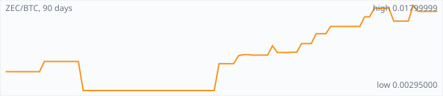

<a href="../"></a>

[All markets](../) · [Why testnet markets](../testnet-markets.md) · [Developers](../developers.md) · [Monthly reports](../reports/) · [Press kit](../press.md) · [altquick.com](https://altquick.com/)

# Zcash (ZEC) price in Bitcoin and how to buy it

Zcash is a 2016 Bitcoin-style coin with optional shielded payments using zero-knowledge proofs. It trades against Bitcoin on AltQuick with a public order book and API.

**[Open the ZEC/BTC market on AltQuick →](https://altquick.com/market/zcash-bitcoin/)**

## Live ZEC/BTC numbers

| | |
|---|---|
| Last price | 0.01695198 BTC |
| Best bid / ask | 0.00950000 / 0.01676422 BTC |
| Trades, last 7 days | 0 |
| Volume, last 7 days | 0.00000000 BTC |
| Last trade | 2026-09-27 23:56 UTC |

## About Zcash

| | |
|---|---|
| Ticker | ZEC |
| Launched | 28 October 2016. |
| Consensus | Equihash proof of work with 75-second blocks. |

Zcash launched on 28 October 2016. It grew out of Zerocash, academic research on using zero-knowledge proofs for private payments, and was developed by the company now called Electric Coin Company. Like Bitcoin it has a 21 million coin cap and halvings; it uses Equihash proof of work, and blocks have come every 75 seconds since a 2019 upgrade.

Zcash has two kinds of addresses. Transparent addresses (starting with t) work like Bitcoin: everything is public. Shielded addresses use zero-knowledge proofs (zk-SNARKs) to hide the sender, receiver and amount while still proving the transaction is valid. Shielding is optional, which is the main difference from Monero, where privacy is always on.

The shielded protocol has gone through generations: Sprout at launch, Sapling in 2018, which made shielded transactions practical on phones, and Orchard in 2022, built on the Halo 2 proving system, which doesn't need the trusted setup ceremony the earlier pools relied on.

Check whether AltQuick's ZEC deposit address is transparent or shielded before sending from a shielded wallet.

### Official links

- Website: [z.cash](https://z.cash/)
- Explorer: [mainnet.zcashexplorer.app](https://mainnet.zcashexplorer.app/)
- Source code: [github.com/zcash/zcash](https://github.com/zcash/zcash)

## ZEC/BTC price history, last 90 days



| | |
|---|---|
| Change, 30 days | +50.5% |
| Change, 90 days | +169.5% |
| Highest daily close | 0.01799999 BTC |
| Lowest daily close | 0.00295000 BTC |

Daily candles from AltQuick's klines API, UTC days. On days without trades the previous close carries forward.

<details open><summary>Daily closes, last 30 days</summary>

| Date (UTC) | Close (BTC) | High | Low | Volume (ZEC) |
|---|---|---|---|---|
| 2026-10-05 | 0.01695198 | 0.01695198 | 0.01695198 | 0 |
| 2026-10-04 | 0.01695198 | 0.01695198 | 0.01695198 | 0 |
| 2026-10-03 | 0.01695198 | 0.01695198 | 0.01695198 | 0 |
| 2026-10-02 | 0.01695198 | 0.01695198 | 0.01695198 | 0 |
| 2026-10-01 | 0.01695198 | 0.01695198 | 0.01695198 | 0 |
| 2026-09-30 | 0.01695198 | 0.01695198 | 0.01695198 | 0 |
| 2026-09-29 | 0.01695198 | 0.01695198 | 0.01695198 | 0 |
| 2026-09-28 | 0.01695198 | 0.01695198 | 0.01695198 | 0 |
| 2026-09-27 | 0.01695198 | 0.01695198 | 0.01695198 | 7.5e-05 |
| 2026-09-26 | 0.01799999 | 0.01799999 | 0.01799999 | 0.021279 |
| 2026-09-25 | 0.01523784 | 0.01523784 | 0.01523784 | 0 |
| 2026-09-24 | 0.01523784 | 0.01523784 | 0.01523784 | 0 |
| 2026-09-23 | 0.01523784 | 0.01523784 | 0.01523784 | 0 |
| 2026-09-22 | 0.01523784 | 0.01523784 | 0.01523784 | 0.00050292 |
| 2026-09-21 | 0.01750000 | 0.01750000 | 0.01750000 | 0 |
| 2026-09-20 | 0.01750000 | 0.01750000 | 0.01750000 | 0 |
| 2026-09-19 | 0.01750000 | 0.01750000 | 0.01750000 | 0 |
| 2026-09-18 | 0.01750000 | 0.01750000 | 0.01750000 | 0.000508 |
| 2026-09-17 | 0.01600000 | 0.01600000 | 0.01600000 | 0 |
| 2026-09-16 | 0.01600000 | 0.01600000 | 0.01600000 | 0.1 |
| 2026-09-15 | 0.01430000 | 0.01430000 | 0.01430000 | 0 |
| 2026-09-14 | 0.01430000 | 0.01430000 | 0.01430000 | 0 |
| 2026-09-13 | 0.01430000 | 0.01430000 | 0.01430000 | 0 |
| 2026-09-12 | 0.01430000 | 0.01430000 | 0.01430000 | 0 |
| 2026-09-11 | 0.01430000 | 0.01430000 | 0.01430000 | 0 |
| 2026-09-10 | 0.01430000 | 0.01430000 | 0.01430000 | 0 |
| 2026-09-09 | 0.01430000 | 0.01430000 | 0.01430000 | 0.1 |
| 2026-09-08 | 0.01300000 | 0.01300000 | 0.01300000 | 0 |
| 2026-09-07 | 0.01300000 | 0.01300000 | 0.01300000 | 0 |
| 2026-09-06 | 0.01300000 | 0.01300000 | 0.01200000 | 0.2 |

</details>

## Order book snapshot

Top 5 bids (buy orders) and asks (sell orders).

| Bid price (BTC) | Bid amount (ZEC) | Ask price (BTC) | Ask amount (ZEC) |
|---|---|---|---|
| 0.00950000 | 0.705719 | 0.01676422 | 0.0216384 |
| 0.00500000 | 0.100024 | 0.01799999 | 0.00263056 |
| 0.00400001 | 0.0899998 | 0.01900000 | 0.01 |
| 0.00295001 | 0.0899997 | 0.02100000 | 0.02 |
| 0.00040517 | 0.0999827 | 0.89867000 | 8.07e-06 |

## Recent trades

| Time (UTC) | Side | Price (BTC) | Amount (ZEC) |
|---|---|---|---|
| 2026-09-27 23:56 | sell | 0.01695198 | 0.00007500 |
| 2026-09-26 22:00 | buy | 0.01799999 | 0.00000333 |
| 2026-09-26 22:00 | buy | 0.01799999 | 0.01127569 |
| 2026-09-26 22:00 | buy | 0.01799999 | 0.01000000 |
| 2026-09-22 02:36 | sell | 0.01523784 | 0.00050292 |
| 2026-09-18 05:49 | buy | 0.01750000 | 0.00050800 |
| 2026-09-16 18:50 | buy | 0.01600000 | 0.10000000 |
| 2026-09-09 11:30 | buy | 0.01430000 | 0.10000000 |
| 2026-09-06 06:00 | buy | 0.01300000 | 0.01947829 |
| 2026-09-06 05:50 | buy | 0.01300000 | 0.00001432 |

## How to buy Zcash with Bitcoin

1. Create a free account on [altquick.com](https://altquick.com/) and deposit Bitcoin.
2. Open the [ZEC/BTC market](https://altquick.com/market/zcash-bitcoin/), check the order book, and place a limit or market order.
3. Withdraw ZEC to your own wallet, or keep it on AltQuick to trade later.

To sell, deposit ZEC and place a sell order on the same market to receive Bitcoin.

## Zcash FAQ

### What is Zcash (ZEC)?

Zcash is a 2016 Bitcoin-style coin with optional shielded payments using zero-knowledge proofs.

### When did Zcash launch?

28 October 2016.

### How is the Zcash network secured?

Equihash proof of work with 75-second blocks.

### How do I buy Zcash with Bitcoin?

Create a free account on altquick.com, deposit Bitcoin, then place a limit or market order on the [ZEC/BTC market](https://altquick.com/market/zcash-bitcoin/). You can withdraw ZEC to your own wallet afterwards. AltQuick's trading fee is 1%.

### Where does the ZEC price on this page come from?

From AltQuick's public API: the last price, order book and trades of the ZEC/BTC market, and daily candles for the price history. No other exchanges are included.

## Related markets

- [Monero (XMR)](../monero/): Monero is a CryptoNote-based privacy coin launched in April 2014 that hides senders, receivers and amounts by default.
- [Dash (DASH)](../dash/): Dash is a payments-focused cryptocurrency with a masternode network that provides InstantSend, ChainLocks and optional CoinJoin mixing.
- [Particl (PART)](../particl/): Particl is a pure proof-of-stake privacy coin on a Bitcoin Core codebase, built to power a decentralized marketplace.

[See every AltQuick market](../) · [Zcash on altquick.com](https://altquick.com/asset/zcash/)

## Get this data yourself

```
curl "https://altquick.com/api/v1/trades?market=BTC_ZEC&limit=20"
curl "https://altquick.com/api/v1/depth?market=BTC_ZEC&limit=20"
curl "https://altquick.com/api/v1/klines?market=BTC_ZEC&interval=1d&limit=90"
```

Background facts were checked against each project's own sites and public sources. Nothing here is investment advice.

Last updated: 2026-10-05 10:43 UTC from AltQuick's public API.

---

AltQuick, US-based since 2015. [altquick.com](https://altquick.com/) · [API docs](https://github.com/AltQuick-com/api) · hello@altquick.com
